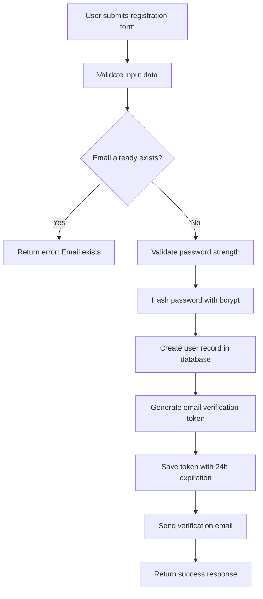
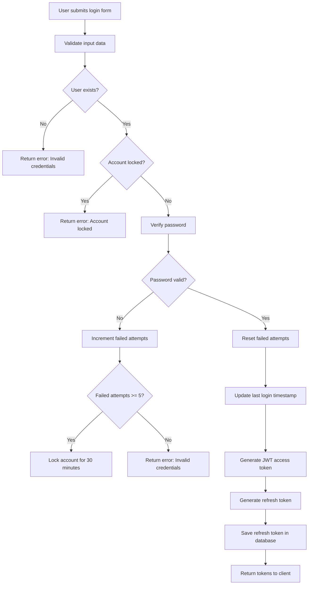
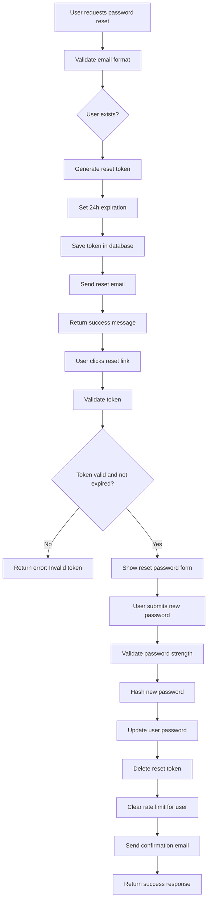
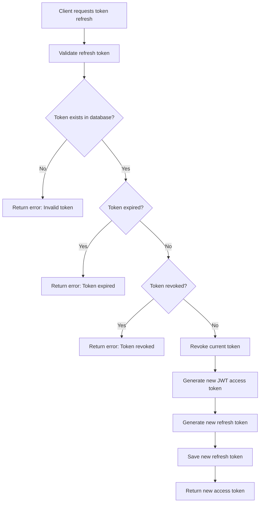
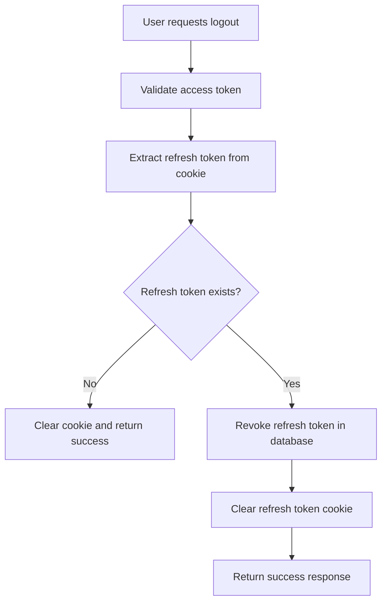
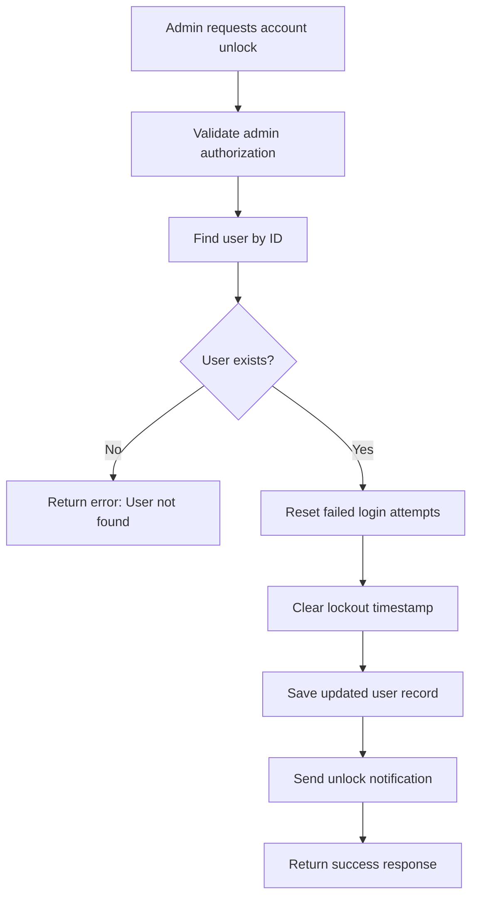

# Authentication System Design

## 1. Overview

The Authentication System is a critical component of the To-Do List and Time Planner application, providing secure user registration, login, session management, and access control. This system implements industry-standard security practices including JWT-based authentication with refresh tokens, email verification, password reset functionality, and robust security measures to protect user accounts.

### 1.1 Objectives
- Secure user authentication and authorization
- Protection against common security vulnerabilities
- Seamless user experience with persistent sessions
- Compliance with security best practices and standards

### 1.2 Key Features
- User registration with email verification
- Secure login with JWT authentication
- Password reset functionality
- Session management with refresh tokens
- Rate limiting for authentication endpoints
- Account lockout after failed attempts
- Secure logout mechanism

## 2. Architecture

### 2.1 System Components

The system consists of the following components:

- **Client Application**: The frontend interface that users interact with
- **Authentication API**: The core service handling all authentication requests
- **User Database**: Storage for user account information
- **Token Storage**: Secure storage for refresh tokens
- **Email Service**: Service for sending verification and notification emails
- **Security Middleware**: Component responsible for security checks and validations
- **Rate Limiter**: Component that enforces rate limiting policies

### 2.2 Technology Stack
- **Framework**: NestJS (Node.js framework with TypeScript support)
- **Authentication**: JWT (JSON Web Tokens) with RS256 asymmetric encryption
- **Database**: PostgreSQL with TypeORM
- **Token Storage**: Redis for refresh token blacklisting
- **Email Service**: SMTP provider (e.g., SendGrid, AWS SES)
- **Rate Limiting**: Redis-based rate limiting
- **Encryption**: bcrypt for password hashing

### 2.3 Data Flow

The authentication flow involves these steps:

1. User registration with email and password
2. System checks if user already exists
3. If new user, system hashes password and creates account
4. System sends verification email
5. User login with credentials
6. System validates credentials against stored data
7. System generates JWT access and refresh tokens
8. System updates last login timestamp
9. Client accesses protected resources using tokens
10. System validates JWT tokens for each request
11. Token refresh process for expired access tokens
12. System validates refresh token and generates new tokens

## 3. API Endpoints Reference

### 3.1 Authentication Endpoints

| Endpoint | Method | Description | Authentication |
|----------|--------|-------------|----------------|
| `/auth/register` | POST | User registration with email verification | Public |
| `/auth/verify-email` | GET | Email verification with token | Public |
| `/auth/login` | POST | User login with credentials | Public |
| `/auth/refresh` | POST | Refresh access token | Refresh token |
| `/auth/logout` | POST | User logout and token invalidation | JWT |
| `/auth/forgot-password` | POST | Initiate password reset process | Public |
| `/auth/reset-password` | POST | Reset password with token | Public |
| `/auth/profile` | GET | Get authenticated user profile | JWT |
| `/auth/profile` | PUT | Update user profile | JWT |
| `/auth/unlock-account/:userId` | POST | Unlock locked account | JWT (Admin) |

### 3.2 Request/Response Schema

#### Register User
```json
// Request
{
  "email": "user@example.com",
  "password": "SecurePass123!",
  "firstName": "John",
  "lastName": "Doe"
}

// Response
{
  "success": true,
  "message": "User registered successfully. Please check your email for verification.",
  "user": {
    "id": "uuid",
    "email": "user@example.com",
    "firstName": "John",
    "lastName": "Doe"
  }
}
```

#### Login User
```json
// Request
{
  "email": "user@example.com",
  "password": "SecurePass123!"
}

// Response
{
  "success": true,
  "accessToken": "jwt-access-token",
  "refreshToken": "refresh-token",
  "user": {
    "email": "user@example.com"
  }
}
```

#### Refresh Token
```json
// Request (with refresh token in cookie)
{}

// Response
{
  "success": true,
  "accessToken": "new-jwt-access-token"
}
```

### 3.3 Authentication Requirements

#### JWT Token Structure
- **Access Token**: Short-lived (15 minutes), contains user ID and email
- **Refresh Token**: Long-lived (30 days), stored in HTTP-only cookie
- **Token Claims**:
  - `sub`: User ID
  - `email`: User email
  - `iat`: Issued at timestamp
  - `exp`: Expiration timestamp

#### Security Headers
- `HttpOnly`: Prevents XSS attacks
- `Secure`: Only transmitted over HTTPS
- `SameSite`: Prevents CSRF attacks
- `Max-Age`: Token expiration time

## 4. Data Models & ORM Mapping

### 4.1 User Model

| Field | Type | Constraints | Description |
|-------|------|-------------|-------------|
| id | UUID | Primary Key | Unique user identifier |
| email | String | Unique, Not Null | User's email address |
| password | String | Not Null | Hashed password |
| firstName | String | Nullable | User's first name |
| lastName | String | Nullable | User's last name |
| isEmailVerified | Boolean | Default: false | Email verification status |
| emailVerificationToken | String | Nullable | Token for email verification |
| emailVerificationTokenExpires | DateTime | Nullable | Expiration time for verification token |
| passwordResetToken | String | Nullable | Token for password reset |
| passwordResetTokenExpires | DateTime | Nullable | Expiration time for reset token |
| isActive | Boolean | Default: true | Account status |
| failedLoginAttempts | Integer | Default: 0 | Count of failed login attempts |
| lockoutUntil | DateTime | Nullable | Account lockout expiration |
| createdAt | DateTime | Not Null | Account creation timestamp |
| updatedAt | DateTime | Not Null | Last update timestamp |

### 4.2 Refresh Token Model

| Field | Type | Constraints | Description |
|-------|------|-------------|-------------|
| id | UUID | Primary Key | Unique token identifier |
| token | String | Not Null | Refresh token value |
| userId | String | Foreign Key | Reference to user |
| expiresAt | DateTime | Not Null | Token expiration timestamp |
| ipAddress | String | Nullable | Client IP address |
| userAgent | String | Nullable | Client user agent |
| isRevoked | Boolean | Default: false | Token revocation status |
| createdAt | DateTime | Not Null | Token creation timestamp |

### 4.3 Database Relationships

- **User to RefreshToken**: One-to-Many relationship (one user can have multiple refresh tokens)
- **User to Tasks**: One-to-Many relationship (one user can have multiple tasks)
- **User to Projects**: One-to-Many relationship (one user can have multiple projects)
- **User to Tags**: One-to-Many relationship (one user can have multiple tags)
- **User to TimeBlocks**: One-to-Many relationship (one user can have multiple time blocks)

## 5. Business Logic Layer

### 5.1 Registration Flow



### 5.2 Login Flow



### 5.3 Password Reset Flow



### 5.4 Token Refresh Flow



### 5.5 Logout Flow



### 5.6 Account Unlock Flow



## 6. Middleware & Interceptors

### 6.1 Authentication Middleware

#### JWT Verification
- Validates JWT token signature and expiration
- Extracts user information from token claims
- Attaches user object to request context
- Handles expired and invalid token scenarios

#### Role-Based Access Control (RBAC)
- Checks user permissions for protected routes
- Supports role hierarchy and permission inheritance
- Custom decorators for granular access control

### 6.2 Security Interceptors

#### Rate Limiting
- Implements token bucket algorithm for rate limiting
- Configurable limits per endpoint (10 requests/minute for auth endpoints)
- IP-based and user-based rate limiting
- Automatic rate limit reset after time window

#### Request Validation
- Validates request payloads against defined schemas
- Sanitizes input to prevent injection attacks
- Provides detailed validation error messages

#### Logging Interceptor
- Logs authentication attempts and outcomes
- Tracks security-related events
- Monitors for suspicious activities

### 6.3 Session Management

#### Token Blacklisting
- Maintains blacklist of revoked refresh tokens
- Uses Redis for fast token validation
- Automatic cleanup of expired tokens

#### Concurrent Session Control
- Limits number of active sessions per user
- Allows user to view active sessions
- Enables session termination from other devices

## 7. Security Measures

### 7.1 Password Security
- bcrypt hashing with salt rounds >= 12
- Password strength requirements (min 8 chars, mixed case, numbers, special chars)
- Password history to prevent reuse
- Rate limiting on password reset requests

### 7.2 Account Protection
- Account lockout after 5 failed login attempts
- 30-minute lockout duration
- Admin unlock capability
- Email notification on lockout events

### 7.3 Token Security
- Asymmetric JWT signing (RS256)
- Short-lived access tokens (15 minutes)
- Long-lived refresh tokens with rotation
- HTTP-only, Secure, SameSite cookies
- Token blacklisting on logout

### 7.4 Rate Limiting
- 10 requests/minute for authentication endpoints
- Separate limits for different endpoints
- IP-based and user-based limiting
- Adaptive rate limiting for suspicious behavior

### 7.5 Input Validation
- Schema validation for all inputs
- Sanitization to prevent injection attacks
- Length and format validation
- Unicode normalization

## 8. Testing

### 8.1 Unit Tests

#### Authentication Service Tests
- User registration with valid/invalid data
- Email verification with valid/invalid tokens
- Login with valid/invalid credentials
- Password reset request and completion
- Token refresh with valid/invalid tokens
- Logout functionality

#### Security Tests
- Password hashing and verification
- JWT token generation and validation
- Rate limiting enforcement
- Account lockout mechanisms

### 8.2 Integration Tests

#### API Endpoint Tests
- Registration endpoint with various inputs
- Login endpoint with various credentials
- Password reset flow end-to-end
- Token refresh endpoint
- Profile management endpoints

#### Security Integration Tests
- CSRF protection
- XSS prevention
- SQL injection prevention
- Rate limiting across multiple requests

### 8.3 Test Cases Coverage

#### Registration Test Cases
- Valid registration with proper email and password
- Invalid email format rejection
- Password strength validation (minimum 8 characters, mix of letters, numbers, special characters)
- Duplicate email rejection
- Email verification workflow
- Registration confirmation redirect
- Empty email field
- Empty password field
- Extremely long email (255+ characters)
- SQL injection attempts in email field
- Special characters in email
- Unicode characters in email
- Password with only letters
- Password with only numbers
- Password with only special characters
- Concurrent registration attempts with same email

#### Login Test Cases
- Valid login with correct credentials
- Invalid credentials error handling
- Successful redirect to dashboard
- JWT token generation and validation
- "Remember me" functionality (30-day persistence)
- Account lockout after 5 failed attempts
- Empty email field
- Empty password field
- Non-existent email
- Incorrect password
- Case sensitivity of email
- SQL injection attempts
- Excessive login attempts (5+ failed attempts)
- Expired JWT tokens
- Malformed JWT tokens
- Login during system maintenance

#### Password Reset Test Cases
- Password reset request with valid email
- Password reset email delivery
- 24-hour token expiration
- New password strength requirements
- Successful login after password reset
- Session invalidation after reset
- Non-existent email in reset request
- Empty email field
- Malformed email in reset request
- Expired reset token usage
- Reused reset token
- Password same as previous
- Password with common patterns (123456, password)
- Multiple reset requests for same email
- Reset attempt with expired session

#### Session Management Test Cases
- Refresh token generation
- Token refresh workflow
- Expired token handling
- Concurrent session management
- Token storage security
- Expired refresh token
- Invalid refresh token
- Refresh token theft
- Simultaneous token refresh
- Network failure during refresh
- Multiple devices token management
- Token refresh during maintenance

#### Logout Test Cases
- Logout button functionality
- Session termination on logout
- JWT token invalidation
- Redirect to login page
- Browser storage cleanup
- Logout confirmation message
- Logout with expired session
- Multiple simultaneous logout attempts
- Logout during API request
- Logout with network interruption
- Logout from multiple tabs
- Logout with invalid tokens
- Logout during system maintenance

#### Rate Limiting Test Cases
- Rate limit enforcement (e.g., 10 requests/minute)
- Rate limit exceeded response
- Rate limit reset after time window
- Different limits for different endpoints
- Burst requests at limit threshold
- Distributed denial-of-service attempts
- Legitimate high-volume usage
- Rate limit bypass attempts
- Time synchronization issues
- Multiple IP addresses from same user

#### Account Lockout Test Cases
- Lockout after 5 failed attempts
- Lockout duration (e.g., 30 minutes)
- Unlock after time period
- Admin unlock capability
- Lockout notification
- Failed attempts across multiple sessions
- Failed attempts with different IPs
- Lockout during time zone changes
- Concurrent lockout attempts
- System restart during lockout
- Manual unlock by admin

## 9. Database Setup

### 9.1 Users Table Design

The Users table stores all user account information and authentication data.

| Column Name | Data Type | Constraints | Description |
|-------------|-----------|-------------|-------------|
| id | UUID | PRIMARY KEY | Unique user identifier |
| email | VARCHAR(255) | UNIQUE, NOT NULL | User's email address |
| password | VARCHAR(255) | NOT NULL | Hashed password |
| firstName | VARCHAR(100) | NULLABLE | User's first name |
| lastName | VARCHAR(100) | NULLABLE | User's last name |
| isEmailVerified | BOOLEAN | DEFAULT false | Email verification status |
| emailVerificationToken | VARCHAR(255) | NULLABLE | Token for email verification |
| emailVerificationTokenExpires | TIMESTAMP | NULLABLE | Expiration time for verification token |
| passwordResetToken | VARCHAR(255) | NULLABLE | Token for password reset |
| passwordResetTokenExpires | TIMESTAMP | NULLABLE | Expiration time for reset token |
| isActive | BOOLEAN | DEFAULT true | Account status |
| failedLoginAttempts | INTEGER | DEFAULT 0 | Count of failed login attempts |
| lockoutUntil | TIMESTAMP | NULLABLE | Account lockout expiration |
| createdAt | TIMESTAMP | NOT NULL | Account creation timestamp |
| updatedAt | TIMESTAMP | NOT NULL | Last update timestamp |

#### Indexes
- Primary Key: id
- Unique Index: email
- Index: emailVerificationToken
- Index: passwordResetToken

### 9.2 Refresh Tokens Table Design

The Refresh Tokens table stores long-lived refresh tokens for session management.

| Column Name | Data Type | Constraints | Description |
|-------------|-----------|-------------|-------------|
| id | UUID | PRIMARY KEY | Unique token identifier |
| token | VARCHAR(255) | NOT NULL | Refresh token value |
| userId | UUID | FOREIGN KEY | Reference to user |
| expiresAt | TIMESTAMP | NOT NULL | Token expiration timestamp |
| ipAddress | VARCHAR(45) | NULLABLE | Client IP address |
| userAgent | TEXT | NULLABLE | Client user agent |
| isRevoked | BOOLEAN | DEFAULT false | Token revocation status |
| createdAt | TIMESTAMP | NOT NULL | Token creation timestamp |

#### Indexes
- Primary Key: id
- Unique Index: token
- Index: userId
- Index: expiresAt

### 9.3 Database Relationships

#### User to Refresh Token Relationship
- One-to-Many relationship: One user can have multiple refresh tokens
- CASCADE DELETE: When a user is deleted, all their refresh tokens are deleted
- Foreign Key: refresh_tokens.userId references users.id

### 9.4 Database Constraints

#### Check Constraints
- Email format validation at application level
- Password strength validation at application level
- Token expiration validation

#### Foreign Key Constraints
- refresh_tokens.userId → users.id (CASCADE DELETE)

### 9.5 Performance Optimization

#### Indexing Strategy
- Index on users.email for fast login lookups
- Index on users.emailVerificationToken for verification lookups
- Index on users.passwordResetToken for reset lookups
- Index on refresh_tokens.token for token validation
- Index on refresh_tokens.userId for user token lookups
- Index on refresh_tokens.expiresAt for cleanup queries

#### Query Optimization
- Efficient queries for authentication workflows
- Proper use of database indexes
- Connection pooling for database access

### 9.6 Migration Strategy

#### Initial Migration
1. Create users table with all required columns
2. Create refresh_tokens table with all required columns
3. Add indexes for performance optimization
4. Add foreign key constraints

#### Future Migrations
- Backward compatible schema changes
- Data migration scripts for existing users
- Rollback procedures for failed migrations

### 9.7 Testing Database Implementation

#### Unit Tests
- User entity validation
- Refresh token entity validation
- Database relationship integrity
- Index performance testing

#### Integration Tests
- Database connection and configuration
- CRUD operations for users
- CRUD operations for refresh tokens
- Transaction handling
- Error handling for database failures

#### Test Cases Coverage
- User record creation
- User record retrieval
- User record update
- User record deletion
- Data integrity constraints
- Index performance
- NULL values in required fields
- Extremely long text fields
- Special characters in text fields
- Unicode characters
- Duplicate primary keys
- Foreign key constraint violations
- Database connection failures