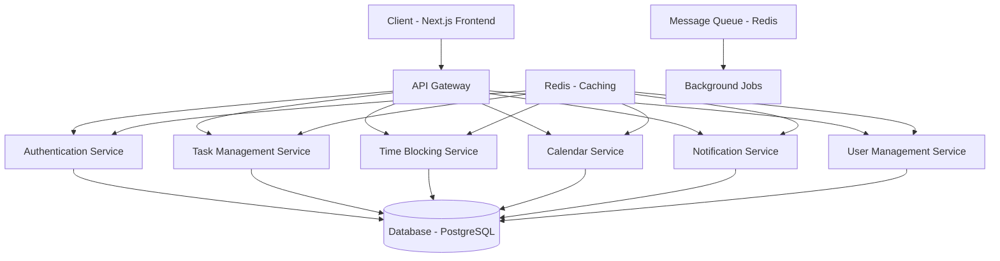
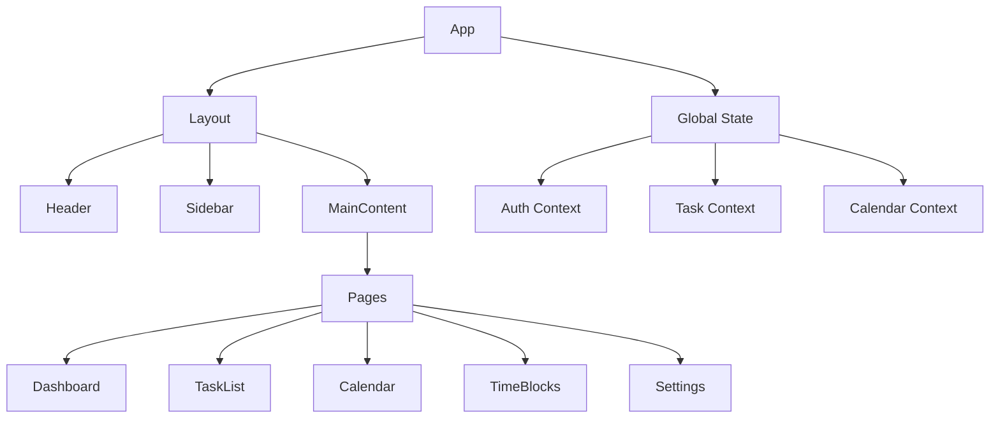

# Full-Stack To-Do List and Time Planner Application Design

## 1. Overview

This document outlines the design for making the To-Do List and Time Planner application fully runnable on both frontend and backend. The application combines task management with time blocking techniques to help users maximize their efficiency.

### 1.1 Technology Stack

#### Backend (NestJS)
- Framework: NestJS v11 (already implemented)
- Language: TypeScript
- ORM: TypeORM
- Database: PostgreSQL (production) / SQLite (development)
- Authentication: JWT with Passport
- Caching: Redis
- Testing: Jest

#### Frontend (Next.js)
- Framework: Next.js (React framework with SSR/SSG capabilities)
- State Management: React Context API with Redux Toolkit
- Styling: Tailwind CSS
- Authentication: JWT-based with HttpOnly cookies
- API Client: Axios with interceptors
- Date Management: date-fns
- Forms: React Hook Form
- Testing: Jest, React Testing Library, Cypress

## 2. Architecture

### 2.1 System Architecture



### 2.2 Component Architecture

#### Backend Module Structure
```
src/
├── auth/                 # Authentication module
├── tasks/                # Task management module
├── time-blocks/          # Time blocking module
├── calendar/             # Calendar views module
├── notifications/        # Notification system
├── users/                # User management
├── projects/             # Project management
├── tags/                 # Tag management
└── app.module.ts         # Main application module
```

#### Frontend Component Structure
```
frontend/
├── components/           # Reusable UI components
│   ├── Task/
│   ├── TimeBlock/
│   ├── Calendar/
│   ├── Dashboard/
│   └── Notifications/
├── pages/                # Next.js pages
│   ├── dashboard/
│   ├── tasks/
│   ├── calendar/
│   ├── planner/
│   └── settings/
├── services/             # API service layer
├── hooks/                # Custom React hooks
├── types/                # TypeScript type definitions
├── utils/                # Utility functions
└── store/                # Redux store
```

## 3. API Endpoints Reference

### 3.1 Authentication Endpoints

| Endpoint | Method | Description | Auth Required |
|----------|--------|-------------|---------------|
| `/api/auth/register` | POST | User registration | No |
| `/api/auth/login` | POST | User login | No |
| `/api/auth/refresh` | POST | Refresh access token | Yes |
| `/api/auth/logout` | POST | User logout | Yes |
| `/api/auth/profile` | GET/PUT | Get/update user profile | Yes |

### 3.2 Task Management Endpoints

| Endpoint | Method | Description | Auth Required |
|----------|--------|-------------|---------------|
| `/api/tasks` | GET | Get all tasks | Yes |
| `/api/tasks` | POST | Create new task | Yes |
| `/api/tasks/:id` | GET | Get specific task | Yes |
| `/api/tasks/:id` | PUT | Update task | Yes |
| `/api/tasks/:id` | DELETE | Delete task | Yes |
| `/api/tasks/:id/complete` | PUT | Mark task as complete | Yes |

### 3.3 Time Blocking Endpoints

| Endpoint | Method | Description | Auth Required |
|----------|--------|-------------|---------------|
| `/api/time-blocks` | GET | Get all time blocks | Yes |
| `/api/time-blocks` | POST | Create new time block | Yes |
| `/api/time-blocks/:id` | GET | Get specific time block | Yes |
| `/api/time-blocks/:id` | PUT | Update time block | Yes |
| `/api/time-blocks/:id` | DELETE | Delete time block | Yes |
| `/api/time-blocks/conflicts` | GET | Check for scheduling conflicts | Yes |

### 3.4 Calendar Endpoints

| Endpoint | Method | Description | Auth Required |
|----------|--------|-------------|---------------|
| `/api/calendar/events` | GET | Get calendar events | Yes |
| `/api/calendar/views/:type` | GET | Get specific calendar view | Yes |

## 4. Data Models & ORM Mapping

### 4.1 User Entity

```typescript
// src/users/user.entity.ts
import { Entity, PrimaryGeneratedColumn, Column, CreateDateColumn, UpdateDateColumn, OneToMany } from 'typeorm';
import { Task } from '../tasks/task.entity';
import { TimeBlock } from '../time-blocks/time-block.entity';

@Entity('users')
export class User {
  @PrimaryGeneratedColumn()
  id: number;

  @Column({ unique: true })
  email: string;

  @Column()
  password: string;

  @Column()
  firstName: string;

  @Column()
  lastName: string;

  @Column({ nullable: true })
  timezone: string;

  @Column({ default: false })
  emailVerified: boolean;

  @Column({ default: true })
  isActive: boolean;

  @CreateDateColumn()
  createdAt: Date;

  @UpdateDateColumn()
  updatedAt: Date;

  @OneToMany(() => Task, task => task.user)
  tasks: Task[];

  @OneToMany(() => TimeBlock, timeBlock => timeBlock.user)
  timeBlocks: TimeBlock[];
}
```

### 4.2 Task Entity

```typescript
// src/tasks/task.entity.ts
import { Entity, PrimaryGeneratedColumn, Column, CreateDateColumn, UpdateDateColumn, ManyToOne, OneToMany } from 'typeorm';
import { User } from '../users/user.entity';
import { TimeBlock } from '../time-blocks/time-block.entity';

@Entity('tasks')
export class Task {
  @PrimaryGeneratedColumn()
  id: number;

  @Column()
  title: string;

  @Column({ type: 'text', nullable: true })
  description: string;

  @Column({ nullable: true })
  dueDate: Date;

  @Column({ 
    type: 'enum', 
    enum: ['backlog', 'todo', 'in-progress', 'review', 'completed', 'cancelled'],
    default: 'todo'
  })
  status: string;

  @Column({ 
    type: 'enum', 
    enum: ['low', 'medium', 'high', 'urgent'],
    default: 'medium'
  })
  priority: string;

  @Column({ nullable: true })
  estimatedTime: number;

  @Column({ nullable: true })
  actualTime: number;

  @CreateDateColumn()
  createdAt: Date;

  @UpdateDateColumn()
  updatedAt: Date;

  @ManyToOne(() => User, user => user.tasks, { eager: false })
  user: User;

  @Column()
  userId: number;

  @OneToMany(() => TimeBlock, timeBlock => timeBlock.task, { eager: true })
  timeBlocks: TimeBlock[];
}
```

### 4.3 TimeBlock Entity

```typescript
// src/time-blocks/time-block.entity.ts
import { Entity, PrimaryGeneratedColumn, Column, CreateDateColumn, UpdateDateColumn, ManyToOne } from 'typeorm';
import { User } from '../users/user.entity';
import { Task } from '../tasks/task.entity';

@Entity('time_blocks')
export class TimeBlock {
  @PrimaryGeneratedColumn()
  id: number;

  @Column()
  title: string;

  @Column({ type: 'text', nullable: true })
  description: string;

  @Column({ type: 'timestamp' })
  startTime: Date;

  @Column({ type: 'timestamp' })
  endTime: Date;

  @Column()
  color: string;

  @CreateDateColumn()
  createdAt: Date;

  @UpdateDateColumn()
  updatedAt: Date;

  @ManyToOne(() => User, user => user.timeBlocks, { eager: false })
  user: User;

  @Column()
  userId: number;

  @ManyToOne(() => Task, task => task.timeBlocks, { eager: false, nullable: true })
  task: Task;

  @Column({ nullable: true })
  taskId: number;
}
```

## 5. Business Logic Layer

### 5.1 Authentication Service Architecture

The authentication service handles user registration, login, and session management:

```typescript
// src/auth/auth.service.ts
@Injectable()
export class AuthService {
  constructor(
    private usersService: UsersService,
    private jwtService: JwtService,
    private readonly redisService: RedisService,
  ) {}

  async register(registerDto: RegisterDto): Promise<User> {
    // Implementation for user registration
  }

  async login(loginDto: LoginDto): Promise<AuthResponse> {
    // Implementation for user login
  }

  async refreshToken(refreshToken: string): Promise<AuthResponse> {
    // Implementation for token refresh
  }

  async logout(userId: number, refreshToken: string): Promise<void> {
    // Implementation for user logout
  }
}
```

### 5.2 Task Management Service Architecture

The task service handles CRUD operations for tasks:

```typescript
// src/tasks/tasks.service.ts
@Injectable()
export class TasksService {
  constructor(
    @InjectRepository(Task)
    private tasksRepository: Repository<Task>,
  ) {}

  async findAll(userId: number, filters?: TaskFilters): Promise<Task[]> {
    // Implementation for retrieving tasks
  }

  async findOne(id: number, userId: number): Promise<Task> {
    // Implementation for retrieving a specific task
  }

  async create(createTaskDto: CreateTaskDto, userId: number): Promise<Task> {
    // Implementation for creating a task
  }

  async update(id: number, updateTaskDto: UpdateTaskDto, userId: number): Promise<Task> {
    // Implementation for updating a task
  }

  async remove(id: number, userId: number): Promise<void> {
    // Implementation for deleting a task
  }

  async markComplete(id: number, userId: number): Promise<Task> {
    // Implementation for marking a task as complete
  }
}
```

### 5.3 Time Blocking Service Architecture

The time blocking service handles scheduling and conflict detection:

```typescript
// src/time-blocks/time-blocks.service.ts
@Injectable()
export class TimeBlocksService {
  constructor(
    @InjectRepository(TimeBlock)
    private timeBlocksRepository: Repository<TimeBlock>,
  ) {}

  async findAll(userId: number, filters?: TimeBlockFilters): Promise<TimeBlock[]> {
    // Implementation for retrieving time blocks
  }

  async findOne(id: number, userId: number): Promise<TimeBlock> {
    // Implementation for retrieving a specific time block
  }

  async create(createTimeBlockDto: CreateTimeBlockDto, userId: number): Promise<TimeBlock> {
    // Implementation for creating a time block with conflict detection
  }

  async update(id: number, updateTimeBlockDto: UpdateTimeBlockDto, userId: number): Promise<TimeBlock> {
    // Implementation for updating a time block
  }

  async remove(id: number, userId: number): Promise<void> {
    // Implementation for deleting a time block
  }

  async checkConflicts(userId: number, timeBlock: TimeBlock): Promise<Conflict[]> {
    // Implementation for checking scheduling conflicts
  }
}
```

### 5.4 Calendar Service Architecture

The calendar service handles different calendar views:

```typescript
// src/calendar/calendar.service.ts
@Injectable()
export class CalendarService {
  constructor(
    private tasksService: TasksService,
    private timeBlocksService: TimeBlocksService,
  ) {}

  async getDayView(date: Date, userId: number): Promise<DayViewData> {
    // Implementation for day view data
  }

  async getWeekView(startDate: Date, userId: number): Promise<WeekViewData> {
    // Implementation for week view data
  }

  async getMonthView(year: number, month: number, userId: number): Promise<MonthViewData> {
    // Implementation for month view data
  }
}
```

## 6. Frontend Architecture

### 6.1 Component Hierarchy



### 6.2 State Management

The frontend uses a combination of React Context API and Redux Toolkit for state management:

```typescript
// frontend/store/store.ts
import { configureStore } from '@reduxjs/toolkit';
import authReducer from './slices/authSlice';
import taskReducer from './slices/taskSlice';
import calendarReducer from './slices/calendarSlice';

export const store = configureStore({
  reducer: {
    auth: authReducer,
    tasks: taskReducer,
    calendar: calendarReducer,
  },
});

export type RootState = ReturnType<typeof store.getState>;
export type AppDispatch = typeof store.dispatch;
```

### 6.3 API Integration Layer

The frontend uses Axios for API communication with interceptors for authentication:

```typescript
// frontend/services/api.ts
import axios from 'axios';

const api = axios.create({
  baseURL: process.env.NEXT_PUBLIC_API_URL || 'http://localhost:3001/api',
  withCredentials: true,
});

// Request interceptor to add auth token
api.interceptors.request.use((config) => {
  const token = localStorage.getItem('accessToken');
  if (token) {
    config.headers.Authorization = `Bearer ${token}`;
  }
  return config;
});

// Response interceptor to handle token refresh
api.interceptors.response.use(
  (response) => response,
  async (error) => {
    const originalRequest = error.config;
    if (error.response?.status === 401 && !originalRequest._retry) {
      originalRequest._retry = true;
      try {
        const refreshToken = localStorage.getItem('refreshToken');
        const response = await axios.post('/api/auth/refresh', { refreshToken });
        const { accessToken } = response.data;
        localStorage.setItem('accessToken', accessToken);
        originalRequest.headers.Authorization = `Bearer ${accessToken}`;
        return api(originalRequest);
      } catch (err) {
        // Redirect to login
        window.location.href = '/login';
      }
    }
    return Promise.reject(error);
  }
);

export default api;
```

### 6.4 Custom Hooks

Custom hooks encapsulate business logic and API calls:

```typescript
// frontend/hooks/useTasks.ts
import { useState, useEffect } from 'react';
import { Task } from '../types/task.types';
import { taskService } from '../services/task.service';

export const useTasks = (userId: string) => {
  const [tasks, setTasks] = useState<Task[]>([]);
  const [loading, setLoading] = useState<boolean>(true);
  const [error, setError] = useState<string | null>(null);

  useEffect(() => {
    const fetchTasks = async () => {
      try {
        setLoading(true);
        const data = await taskService.getTasks(userId);
        setTasks(data);
      } catch (err) {
        setError('Failed to fetch tasks');
      } finally {
        setLoading(false);
      }
    };

    if (userId) {
      fetchTasks();
    }
  }, [userId]);

  const createTask = async (taskData: Partial<Task>) => {
    try {
      const newTask = await taskService.createTask(taskData);
      setTasks([...tasks, newTask]);
      return newTask;
    } catch (err) {
      setError('Failed to create task');
      throw err;
    }
  };

  const updateTask = async (id: number, taskData: Partial<Task>) => {
    try {
      const updatedTask = await taskService.updateTask(id, taskData);
      setTasks(tasks.map(task => task.id === id ? updatedTask : task));
      return updatedTask;
    } catch (err) {
      setError('Failed to update task');
      throw err;
    }
  };

  const deleteTask = async (id: number) => {
    try {
      await taskService.deleteTask(id);
      setTasks(tasks.filter(task => task.id !== id));
    } catch (err) {
      setError('Failed to delete task');
      throw err;
    }
  };

  return {
    tasks,
    loading,
    error,
    createTask,
    updateTask,
    deleteTask,
  };
};
```

## 7. Testing Strategy

### 7.1 Backend Testing

#### Unit Testing
```typescript
// src/tasks/tasks.service.spec.ts
describe('TasksService', () => {
  let service: TasksService;
  let repository: Repository<Task>;

  beforeEach(async () => {
    const module: TestingModule = await Test.createTestingModule({
      providers: [
        TasksService,
        {
          provide: getRepositoryToken(Task),
          useValue: {
            find: jest.fn(),
            findOne: jest.fn(),
            create: jest.fn(),
            save: jest.fn(),
            remove: jest.fn(),
          },
        },
      ],
    }).compile();

    service = module.get<TasksService>(TasksService);
    repository = module.get<Repository<Task>>(getRepositoryToken(Task));
  });

  it('should be defined', () => {
    expect(service).toBeDefined();
  });

  describe('findAll', () => {
    it('should return an array of tasks', async () => {
      const userId = 1;
      const tasks = [{ id: 1, title: 'Test Task' }] as Task[];
      jest.spyOn(repository, 'find').mockResolvedValue(tasks);

      const result = await service.findAll(userId);
      expect(result).toEqual(tasks);
    });
  });
});
```

#### End-to-End Testing
```typescript
// test/tasks.e2e-spec.ts
describe('TasksController (e2e)', () => {
  let app: INestApplication;
  let token: string;

  beforeAll(async () => {
    const moduleFixture: TestingModule = await Test.createTestingModule({
      imports: [AppModule],
    }).compile();

    app = moduleFixture.createNestApplication();
    await app.init();

    // Login to get auth token
    const loginResponse = await request(app.getHttpServer())
      .post('/auth/login')
      .send({ email: 'test@example.com', password: 'password' });
    
    token = loginResponse.body.accessToken;
  });

  it('/tasks (GET)', async () => {
    return request(app.getHttpServer())
      .get('/tasks')
      .set('Authorization', `Bearer ${token}`)
      .expect(200);
  });

  afterAll(async () => {
    await app.close();
  });
});
```

### 7.2 Frontend Testing

#### Component Testing
```typescript
// frontend/components/TaskCard.test.tsx
import { render, screen } from '@testing-library/react';
import userEvent from '@testing-library/user-event';
import { TaskCard } from './TaskCard';

const mockTask = {
  id: 1,
  title: 'Test Task',
  description: 'Test Description',
  status: 'todo',
  priority: 'medium',
};

const mockHandlers = {
  onEdit: jest.fn(),
  onDelete: jest.fn(),
  onComplete: jest.fn(),
};

describe('TaskCard', () => {
  it('renders task information correctly', () => {
    render(<TaskCard task={mockTask} {...mockHandlers} />);
    
    expect(screen.getByText('Test Task')).toBeInTheDocument();
    expect(screen.getByText('Test Description')).toBeInTheDocument();
  });

  it('calls onEdit when edit button is clicked', async () => {
    const user = userEvent.setup();
    render(<TaskCard task={mockTask} {...mockHandlers} />);
    
    const editButton = screen.getByRole('button', { name: /edit/i });
    await user.click(editButton);
    
    expect(mockHandlers.onEdit).toHaveBeenCalledWith(mockTask.id);
  });
});
```

#### Integration Testing
```typescript
// frontend/services/task.service.test.ts
import { taskService } from './task.service';
import api from './api';

jest.mock('./api');

const mockedApi = api as jest.Mocked<typeof api>;

describe('TaskService', () => {
  const mockTask = {
    id: 1,
    title: 'Test Task',
    description: 'Test Description',
    status: 'todo',
    priority: 'medium',
  };

  beforeEach(() => {
    jest.clearAllMocks();
  });

  it('should fetch tasks', async () => {
    mockedApi.get.mockResolvedValue({ data: [mockTask] });
    
    const tasks = await taskService.getTasks('1');
    
    expect(mockedApi.get).toHaveBeenCalledWith('/tasks');
    expect(tasks).toEqual([mockTask]);
  });

  it('should create a task', async () => {
    mockedApi.post.mockResolvedValue({ data: mockTask });
    
    const task = await taskService.createTask({ title: 'Test Task' });
    
    expect(mockedApi.post).toHaveBeenCalledWith('/tasks', { title: 'Test Task' });
    expect(task).toEqual(mockTask);
  });
});
```

## 8. Deployment Considerations

### 8.1 Development Environment

- SQLite for local development with seed data
- Hot reloading for frontend (Next.js) and backend (NestJS)
- Environment-based configuration with .env files
- Development Docker setup for consistent environments

### 8.2 Production Environment

- PostgreSQL database with connection pooling
- Docker containerization for both frontend and backend
- Kubernetes orchestration for container management
- CI/CD pipeline with GitHub Actions
- Load balancing and auto-scaling configurations
- Health checks and monitoring integrations

### 8.3 Monitoring and Observability

- Application performance monitoring (APM) with tools like DataDog
- Log aggregation with ELK stack
- Error tracking with Sentry
- Uptime monitoring and alerting systems
- Infrastructure monitoring with Prometheus and Grafana
