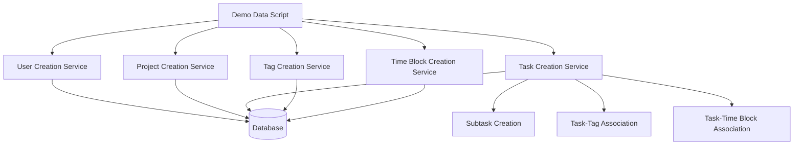

# Demo Data Creation System Design

## Overview

This document outlines the design for a demo data creation system that will generate sample users, tasks, projects, tags, and time blocks for testing and demonstration purposes. The system will provide a convenient way to populate the application with realistic sample data without requiring manual input.

## Architecture

The demo data creation system will be implemented as a standalone script that can be executed via CLI or as part of the application initialization process. It will leverage existing services to create entities in a consistent manner with the application's business logic.



## Data Models

### User Model
The system will create demo users with the following properties:
- Email: Generated with a consistent pattern (e.g., demo1@example.com)
- Password: Default password for all demo users
- First Name: Generated from a list of sample names
- Last Name: Generated from a list of sample names
- isActive: true
- isEmailVerified: true

### Project Model
Demo projects will be created with:
- Name: Generated from a list of sample project names
- Description: Generated from a list of sample descriptions
- Color: Randomly selected from a predefined color palette
- isArchived: false

### Task Model
Demo tasks will include:
- Title: Generated from a list of sample task titles
- Description: Generated from a list of sample descriptions
- Due Date: Random dates within a reasonable range
- Priority: Random priority levels (0-4)
- Status: Random status from allowed values (pending, in-progress, completed, cancelled)
- CompletedAt: Set for completed tasks

### Tag Model
Demo tags will be created with:
- Name: Generated from a list of common productivity tags
- Color: Randomly selected from a predefined color palette

### Time Block Model
Demo time blocks will include:
- Title: Generated from a list of sample time block titles
- Description: Generated from a list of sample descriptions
- StartTime: Random times within a reasonable range
- EndTime: Times that ensure valid duration
- Color: Randomly selected from a predefined color palette

## Implementation Plan

### 1. User Creation
- Create 2-3 demo users with realistic names
- Assign default passwords
- Set appropriate user properties for demo purposes

### 2. Project Creation
- For each user, create 3-5 projects
- Use realistic project names and descriptions
- Assign colors from a predefined palette

### 3. Tag Creation
- Create 10-15 tags with common productivity names
- Assign colors from a predefined palette
- Associate tags with users

### 4. Task Creation
- For each user, create 15-25 tasks
- Distribute tasks among projects
- Assign random priorities and statuses
- Create 2-5 subtasks for 30% of tasks
- Associate 60% of tasks with 1-2 tags
- Set due dates with a realistic distribution

### 5. Time Block Creation
- For each user, create 10-20 time blocks
- Associate 70% of time blocks with tasks
- Ensure time blocks have valid start/end times
- Avoid conflicts between time blocks

## Business Logic Implementation

### User Service Integration
The demo data creation will use the existing `UsersService` to create users:
```typescript
const user = await usersService.create({
  email: 'demo1@example.com',
  password: 'DemoPassword123!',
  firstName: 'Demo',
  lastName: 'User',
  isEmailVerified: true,
  isActive: true
});
```

### Project Service Integration
Projects will be created using the `ProjectsService`:
```typescript
const project = await projectsService.create(userId, {
  name: 'Website Redesign',
  description: 'Complete redesign of company website',
  color: '#3498db'
});
```

### Task Service Integration
Tasks will be created using the `TasksService`:
```typescript
const task = await tasksService.create(userId, {
  title: 'Create wireframes',
  description: 'Design initial wireframes for homepage',
  dueDate: new Date('2023-12-31'),
  priority: 2,
  projectId: projectId
});
```

### Tag Service Integration
Tags will be created using the `TagsService`:
```typescript
const tag = await tagsService.create({
  name: 'Design',
  color: '#9b59b6',
  userId: userId
});
```

### Time Block Service Integration
Time blocks will be created using the `TimeBlocksService`:
```typescript
const timeBlock = await timeBlocksService.create(userId, {
  title: 'Design meeting',
  description: 'Team meeting to discuss wireframes',
  startTime: new Date('2023-12-15T10:00:00'),
  endTime: new Date('2023-12-15T11:00:00'),
  color: '#e74c3c',
  taskId: taskId
});
```

## Data Generation Strategy

### Sample Data Sources
The system will use predefined arrays of sample data to generate realistic content:

1. **User Names**: 
   - First names: ["Alex", "Taylor", "Jordan", "Casey", "Riley", "Morgan", "Jamie", "Cameron"]
   - Last names: ["Smith", "Johnson", "Williams", "Brown", "Jones", "Garcia", "Miller", "Davis"]

2. **Project Names**:
   - ["Website Redesign", "Mobile App Development", "Marketing Campaign", "Product Launch", "System Migration"]

3. **Task Titles**:
   - ["Research competitors", "Create wireframes", "Write documentation", "Test functionality", "Review code"]

4. **Tag Names**:
   - ["Design", "Development", "Marketing", "Urgent", "Review", "Meeting", "Research", "Planning"]

5. **Color Palette**:
   - ["#3498db", "#2ecc71", "#e74c3c", "#f39c12", "#9b59b6", "#1abc9c", "#d35400", "#34495e"]

### Randomization
- Use appropriate randomization techniques to ensure varied but realistic data
- Ensure time blocks don't conflict with each other
- Distribute task priorities and statuses according to realistic patterns

## Execution Methods

### CLI Command
The demo data creation will be available as a CLI command:
```bash
npm run demo:data
```

### Programmatic API
The system will also be available as a service that can be called programmatically:
```typescript
await demoDataService.createDemoData();
```

## Testing Strategy

### Unit Tests
- Test data generation functions to ensure they produce valid output
- Verify that created entities conform to business rules
- Test edge cases in data creation

### Integration Tests
- Verify that demo data can be created and retrieved through the API
- Ensure relationships between entities are properly established
- Test that demo data works correctly with existing application features

## Security Considerations

- Demo users should have default passwords that are changed on first login
- Demo data should be clearly identifiable and separable from production data
- The demo data creation should be disabled in production environments
- Proper access controls should be in place to prevent unauthorized execution

## Performance Considerations

- Batch creation of entities where possible to reduce database round trips
- Use transactions to ensure data consistency
- Implement proper error handling to prevent partial data creation
- Monitor memory usage during large data creation operations