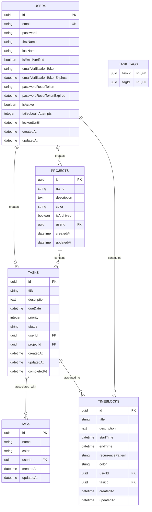

# Database Setup Design

## 1. Overview

This document outlines the design for implementing the database schema for the To-Do List and Time Planner application. The database will be implemented using PostgreSQL with TypeORM as the ORM. The schema will include tables for Users, Tasks, Projects, Tags, and TimeBlocks with appropriate relationships and constraints to support the application's functionality.

The design will focus on:
- Data integrity through proper relationships and constraints
- Performance optimization through strategic indexing
- Scalability for future enhancements
- Security through proper data handling

## 2. Architecture

### 2.1 Technology Stack
- **Database**: PostgreSQL
- **ORM**: TypeORM
- **Migration Tool**: TypeORM migrations
- **Connection Pooling**: Built-in PostgreSQL connection pooling

### 2.2 Database Schema Design

The database schema consists of five main entities:
1. **Users**: Authentication and user profile information (already implemented)
2. **Tasks**: Individual task items with due dates, priorities, and status
3. **Projects**: Task categorization system for organizing related tasks
4. **Tags**: Labeling system for organizing and filtering tasks
5. **TimeBlocks**: Scheduled time slots for focused work periods

### 2.3 Entity Relationship Diagram



### 2.4 Database Configuration

The database connection is configured through environment variables:

| Environment Variable | Description | Default Value |
|---------------------|-------------|---------------|
| DB_HOST | Database server hostname | localhost |
| DB_PORT | Database server port | 5432 |
| DB_USERNAME | Database user | postgres |
| DB_PASSWORD | Database password | postgres |
| DB_NAME | Database name | todo_planer |
| DB_SSL | Enable SSL connection | false |
| DB_CONNECTION_TIMEOUT | Connection timeout in ms | 30000 |
| DB_POOL_SIZE | Connection pool size | 10 |

The configuration is implemented in the `data-source.ts` file:
```typescript
export const AppDataSource = new DataSource({
  type: 'postgres',
  host: process.env.DB_HOST || 'localhost',
  port: parseInt(process.env.DB_PORT || '5432'),
  username: process.env.DB_USERNAME || 'postgres',
  password: process.env.DB_PASSWORD || 'postgres',
  database: process.env.DB_NAME || 'todo_planer',
  synchronize: false, // Always false in production
  logging: false,
  entities: [User, RefreshToken, Task, Project, Tag, TimeBlock],
  migrations: [__dirname + '/../migrations/**/*{.ts,.js}'],
  subscribers: [],
  ssl: process.env.DB_SSL === 'true' ? {
    rejectUnauthorized: false,
  } : false,
  connectTimeoutMS: parseInt(process.env.DB_CONNECTION_TIMEOUT || '30000'),
  poolSize: parseInt(process.env.DB_POOL_SIZE || '10'),
});
```

## 3. Data Models & ORM Mapping

### 3.1 Users Table
The Users table has already been implemented as part of the authentication system. It includes fields for authentication, profile information, email verification, password reset functionality, account status, and security tracking.

### 3.2 Tasks Table

```typescript
import { Entity, PrimaryGeneratedColumn, Column, CreateDateColumn, UpdateDateColumn, ManyToOne, JoinColumn, ManyToMany, JoinTable, OneToMany } from 'typeorm';
import { IsIn, Length, Min, Max } from 'class-validator';
import { User } from './user.entity';
import { Project } from './project.entity';
import { Tag } from './tag.entity';
import { TimeBlock } from './time-block.entity';

@Entity('tasks')
export class Task {
  @PrimaryGeneratedColumn('uuid')
  id: string;

  @Column()
  @Length(1, 255)
  title: string;

  @Column({ type: 'text', nullable: true })
  @Length(0, 5000)
  description: string;

  @Column({ type: 'timestamp', nullable: true })
  dueDate: Date;

  @Column({ type: 'int', default: 0 })
  @Min(0)
  @Max(4)
  priority: number;

  @Column({ default: 'pending' })
  @IsIn(['pending', 'in-progress', 'completed', 'cancelled'])
  status: string;

  @Column({ type: 'timestamp', nullable: true })
  completedAt: Date;

  @CreateDateColumn()
  createdAt: Date;

  @UpdateDateColumn()
  updatedAt: Date;

  @ManyToOne(() => User, user => user.tasks, { onDelete: 'CASCADE' })
  @JoinColumn({ name: 'userId' })
  user: User;

  @Column()
  userId: string;

  @ManyToOne(() => Project, project => project.tasks, { nullable: true, onDelete: 'SET NULL' })
  @JoinColumn({ name: 'projectId' })
  project: Project;

  @Column({ nullable: true })
  projectId: string;

  @ManyToMany(() => Tag, { cascade: true })
  @JoinTable({
    name: 'task_tags',
    joinColumn: { name: 'taskId' },
    inverseJoinColumn: { name: 'tagId' }
  })
  tags: Tag[];

  @OneToMany(() => TimeBlock, timeBlock => timeBlock.task, { cascade: true })
  timeBlocks: TimeBlock[];
}
```

### 3.3 Projects Table

```typescript
import { Entity, PrimaryGeneratedColumn, Column, CreateDateColumn, UpdateDateColumn, ManyToOne, JoinColumn, OneToMany, BeforeInsert, BeforeUpdate } from 'typeorm';
import { Length, Matches } from 'class-validator';
import { User } from './user.entity';
import { Task } from './task.entity';

@Entity('projects')
export class Project {
  @PrimaryGeneratedColumn('uuid')
  id: string;

  @Column()
  @Length(1, 100)
  name: string;

  @Column({ type: 'text', nullable: true })
  @Length(0, 1000)
  description: string;

  @Column({ nullable: true })
  @Matches(/^#[0-9A-F]{6}$/i, { message: 'Color must be a valid hex color code' })
  color: string;

  @Column({ default: false })
  isArchived: boolean;

  @CreateDateColumn()
  createdAt: Date;

  @UpdateDateColumn()
  updatedAt: Date;

  @ManyToOne(() => User, user => user.projects, { onDelete: 'CASCADE' })
  @JoinColumn({ name: 'userId' })
  user: User;

  @Column()
  userId: string;

  @OneToMany(() => Task, task => task.project, { cascade: true })
  tasks: Task[];

  @BeforeInsert()
  @BeforeUpdate()
  beforeSave() {
    if (this.name) {
      this.name = this.name.trim();
    }
  }
}
```

### 3.4 Tags Table

```typescript
import { Entity, PrimaryGeneratedColumn, Column, CreateDateColumn, UpdateDateColumn, ManyToOne, JoinColumn, ManyToMany, BeforeInsert, BeforeUpdate } from 'typeorm';
import { Length, Matches } from 'class-validator';
import { User } from './user.entity';
import { Task } from './task.entity';

@Entity('tags')
export class Tag {
  @PrimaryGeneratedColumn('uuid')
  id: string;

  @Column()
  @Length(1, 50)
  name: string;

  @Column({ nullable: true })
  @Matches(/^#[0-9A-F]{6}$/i, { message: 'Color must be a valid hex color code' })
  color: string;

  @CreateDateColumn()
  createdAt: Date;

  @UpdateDateColumn()
  updatedAt: Date;

  @ManyToOne(() => User, user => user.tags, { onDelete: 'CASCADE' })
  @JoinColumn({ name: 'userId' })
  user: User;

  @Column()
  userId: string;

  @ManyToMany(() => Task, task => task.tags, { cascade: true })
  tasks: Task[];

  @BeforeInsert()
  @BeforeUpdate()
  beforeSave() {
    if (this.name) {
      this.name = this.name.trim().toLowerCase();
    }
  }
}
```

### 3.5 TimeBlocks Table

```typescript
import { Entity, PrimaryGeneratedColumn, Column, CreateDateColumn, UpdateDateColumn, ManyToOne, JoinColumn, BeforeInsert, BeforeUpdate } from 'typeorm';
import { Length, Matches, IsDate } from 'class-validator';
import { User } from './user.entity';
import { Task } from './task.entity';

@Entity('time_blocks')
export class TimeBlock {
  @PrimaryGeneratedColumn('uuid')
  id: string;

  @Column()
  @Length(1, 100)
  title: string;

  @Column({ type: 'text', nullable: true })
  @Length(0, 500)
  description: string;

  @Column({ type: 'timestamp' })
  @IsDate()
  startTime: Date;

  @Column({ type: 'timestamp' })
  @IsDate()
  endTime: Date;

  @Column({ nullable: true })
  recurrencePattern: string;

  @Column({ nullable: true })
  @Matches(/^#[0-9A-F]{6}$/i, { message: 'Color must be a valid hex color code' })
  color: string;

  @CreateDateColumn()
  createdAt: Date;

  @UpdateDateColumn()
  updatedAt: Date;

  @ManyToOne(() => User, user => user.timeBlocks, { onDelete: 'CASCADE' })
  @JoinColumn({ name: 'userId' })
  user: User;

  @Column()
  userId: string;

  @ManyToOne(() => Task, task => task.timeBlocks, { nullable: true, onDelete: 'SET NULL' })
  @JoinColumn({ name: 'taskId' })
  task: Task;

  @Column({ nullable: true })
  taskId: string;

  @BeforeInsert()
  @BeforeUpdate()
  validateTime() {
    if (this.startTime && this.endTime && this.startTime >= this.endTime) {
      throw new Error('End time must be after start time');
    }
  }
}
```

## 4. Database Relationships and Constraints

### 4.1 Foreign Key Relationships

| Relationship | Parent Table | Child Table | Foreign Key | Constraint Type |
|--------------|--------------|-------------|-------------|-----------------|
| User-Tasks | Users | Tasks | userId | CASCADE DELETE |
| User-Projects | Users | Projects | userId | CASCADE DELETE |
| User-Tags | Users | Tags | userId | CASCADE DELETE |
| User-TimeBlocks | Users | TimeBlocks | userId | CASCADE DELETE |
| Project-Tasks | Projects | Tasks | projectId | SET NULL |
| Task-Tags | Tasks/Tags | task_tags | taskId/tagId | CASCADE DELETE |
| Task-TimeBlocks | Tasks | TimeBlocks | taskId | SET NULL |

### 4.2 Check Constraints

1. **Task Priority**: Must be between 0-4 (0=lowest, 4=highest)
2. **Task Status**: Must be one of: 'pending', 'in-progress', 'completed', 'cancelled'
3. **TimeBlock Duration**: End time must be after start time
4. **Recurrence Pattern**: Must follow valid cron expression format (if applicable)

### 4.3 Unique Constraints

1. **User Email**: Enforced at application level
2. **Tag Name per User**: Each user can have only one tag with a specific name
3. **Project Name per User**: Each user can have only one project with a specific name

### 4.4 Implementation of Relationships in TypeORM

The relationships between entities will be implemented using TypeORM decorators:

1. **One-to-Many Relationships**:
   - Users to Tasks, Projects, Tags, and TimeBlocks
   - Projects to Tasks
   - Tasks to TimeBlocks

2. **Many-to-Many Relationships**:
   - Tasks to Tags through the junction table `task_tags`

3. **Cascade Operations**:
   - CASCADE DELETE will be implemented for user-owned entities
   - SET NULL will be used for optional relationships

Example implementation in the Task entity:
```typescript
@ManyToOne(() => User, user => user.tasks, { onDelete: 'CASCADE' })
@JoinColumn({ name: 'userId' })
user: User;

@ManyToOne(() => Project, project => project.tasks, { nullable: true, onDelete: 'SET NULL' })
@JoinColumn({ name: 'projectId' })
project: Project;
```

## 5. Indexing Strategy

### 5.1 Primary Indexes
- All primary keys (id columns) are automatically indexed by PostgreSQL

### 5.2 Foreign Key Indexes
- All foreign key columns will be indexed to optimize JOIN operations

### 5.3 Performance Indexes

| Table | Column | Index Type | Purpose |
|-------|--------|------------|---------|
| Tasks | userId, status | Composite | Filter tasks by user and status |
| Tasks | userId, dueDate | Composite | Sort tasks by due date for a user |
| Tasks | projectId | Single | Filter tasks by project |
| Projects | userId, isArchived | Composite | Filter active projects by user |
| Tags | userId, name | Composite | Find tags by user and name |
| TimeBlocks | userId, startTime, endTime | Composite | Query time blocks by user and time range |
| TimeBlocks | taskId | Single | Find time blocks for a specific task |

## 6. Migration Strategy

### 6.1 Migration Approach
- Use TypeORM migrations for schema changes
- Each entity will have its own migration file
- Migrations will be versioned and tracked in the database
- Migration files will follow the naming convention: `Timestamp_Description`

### 6.2 Migration Commands
```bash
# Generate migration
npm run migration:generate -- src/migrations/CreateTasksTable

# Run migrations
npm run migration:run

# Revert last migration
npm run migration:revert
```

### 6.3 Migration Rollback Strategy
- Each migration will include both up and down methods
- Down methods will safely reverse the changes
- Data backup procedures will be documented for major migrations

### 6.4 Migration Implementation Details

#### Users Table Migration
Since the Users table already exists, we'll create a migration to ensure all required fields are present and properly configured.

#### Tasks Table Migration
```typescript
// Example migration for Tasks table
export class CreateTasksTable1234567890123 implements MigrationInterface {
  public async up(queryRunner: QueryRunner): Promise<void> {
    await queryRunner.createTable(
      new Table({
        name: 'tasks',
        columns: [
          {
            name: 'id',
            type: 'uuid',
            isPrimary: true,
            isGenerated: true,
            generationStrategy: 'uuid',
          },
          {
            name: 'title',
            type: 'varchar',
          },
          // ... other columns
        ],
        foreignKeys: [
          {
            columnNames: ['userId'],
            referencedColumnNames: ['id'],
            referencedTableName: 'users',
            onDelete: 'CASCADE',
          },
        ],
      }),
      true,
    );
  }

  public async down(queryRunner: QueryRunner): Promise<void> {
    await queryRunner.dropTable('tasks');
  }
}
```

#### Projects Table Migration
Similar to Tasks table with appropriate foreign key relationships to Users.

#### Tags Table Migration
Similar to other tables with unique constraint on (userId, name).

#### TimeBlocks Table Migration
Includes validation for time constraints in the migration.

#### Junction Table Migration
The `task_tags` junction table will be created automatically by TypeORM based on the ManyToMany relationship definition.

## 7. Module Structure

### 7.1 Tasks Module
```typescript
import { Module, forwardRef } from '@nestjs/common';
import { TypeOrmModule } from '@nestjs/typeorm';
import { TasksController } from './tasks.controller';
import { TasksService } from './tasks.service';
import { Task } from './entities/task.entity';
import { ProjectsModule } from '../projects/projects.module';
import { TagsModule } from '../tags/tags.module';
import { TimeBlocksModule } from '../time-blocks/time-blocks.module';

@Module({
  imports: [
    TypeOrmModule.forFeature([Task]),
    forwardRef(() => ProjectsModule),
    forwardRef(() => TagsModule),
    forwardRef(() => TimeBlocksModule),
  ],
  controllers: [TasksController],
  providers: [TasksService],
  exports: [TasksService],
})
export class TasksModule {}
```

### 7.2 Projects Module
```typescript
import { Module, forwardRef } from '@nestjs/common';
import { TypeOrmModule } from '@nestjs/typeorm';
import { ProjectsController } from './projects.controller';
import { ProjectsService } from './projects.service';
import { Project } from './entities/project.entity';
import { TasksModule } from '../tasks/tasks.module';

@Module({
  imports: [
    TypeOrmModule.forFeature([Project]),
    forwardRef(() => TasksModule),
  ],
  controllers: [ProjectsController],
  providers: [ProjectsService],
  exports: [ProjectsService],
})
export class ProjectsModule {}
```

### 7.3 Tags Module
```typescript
import { Module, forwardRef } from '@nestjs/common';
import { TypeOrmModule } from '@nestjs/typeorm';
import { TagsController } from './tags.controller';
import { TagsService } from './tags.service';
import { Tag } from './entities/tag.entity';
import { TasksModule } from '../tasks/tasks.module';

@Module({
  imports: [
    TypeOrmModule.forFeature([Tag]),
    forwardRef(() => TasksModule),
  ],
  controllers: [TagsController],
  providers: [TagsService],
  exports: [TagsService],
})
export class TagsModule {}
```

### 7.4 TimeBlocks Module
```typescript
import { Module, forwardRef } from '@nestjs/common';
import { TypeOrmModule } from '@nestjs/typeorm';
import { TimeBlocksController } from './time-blocks.controller';
import { TimeBlocksService } from './time-blocks.service';
import { TimeBlock } from './entities/time-block.entity';
import { TasksModule } from '../tasks/tasks.module';

@Module({
  imports: [
    TypeOrmModule.forFeature([TimeBlock]),
    forwardRef(() => TasksModule),
  ],
  controllers: [TimeBlocksController],
  providers: [TimeBlocksService],
  exports: [TimeBlocksService],
})
export class TimeBlocksModule {}
```

## 8. Database Seeding

### 8.1 Seeding Strategy
For development and testing purposes, we'll implement a seeding mechanism to populate the database with sample data.

### 8.2 Seed Data Structure
```typescript
// Example seed data for Tasks
const taskSeeds = [
  {
    title: 'Create project plan',
    description: 'Define project scope and deliverables',
    priority: 3,
    status: 'in-progress',
    dueDate: new Date(Date.now() + 7 * 24 * 60 * 60 * 1000), // 7 days from now
  },
  {
    title: 'Design database schema',
    description: 'Create ERD and define relationships',
    priority: 4,
    status: 'completed',
    dueDate: new Date(Date.now() - 2 * 24 * 60 * 60 * 1000), // 2 days ago
    completedAt: new Date(Date.now() - 1 * 24 * 60 * 60 * 1000), // 1 day ago
  }
];

// Example seed data for Projects
const projectSeeds = [
  {
    name: 'Website Redesign',
    description: 'Complete overhaul of company website',
    color: '#3498db',
  }
];
```

### 8.3 Seeding Implementation
The seeding will be implemented using TypeORM's seeding functionality:
1. Create seed files for each entity
2. Define factory functions for generating realistic test data
3. Implement seed commands in package.json

```bash
# Run seeds
npm run seed:run

# Revert seeds
npm run seed:revert
```

## 9. Testing Strategy

### 8.1 Unit Tests

#### Entity Creation Tests
- User record creation with valid data
- Task record creation with valid data
- Project record creation with valid data
- Tag record creation with valid data
- TimeBlock record creation with valid data

#### Entity Retrieval Tests
- Retrieve user by ID
- Retrieve tasks by user ID
- Retrieve projects by user ID
- Retrieve tags by user ID
- Retrieve time blocks by user ID

#### Entity Update Tests
- Update task status
- Update project name
- Update tag color
- Update time block duration

#### Entity Deletion Tests
- Delete task with associated time blocks
- Delete project with associated tasks
- Delete tag with associated tasks
- Delete time block

### 8.2 Integration Tests

#### Relationship Tests
- Verify cascade delete behavior
- Verify SET NULL behavior
- Verify foreign key constraints

#### Constraint Tests
- Test unique constraint enforcement
- Test check constraint validation
- Test not null constraint enforcement

#### Performance Tests
- Query performance with indexes
- Query performance without indexes
- Large dataset handling

### 8.3 Edge Case Tests

#### Data Integrity Tests
- NULL values in required fields
- Extremely long text fields
- Special characters in text fields
- Unicode characters
- Duplicate primary keys
- Foreign key constraint violations
- Database connection failures

#### Task Specific Tests
- NULL values in required fields
- Extremely long title/description
- Invalid date formats
- Future/past dates
- Negative priority values
- Invalid status values
- Database constraint violations

#### Project Specific Tests
- NULL values in required fields
- Extremely long project names
- Duplicate project names
- Invalid color codes
- Foreign key constraint violations
- Archived project access
- Database connection issues

#### Tag Specific Tests
- NULL values in required fields
- Extremely long tag names
- Duplicate tag names
- Invalid color codes
- Special characters in tag names
- Unicode characters
- Database constraint issues

#### TimeBlock Specific Tests
- NULL values in required fields
- Invalid start/end times
- Start time after end time
- Extremely long durations
- Invalid color codes
- Recurrence pattern validation
- Database constraint violations

### 8.4 Index Performance Tests
- Index creation verification
- Query performance improvement measurement
- Index maintenance procedures
- Composite index effectiveness
- Index fragmentation handling
- Index bloat with large datasets
- Concurrent index modifications
- Index impact on write performance
- Missing index detection
- Redundant index identification

### 8.5 Migration Tests
- Migration script execution with clean database
- Migration script execution with existing data
- Rollback capability testing
- Data migration validation
- Migration conflict resolution
- Failed migration rollback
- Partial migration completion handling
- Migration during high load simulation
- Migration with data inconsistencies
- Concurrent migration attempts
- Migration script syntax validation

## 10. Monitoring and Maintenance

### 10.1 Database Monitoring
- Query performance monitoring
- Connection pool utilization
- Index usage statistics
- Table size growth tracking
- Deadlock detection

### 10.2 Maintenance Procedures
- Regular backup schedules
- Index rebuild/reorganize procedures
- Statistics update schedules
- Log file management
- Database vacuum operations (PostgreSQL)

### 10.3 Performance Tuning
- Query optimization
- Index optimization
- Connection pool sizing
- Memory allocation tuning
- Configuration parameter tuning