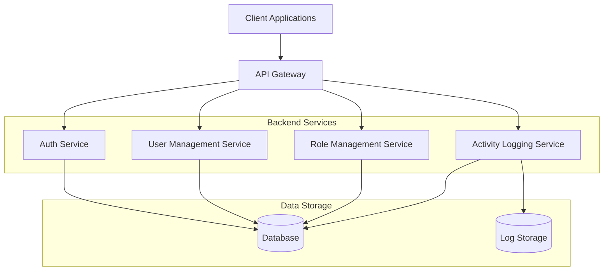
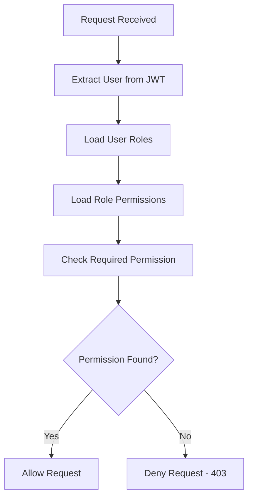

# Enterprise Role Management System Design

## 1. Overview

This document outlines the design for implementing enterprise features for the todo-planer application, including role-based access control (RBAC), user management, activity logging, custom workflows, and audit trails. These features will support enterprise usage scenarios requiring fine-grained access control, compliance, and governance.

### 1.1 Purpose
The enterprise feature set will enable administrators to:
- Define roles with specific permissions for fine-grained access control
- Manage user accounts, statuses, and role assignments through a dashboard
- Track user activities for compliance and auditing purposes
- Implement custom workflows with approval processes
- Maintain comprehensive audit trails for regulatory compliance

### 1.2 Scope
This design covers:
- Role and permission data models
- User management dashboard APIs
- Activity logging functionality
- Custom workflow engine with approval processes
- Audit trail implementation for compliance
- Integration with existing authentication and collaboration systems

### 1.3 Requirements Traceability

| Requirement ID | Feature | User Story Mapping |
|----------------|---------|-------------------|
| ENTERPRISE-001 | Role-based access control | 14.3.3.4 Manage user permissions |
| PERMISSION-MGMT-001 | Permission assignment | 14.3.3.4 Manage user permissions |
| ACTIVITY-001 | Activity logging | 14.3.3.4 Manage user permissions |
| ENTERPRISE-002 | Custom workflow engine | 14.3.3.5 Set up custom workflows |
| WORKFLOW-001 | Workflow definition | 14.3.3.5 Set up custom workflows |
| APPROVAL-001 | Audit trail functionality | 14.3.3.5 Set up custom workflows |

## 2. Architecture

### 2.1 System Components



### 2.2 Integration with Existing System

The role management system will integrate with the existing NestJS architecture:
- Extend the User entity with role associations
- Utilize existing JWT authentication for permission validation
- Leverage TypeORM for data persistence
- Follow existing module structure patterns

#### 2.2.1 Integration with Collaboration System

The role management system will enhance the existing collaboration features:
- Task sharing permissions will be controlled by user roles
- Team calendar access will be role-based
- Comment moderation capabilities based on roles
- Assignment permissions aligned with role hierarchy

#### 2.2.2 Integration with Existing Permission Model

The existing collaboration system uses a simple permission model (view, edit, manage) for task sharing. The new RBAC system will:
- Map existing permissions to new role-based permissions
- Provide backward compatibility during transition
- Enhance granularity of permission control
- Enable organization-wide permission policies

## 3. Data Models

### 3.1 Role Entity

```typescript
@Entity('roles')
export class Role {
  @PrimaryGeneratedColumn('uuid')
  id: string;

  @Column({ unique: true })
  name: string;

  @Column({ nullable: true })
  description: string;

  @Column({ default: true })
  isActive: boolean;

  @CreateDateColumn()
  createdAt: Date;

  @UpdateDateColumn()
  updatedAt: Date;

  @OneToMany(() => UserRole, userRole => userRole.role)
  userRoles: UserRole[];

  @OneToMany(() => RolePermission, rolePermission => rolePermission.role)
  rolePermissions: RolePermission[];
}
```

### 3.2 Permission Entity

```typescript
@Entity('permissions')
export class Permission {
  @PrimaryGeneratedColumn('uuid')
  id: string;

  @Column({ unique: true })
  name: string;

  @Column()
  description: string;

  @Column()
  resource: string;

  @Column()
  action: string;

  @CreateDateColumn()
  createdAt: Date;

  @UpdateDateColumn()
  updatedAt: Date;

  @OneToMany(() => RolePermission, rolePermission => rolePermission.permission)
  rolePermissions: RolePermission[];
}
```

### 3.3 UserRole Entity (Junction)

```typescript
@Entity('user_roles')
export class UserRole {
  @PrimaryGeneratedColumn('uuid')
  id: string;

  @Column()
  userId: string;

  @Column()
  roleId: string;

  @Column({ default: true })
  isActive: boolean;

  @CreateDateColumn()
  createdAt: Date;

  @UpdateDateColumn()
  updatedAt: Date;

  @ManyToOne(() => User, user => user.userRoles)
  @JoinColumn({ name: 'userId' })
  user: User;

  @ManyToOne(() => Role, role => role.userRoles)
  @JoinColumn({ name: 'roleId' })
  role: Role;
}
```

### 3.4 RolePermission Entity (Junction)

```typescript
@Entity('role_permissions')
export class RolePermission {
  @PrimaryGeneratedColumn('uuid')
  id: string;

  @Column()
  roleId: string;

  @Column()
  permissionId: string;

  @CreateDateColumn()
  createdAt: Date;

  @UpdateDateColumn()
  updatedAt: Date;

  @ManyToOne(() => Role, role => role.rolePermissions)
  @JoinColumn({ name: 'roleId' })
  role: Role;

  @ManyToOne(() => Permission, permission => permission.rolePermissions)
  @JoinColumn({ name: 'permissionId' })
  permission: Permission;
}
```

### 3.5 ActivityLog Entity

```typescript
@Entity('activity_logs')
export class ActivityLog {
  @PrimaryGeneratedColumn('uuid')
  id: string;

  @Column()
  userId: string;

  @Column()
  action: string;

  @Column({ type: 'jsonb' })
  metadata: any;

  @Column({ nullable: true })
  ipAddress: string;

  @Column({ nullable: true })
  userAgent: string;

  @CreateDateColumn()
  timestamp: Date;

  @ManyToOne(() => User, user => user.activityLogs)
  @JoinColumn({ name: 'userId' })
  user: User;
}
```

### 3.6 Updated User Entity

The existing User entity will be extended with:

```typescript
// Additional relationships in User entity
@OneToMany(() => UserRole, userRole => userRole.user)
userRoles: UserRole[];

@OneToMany(() => ActivityLog, activityLog => activityLog.user)
activityLogs: ActivityLog[];
```

### 3.7 Workflow Entity

```typescript
@Entity('workflows')
export class Workflow {
  @PrimaryGeneratedColumn('uuid')
  id: string;

  @Column()
  name: string;

  @Column({ nullable: true })
  description: string;

  @Column({ type: 'jsonb' })
  steps: WorkflowStep[];

  @Column({ default: true })
  isActive: boolean;

  @CreateDateColumn()
  createdAt: Date;

  @UpdateDateColumn()
  updatedAt: Date;

  @OneToMany(() => WorkflowInstance, workflowInstance => workflowInstance.workflow)
  workflowInstances: WorkflowInstance[];
}

class WorkflowStep {
  name: string;
  order: number;
  approvers: string[]; // Role IDs or User IDs
  requiredApprovals: number;
}
```

### 3.8 WorkflowInstance Entity

```typescript
@Entity('workflow_instances')
export class WorkflowInstance {
  @PrimaryGeneratedColumn('uuid')
  id: string;

  @Column()
  workflowId: string;

  @Column()
  resourceId: string; // ID of the resource being processed

  @Column()
  resourceType: string; // Type of resource (task, project, etc.)

  @Column()
  status: 'pending' | 'approved' | 'rejected' | 'completed';

  @Column({ type: 'jsonb' })
  currentStep: WorkflowStep;

  @Column({ type: 'jsonb' })
  approvalHistory: ApprovalRecord[];

  @CreateDateColumn()
  createdAt: Date;

  @UpdateDateColumn()
  updatedAt: Date;

  @ManyToOne(() => Workflow, workflow => workflow.workflowInstances)
  @JoinColumn({ name: 'workflowId' })
  workflow: Workflow;
}

class ApprovalRecord {
  userId: string;
  action: 'approved' | 'rejected';
  timestamp: Date;
  comments: string;
}
```

### 3.9 AuditTrail Entity

```typescript
@Entity('audit_trails')
export class AuditTrail {
  @PrimaryGeneratedColumn('uuid')
  id: string;

  @Column()
  userId: string;

  @Column()
  action: string;

  @Column()
  resourceType: string;

  @Column()
  resourceId: string;

  @Column({ type: 'jsonb', nullable: true })
  beforeState: any;

  @Column({ type: 'jsonb', nullable: true })
  afterState: any;

  @Column({ nullable: true })
  ipAddress: string;

  @CreateDateColumn()
  timestamp: Date;

  @ManyToOne(() => User, user => user.auditTrails)
  @JoinColumn({ name: 'userId' })
  user: User;
}
```

## 4. API Endpoints

### 4.1 Role Management Endpoints

#### Create Role
```
POST /roles
```
**Request Body:**
```json
{
  "name": "admin",
  "description": "Administrator with full access"
}
```

**Response:**
```json
{
  "success": true,
  "role": {
    "id": "uuid",
    "name": "admin",
    "description": "Administrator with full access",
    "isActive": true,
    "createdAt": "2023-01-01T00:00:00Z"
  }
}
```

#### Get All Roles
```
GET /roles
```

**Response:**
```json
{
  "success": true,
  "roles": [
    {
      "id": "uuid",
      "name": "admin",
      "description": "Administrator with full access",
      "isActive": true,
      "createdAt": "2023-01-01T00:00:00Z"
    }
  ]
}
```

#### Get Role by ID
```
GET /roles/:id
```

**Response:**
```json
{
  "success": true,
  "role": {
    "id": "uuid",
    "name": "admin",
    "description": "Administrator with full access",
    "isActive": true,
    "createdAt": "2023-01-01T00:00:00Z",
    "permissions": [
      {
        "id": "uuid",
        "name": "task:create",
        "description": "Create tasks",
        "resource": "task",
        "action": "create"
      }
    ]
  }
}
```

#### Update Role
```
PUT /roles/:id
```

**Request Body:**
```json
{
  "name": "administrator",
  "description": "Full system administrator"
}
```

**Response:**
```json
{
  "success": true,
  "role": {
    "id": "uuid",
    "name": "administrator",
    "description": "Full system administrator",
    "isActive": true,
    "createdAt": "2023-01-01T00:00:00Z",
    "updatedAt": "2023-01-02T00:00:00Z"
  }
}
```

#### Delete Role
```
DELETE /roles/:id
```

**Response:**
```json
{
  "success": true,
  "message": "Role deleted successfully"
}
```

### 4.2 Permission Management Endpoints

#### Create Permission
```
POST /permissions
```

**Request Body:**
```json
{
  "name": "task:create",
  "description": "Create tasks",
  "resource": "task",
  "action": "create"
}
```

#### Get All Permissions
```
GET /permissions
```

#### Assign Permission to Role
```
POST /roles/:roleId/permissions
```

**Request Body:**
```json
{
  "permissionId": "uuid"
}
```

#### Remove Permission from Role
```
DELETE /roles/:roleId/permissions/:permissionId
```

### 4.3 User Role Management Endpoints

#### Assign Role to User
```
POST /users/:userId/roles
```

**Request Body:**
```json
{
  "roleId": "uuid"
}
```

#### Get User Roles
```
GET /users/:userId/roles
```

#### Remove Role from User
```
DELETE /users/:userId/roles/:roleId
```

### 4.4 User Management Dashboard Endpoints

#### Get All Users (with pagination)
```
GET /users?limit=10&offset=0&status=active
```

#### Update User Status
```
PUT /users/:userId/status
```

**Request Body:**
```json
{
  "isActive": false
}
```

#### Update User Role
```
PUT /users/:userId/role
```

**Request Body:**
```json
{
  "roleId": "uuid"
}
```

### 4.5 Activity Logging Endpoints

#### Get User Activity Logs
```
GET /users/:userId/activity-logs?limit=50&offset=0
```

#### Get System Activity Logs
```
GET /activity-logs?limit=50&offset=0&userId=uuid&action=login
```

#### Export Activity Logs
```
GET /activity-logs/export?format=csv&startDate=2023-01-01&endDate=2023-01-31
```

### 4.6 Workflow Management Endpoints

#### Create Workflow
```
POST /workflows
```

#### Get All Workflows
```
GET /workflows
```

#### Get Workflow by ID
```
GET /workflows/:id
```

#### Update Workflow
```
PUT /workflows/:id
```

#### Delete Workflow
```
DELETE /workflows/:id
```

#### Start Workflow Instance
```
POST /workflows/:workflowId/instances
```

#### Get Workflow Instances
```
GET /workflows/:workflowId/instances
```

#### Approve Workflow Step
```
POST /workflow-instances/:instanceId/approve
```

#### Reject Workflow Step
```
POST /workflow-instances/:instanceId/reject
```

### 4.7 Audit Trail Endpoints

#### Get Audit Trail Entries
```
GET /audit-trail?resourceType=task&resourceId=uuid
```

#### Get User Audit Trail
```
GET /users/:userId/audit-trail
```

#### Export Audit Trail
```
GET /audit-trail/export?format=csv&startDate=2023-01-01&endDate=2023-01-31
```

## 5. Business Logic

### 5.1 Role-Based Access Control

#### Permission Checking Flow



#### Core Permission Definitions

| Resource | Actions | Description |
|----------|---------|-------------|
| task | create, read, update, delete | Task management operations |
| project | create, read, update, delete | Project management operations |
| user | create, read, update, delete | User management operations |
| role | create, read, update, delete | Role management operations |
| settings | read, update | System settings access |
| report | read, export | Report generation and export |

### 5.2 User Management Logic

#### User Status Management
- Active users can log in and access system
- Inactive users are blocked from authentication
- Deactivated users retain data but lose access

#### Role Assignment Rules
- Users can have multiple roles
- Role conflicts are resolved by permission union
- Role hierarchy is determined by explicit priority field

### 5.3 Activity Logging Logic

#### Logged Actions
- Authentication events (login, logout, failed attempts)
- User management actions (create, update, delete)
- Role and permission changes
- Data access and modification
- System configuration changes

#### Log Retention
- Default retention: 1 year
- Configurable retention policies
- Automatic archival for older logs

### 5.4 Workflow Logic

#### Workflow Execution
- Workflows are triggered by specific actions (task creation, project approval, etc.)
- Each step requires approval from specified roles/users
- Notifications are sent to approvers when action is required
- Workflow state is tracked and updated with each approval/rejection

#### Approval Process
- Approvers can approve or reject workflow steps
- Comments can be added during approval/rejection
- Required number of approvals must be met before proceeding
- Workflow history is maintained for auditing

### 5.5 Audit Trail Logic

#### Change Tracking
- All create, update, and delete operations are tracked
- Before and after states are captured for updates
- User identity and timestamp are recorded
- IP address and user agent are captured for security

#### Compliance Reporting
- Audit trails can be filtered by date range, user, or resource
- Export functionality for compliance reporting
- Data retention policies ensure compliance with regulations

## 6. Security Considerations

### 6.1 Role Validation
- All role assignments validated against existing roles
- Permission checks performed on every protected endpoint
- Admin actions require elevated privileges

### 6.2 Data Protection
- Activity logs encrypted at rest
- Role and permission data validated for integrity
- User data access restricted by role permissions

### 6.3 Audit Trail Integrity
- Immutable log entries with cryptographic hashing
- Regular integrity checks
- Tamper detection mechanisms

## 7. Performance Considerations

### 7.1 Caching Strategy
- Role and permission data cached in Redis
- Cache invalidation on role/permission updates
- User role assignments cached with short TTL

### 7.2 Database Optimization
- Indexes on frequently queried fields
- Pagination for large result sets
- Efficient join queries for role resolution

## 8. Testing Strategy

### 8.1 Unit Tests
- Role creation and validation
- Permission assignment and revocation
- User role management
- Activity logging functionality

### 8.2 Integration Tests
- Role-based access control enforcement
- User management API endpoints
- Activity log generation and retrieval
- Permission inheritance and conflict resolution

### 8.3 Security Tests
- Unauthorized access attempts
- Privilege escalation attempts
- Data exposure prevention
- Injection attack protection

### 8.4 Requirements-Based Test Cases

#### Role-Based Access Control
- [ ] Role creation
- [ ] Permission assignment
- [ ] Access control
- [ ] Activity logging
- [ ] User management

#### User Management Dashboard
- [ ] User listing
- [ ] Role management
- [ ] Status controls
- [ ] Deactivation
- [ ] Permission updates

#### Activity Logging
- [ ] Activity recording
- [ ] Log storage
- [ ] Search functionality
- [ ] Export options
- [ ] Retention policies

#### Custom Workflow Engine
- [ ] Workflow definition
- [ ] Approval steps
- [ ] Status tracking
- [ ] Notification system
- [ ] History tracking

#### Audit Trail Functionality
- [ ] Action tracking
- [ ] Change logging
- [ ] Audit reports
- [ ] Compliance features
- [ ] Data retention

### 8.5 Edge Case Testing

#### Role-Based Access Control Edge Cases
- [ ] Permission conflicts
- [ ] Role hierarchy
- [ ] Concurrent changes
- [ ] Performance impact
- [ ] Security issues
- [ ] Audit requirements

#### User Management Dashboard Edge Cases
- [ ] Large user bases
- [ ] Concurrent management
- [ ] Performance issues
- [ ] Security concerns
- [ ] Data privacy
- [ ] Access control

#### Activity Logging Edge Cases
- [ ] High volume logging
- [ ] Storage limitations
- [ ] Performance impact
- [ ] Privacy compliance
- [ ] Security concerns
- [ ] Log integrity

#### Custom Workflow Engine Edge Cases
- [ ] Complex workflows
- [ ] Concurrent workflows
- [ ] Performance issues
- [ ] Error handling
- [ ] Security concerns
- [ ] Integration issues

#### Audit Trail Functionality Edge Cases
- [ ] High volume tracking
- [ ] Storage limitations
- [ ] Performance impact
- [ ] Privacy compliance
- [ ] Security concerns
- [ ] Data integrity

## 9. Implementation Roadmap

### Phase 1: Core Role Management (Week 1-2)
- [ ] Implement Role and Permission entities
- [ ] Create Role Management API endpoints
- [ ] Implement Permission Management API endpoints
- [ ] Add role assignment to User entity

### Phase 2: User Management Dashboard (Week 3)
- [ ] Implement User Management API endpoints
- [ ] Create activity logging service
- [ ] Implement user status management
- [ ] Add user role assignment APIs

### Phase 3: Activity Logging and Audit (Week 4)
- [ ] Implement ActivityLog entity
- [ ] Create activity logging middleware
- [ ] Implement log retrieval APIs
- [ ] Add log export functionality

### Phase 4: Workflow Engine (Week 5)
- [ ] Implement Workflow and WorkflowInstance entities
- [ ] Create workflow management APIs
- [ ] Implement workflow execution logic
- [ ] Add workflow notification system

### Phase 5: Audit Trail and Security (Week 6)
- [ ] Implement AuditTrail entity
- [ ] Create audit trail APIs
- [ ] Implement permission checking guards
- [ ] Add caching for role/permission data
- [ ] Implement security testing
- [ ] Performance optimization and testing

## 10. Database Migrations

### Migration 1: Create Role Management Tables
- roles table
- permissions table
- user_roles table
- role_permissions table

### Migration 2: Create Activity Logging Table
- activity_logs table

### Migration 3: Add Indexes and Constraints
- Foreign key constraints
- Performance indexes
- Unique constraints

### Migration 4: Create Workflow Tables
- workflows table
- workflow_instances table

### Migration 5: Create Audit Trail Table
- audit_trails table