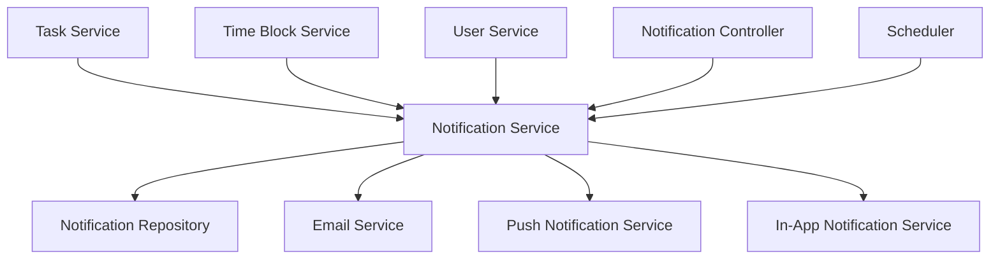
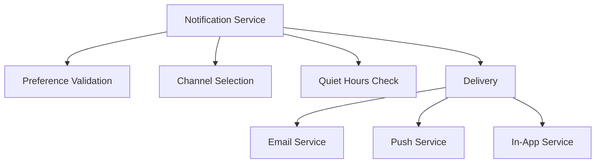

# Notification System Design Document

## 1. Overview

The Notification System is designed to provide users with timely reminders and notifications for tasks, time blocks, and other important events within the todo-planer application. This system will support multiple notification channels (email, push, in-app) with customizable preferences, including quiet hours functionality.

### 1.1 Purpose
To implement a comprehensive notification system that allows users to:
- Receive reminders before task due dates
- Get notifications for upcoming time blocks
- Customize notification preferences and channels
- Configure quiet hours to avoid notifications during specific times
- Manage notification settings through an intuitive UI

### 1.2 Scope
The notification system will include:
- Reminder configuration for tasks and time blocks
- Multi-channel notification delivery (email, push, in-app)
- Notification preferences management
- Quiet hours functionality
- Notification templates for different event types

### 1.3 Key Features
- **Task-based reminders** with configurable timing (at time, 5 min before, 1 hour before, 1 day before)
- **Recurring task reminders** for daily, weekly, and monthly repeating tasks
- **Time block alerts** with start and end time notifications
- **Deadline warnings** with escalating alerts as due dates approach
- **Productivity goal reminders** for habit tracking and goal maintenance
- **Calendar integration alerts** for external calendar events
- **Smart snooze functionality** with intelligent rescheduling options
- **Custom reminder rules** based on task properties and user preferences
- **Multi-channel delivery** (email, push, in-app) for critical alerts
- **Reminder history tracking** with user interaction logging

## 2. Architecture

### 2.1 System Components



### 2.2 Module Structure
The notification system will be implemented as a new module within the existing NestJS application structure:
```
src/
├── notifications/
│   ├── dto/
│   │   ├── create-notification.dto.ts
│   │   ├── update-notification.dto.ts
│   │   ├── notification-preference.dto.ts
│   │   └── reminder.dto.ts
│   ├── entities/
│   │   ├── notification.entity.ts
│   │   └── notification-preference.entity.ts
│   ├── services/
│   │   ├── notification.service.ts
│   │   ├── email.service.ts
│   │   ├── push.service.ts
│   │   └── notification-scheduler.service.ts
│   ├── controllers/
│   │   └── notification.controller.ts
│   ├── exceptions/
│   │   └── notification.exception.ts
│   └── notifications.module.ts
```

### 2.3 Module Integration

The NotificationsModule will integrate with existing modules:

```typescript
import { Module } from '@nestjs/common';
import { TypeOrmModule } from '@nestjs/typeorm';
import { Notification } from './entities/notification.entity';
import { NotificationPreference } from './entities/notification-preference.entity';
import { Reminder } from './entities/reminder.entity';
import { NotificationService } from './services/notification.service';
import { EmailService } from './services/email.service';
import { PushService } from './services/push.service';
import { NotificationSchedulerService } from './services/notification-scheduler.service';
import { NotificationController } from './controllers/notification.controller';
import { TasksModule } from '../tasks/tasks.module';
import { TimeBlocksModule } from '../time-blocks/time-blocks.module';
import { UsersModule } from '../users/users.module';

@Module({
  imports: [
    TypeOrmModule.forFeature([Notification, NotificationPreference, Reminder]),
    TasksModule,
    TimeBlocksModule,
    UsersModule,
  ],
  controllers: [NotificationController],
  providers: [
    NotificationService,
    EmailService,
    PushService,
    NotificationSchedulerService,
  ],
  exports: [NotificationService],
})
export class NotificationsModule {}
```

### 2.4 AppModule Integration

The NotificationsModule will be added to the main AppModule:

```typescript
// In app.module.ts
@Module({
  imports: [
    // ... other modules
    NotificationsModule,
  ],
  // ... controllers and providers
})
export class AppModule {}
```

## 3. API Endpoints Reference

### 3.1 Notification Endpoints

| Endpoint | Method | Description | Authentication |
|----------|--------|-------------|----------------|
| `/notifications` | GET | Get all notifications for user with filtering | JWT |
| `/notifications/:id` | GET | Get specific notification details | JWT |
| `/notifications/:id` | PUT | Mark notification as read | JWT |
| `/notifications/:id` | DELETE | Dismiss notification | JWT |
| `/notifications/bulk` | PUT | Mark multiple notifications as read | JWT |
| `/notifications/bulk` | DELETE | Dismiss multiple notifications | JWT |
| `/notifications/unread-count` | GET | Get count of unread notifications | JWT |

### 3.2 Reminder Endpoints

| Endpoint | Method | Description | Authentication |
|----------|--------|-------------|----------------|
| `/reminders` | GET | Get all reminders for user with filtering | JWT |
| `/reminders` | POST | Create new reminder for task | JWT |
| `/reminders/:id` | GET | Get specific reminder details | JWT |
| `/reminders/:id` | PUT | Update reminder settings | JWT |
| `/reminders/:id` | DELETE | Delete reminder | JWT |
| `/reminders/bulk` | POST | Bulk create reminders for tasks | JWT |
| `/reminders/bulk` | PUT | Bulk update reminders | JWT |
| `/reminders/bulk` | DELETE | Bulk delete reminders | JWT |

### 3.3 Notification Preferences Endpoints

| Endpoint | Method | Description | Authentication |
|----------|--------|-------------|----------------|
| `/notification-preferences` | GET | Get user notification preferences | JWT |
| `/notification-preferences` | PUT | Update user notification preferences | JWT |

### 3.4 Request/Response Schema

#### CreateNotificationDto
```typescript
import { IsString, IsEnum, IsInt, Min, Max, IsBoolean, IsOptional, IsUUID } from 'class-validator';

class CreateNotificationDto {
  @IsString()
  title: string;

  @IsString()
  message: string;

  @IsEnum(['task_reminder', 'time_block_alert', 'deadline_warning', 'productivity_summary', 'system_alert'])
  type: 'task_reminder' | 'time_block_alert' | 'deadline_warning' | 'productivity_summary' | 'system_alert';

  @IsEnum(['email', 'push', 'in_app'])
  channel: 'email' | 'push' | 'in_app';

  @IsInt()
  @Min(0)
  @Max(4)
  priority: number;

  @IsUUID()
  relatedEntityId: string;

  @IsEnum(['task', 'time_block', 'project'])
  relatedEntityType: 'task' | 'time_block' | 'project';
}
```

#### UpdateNotificationDto
```typescript
import { IsBoolean, IsOptional } from 'class-validator';

class UpdateNotificationDto {
  @IsOptional()
  @IsBoolean()
  read?: boolean;

  @IsOptional()
  @IsBoolean()
  dismissed?: boolean;
}
```

#### NotificationPreferenceDto
```typescript
import { IsBoolean, IsOptional, IsString, Matches } from 'class-validator';

class NotificationPreferenceDto {
  @IsOptional()
  @IsBoolean()
  emailEnabled?: boolean;

  @IsOptional()
  @IsBoolean()
  pushEnabled?: boolean;

  @IsOptional()
  @IsBoolean()
  inAppEnabled?: boolean;

  @IsOptional()
  @IsBoolean()
  quietHoursEnabled?: boolean;

  @IsOptional()
  @Matches(/^([0-1]?[0-9]|2[0-3]):[0-5][0-9]$/, { message: 'Invalid time format. Use HH:MM' })
  quietHoursStart?: string;

  @IsOptional()
  @Matches(/^([0-1]?[0-9]|2[0-3]):[0-5][0-9]$/, { message: 'Invalid time format. Use HH:MM' })
  quietHoursEnd?: string;

  @IsOptional()
  @IsBoolean()
  taskRemindersEnabled?: boolean;

  @IsOptional()
  @IsBoolean()
  timeBlockAlertsEnabled?: boolean;

  @IsOptional()
  @IsBoolean()
  deadlineWarningsEnabled?: boolean;

  @IsOptional()
  @IsBoolean()
  productivitySummariesEnabled?: boolean;

  @IsOptional()
  @IsBoolean()
  systemAlertsEnabled?: boolean;
}
```

#### CreateReminderDto
```typescript
import { IsUUID, IsEnum, IsBoolean } from 'class-validator';

class CreateReminderDto {
  @IsUUID()
  taskId: string;

  @IsEnum(['at_time', '5_min', '1_hour', '1_day'])
  timeBefore: 'at_time' | '5_min' | '1_hour' | '1_day';

  @IsBoolean()
  enabled: boolean;
}
```

#### UpdateReminderDto
```typescript
import { IsEnum, IsBoolean, IsOptional } from 'class-validator';

class UpdateReminderDto {
  @IsOptional()
  @IsEnum(['at_time', '5_min', '1_hour', '1_day'])
  timeBefore?: 'at_time' | '5_min' | '1_hour' | '1_day';

  @IsOptional()
  @IsBoolean()
  enabled?: boolean;
}
```

### 3.5 Authentication Requirements

All notification endpoints require JWT authentication. The system will use the existing JWT authentication infrastructure from the auth module:

- JWT tokens must be provided in the Authorization header
- Tokens are validated using the JwtAuthGuard
- User context is extracted from the token for authorization
- Rate limiting will be applied to prevent abuse
- Access control ensures users can only access their own notifications

## 4. Data Models & ORM Mapping

### 4.1 Notification Entity

```typescript
import { Entity, PrimaryGeneratedColumn, Column, CreateDateColumn, UpdateDateColumn, ManyToOne, JoinColumn } from 'typeorm';
import { User } from '../users/user.entity';

@Entity('notifications')
export class Notification {
  @PrimaryGeneratedColumn('uuid')
  id: string;

  @Column({ type: 'uuid' })
  userId: string;

  @ManyToOne(() => User, user => user.tasks, { onDelete: 'CASCADE' })
  @JoinColumn({ name: 'userId' })
  user: User;

  @Column()
  title: string;

  @Column({ type: 'text' })
  message: string;

  @Column({ 
    type: 'enum', 
    enum: ['task_reminder', 'time_block_alert', 'deadline_warning', 'productivity_summary', 'system_alert'] 
  })
  type: 'task_reminder' | 'time_block_alert' | 'deadline_warning' | 'productivity_summary' | 'system_alert';

  @Column({ 
    type: 'enum', 
    enum: ['email', 'push', 'in_app'] 
  })
  channel: 'email' | 'push' | 'in_app';

  @Column({ type: 'int', default: 2 })
  priority: number; // 0-4 (0=none, 1=low, 2=medium, 3=high, 4=urgent)

  @Column({ default: false })
  read: boolean;

  @Column({ default: false })
  dismissed: boolean;

  @Column({ type: 'timestamp', nullable: true })
  sentAt: Date;

  @Column({ type: 'timestamp', nullable: true })
  readAt: Date;

  @Column({ type: 'uuid', nullable: true })
  relatedEntityId: string; // ID of related task, time block, etc.

  @Column({ 
    type: 'enum', 
    enum: ['task', 'time_block', 'project'],
    nullable: true
  })
  relatedEntityType: 'task' | 'time_block' | 'project';

  @CreateDateColumn()
  createdAt: Date;

  @UpdateDateColumn()
  updatedAt: Date;
}
```

### 4.2 NotificationPreference Entity

```typescript
import { Entity, PrimaryGeneratedColumn, Column, CreateDateColumn, UpdateDateColumn, OneToOne, JoinColumn } from 'typeorm';
import { User } from '../users/user.entity';

@Entity('notification_preferences')
export class NotificationPreference {
  @PrimaryGeneratedColumn('uuid')
  id: string;

  @Column({ type: 'uuid' })
  userId: string;

  @OneToOne(() => User)
  @JoinColumn({ name: 'userId' })
  user: User;

  @Column({ default: true })
  emailEnabled: boolean;

  @Column({ default: true })
  pushEnabled: boolean;

  @Column({ default: true })
  inAppEnabled: boolean;

  @Column({ type: 'time', nullable: true })
  quietHoursStart: string; // HH:MM format

  @Column({ type: 'time', nullable: true })
  quietHoursEnd: string; // HH:MM format

  @Column({ default: false })
  quietHoursEnabled: boolean;

  @Column({ default: true })
  taskRemindersEnabled: boolean;

  @Column({ default: true })
  timeBlockAlertsEnabled: boolean;

  @Column({ default: true })
  deadlineWarningsEnabled: boolean;

  @Column({ default: true })
  productivitySummariesEnabled: boolean;

  @Column({ default: true })
  systemAlertsEnabled: boolean;

  @CreateDateColumn()
  createdAt: Date;

  @UpdateDateColumn()
  updatedAt: Date;
}
```

### 4.3 Reminder Entity

```typescript
import { Entity, PrimaryGeneratedColumn, Column, CreateDateColumn, UpdateDateColumn, ManyToOne, JoinColumn } from 'typeorm';
import { User } from '../users/user.entity';
import { Task } from '../tasks/entities/task.entity';

@Entity('reminders')
export class Reminder {
  @PrimaryGeneratedColumn('uuid')
  id: string;

  @Column({ type: 'uuid' })
  userId: string;

  @ManyToOne(() => User, user => user.tasks, { onDelete: 'CASCADE' })
  @JoinColumn({ name: 'userId' })
  user: User;

  @Column({ type: 'uuid' })
  taskId: string;

  @ManyToOne(() => Task, task => task.reminders, { onDelete: 'CASCADE' })
  @JoinColumn({ name: 'taskId' })
  task: Task;

  @Column({ 
    type: 'enum', 
    enum: ['at_time', '5_min', '1_hour', '1_day'] 
  })
  timeBefore: 'at_time' | '5_min' | '1_hour' | '1_day'; // When to send reminder

  @Column({ default: true })
  enabled: boolean;

  @Column({ type: 'timestamp', nullable: true })
  lastSentAt: Date;

  @CreateDateColumn()
  createdAt: Date;

  @UpdateDateColumn()
  updatedAt: Date;
}
```

## 5. Business Logic Layer

### 5.1 Notification Service Architecture

The notification service will be responsible for:
1. Creating and managing notifications
2. Sending notifications through appropriate channels
3. Handling notification preferences
4. Managing reminder scheduling



### 5.2 Notification Scheduler

A background scheduler will be implemented to:
1. Check for upcoming tasks and time blocks
2. Generate reminders based on user preferences
3. Send notifications at appropriate times
4. Handle retry mechanisms for failed deliveries

The scheduler will run at regular intervals (e.g., every 5 minutes) to check for upcoming events that require notifications.

#### Scheduler Implementation

```typescript
import { Injectable, Logger } from '@nestjs/common';
import { Cron, CronExpression } from '@nestjs/schedule';
import { NotificationService } from './notification.service';

@Injectable()
export class NotificationSchedulerService {
  private readonly logger = new Logger(NotificationSchedulerService.name);

  constructor(
    private readonly notificationService: NotificationService,
  ) {}

  @Cron(CronExpression.EVERY_5_MINUTES)
  async handleUpcomingReminders() {
    this.logger.debug('Checking for upcoming reminders');
    try {
      await this.notificationService.processUpcomingReminders();
    } catch (error) {
      this.logger.error('Failed to process upcoming reminders', error.stack);
    }
  }

  @Cron(CronExpression.EVERY_HOUR)
  async handleDailySummaries() {
    this.logger.debug('Generating daily productivity summaries');
    try {
      await this.notificationService.generateDailySummaries();
    } catch (error) {
      this.logger.error('Failed to generate daily summaries', error.stack);
    }
  }
}
```

#### Scheduler Logic

1. **Task Reminder Processing**:
   - Query tasks with due dates within the next reminder window
   - Check user preferences for reminder settings
   - Generate notifications for enabled reminder types
   - Skip users with quiet hours active

2. **Time Block Alert Processing**:
   - Query time blocks starting within the next 10 minutes
   - Generate start alerts based on user preferences
   - Query time blocks ending within the next 10 minutes
   - Generate end alerts based on user preferences

3. **Deadline Warning Processing**:
   - Query overdue tasks that haven't been notified about
   - Generate escalating warnings based on overdue duration
   - Apply user preference filters

4. **Retry Mechanism**:
   - Track failed notification deliveries
   - Implement exponential backoff for retries
   - Limit retry attempts to prevent endless loops

### 5.3 Reminder Configuration

Users will be able to configure reminders for tasks with the following options:
- Time before due date: at time, 5 minutes before, 1 hour before, 1 day before
- Channel selection: email, push, in-app
- Snooze functionality with intelligent rescheduling

### 5.4 Notification Preferences Management

Users can customize their notification experience through:
- Channel preferences (email, push, in-app)
- Reminder timing configuration
- Priority filters for notifications
- Quiet hours settings
- Sound settings (for push notifications)
- Notification history tracking

### 5.5 Quiet Hours Implementation

The quiet hours functionality will:
1. Check user preferences before sending any notification
2. Compare current time with quiet hours settings
3. Suppress notifications during quiet hours unless overridden
4. Handle cross-timezone scenarios
5. Support edge cases like overlapping quiet periods

### 5.6 Email Notification Service

The email notification service will:
1. Render email templates with dynamic content
2. Handle email delivery with retry mechanisms
3. Support mobile-responsive email designs
4. Manage email branding elements
5. Handle special character and localization issues

#### Email Templates

The system will include the following email templates:

1. **Task Reminder Template**
   - Task title and description
   - Due date and priority
   - Action links to view task
   - Snooze options

2. **Time Block Alert Template**
   - Time block title and description
   - Start/end times
   - Calendar link
   - Reschedule options

3. **Deadline Warning Template**
   - Overdue task information
   - Duration overdue
   - Priority escalation
   - Action links

4. **Productivity Summary Template**
   - Daily/weekly task completion statistics
   - Time block utilization
   - Productivity insights
   - Goal progress

#### Email Service Implementation

```typescript
import { Injectable, Logger } from '@nestjs/common';
import { MailerService } from '@nestjs-modules/mailer';
import { Notification } from '../entities/notification.entity';

@Injectable()
export class EmailService {
  private readonly logger = new Logger(EmailService.name);

  constructor(
    private readonly mailerService: MailerService,
  ) {}

  async sendNotificationEmail(notification: Notification): Promise<void> {
    try {
      await this.mailerService.sendMail({
        to: notification.user.email,
        subject: notification.title,
        template: this.getTemplateForType(notification.type),
        context: {
          title: notification.title,
          message: notification.message,
          taskId: notification.relatedEntityId,
          // Additional context based on notification type
        },
      });
      this.logger.debug(`Email notification sent to ${notification.user.email}`);
    } catch (error) {
      this.logger.error(`Failed to send email notification to ${notification.user.email}`, error.stack);
      throw new NotificationDeliveryException('Email delivery failed');
    }
  }

  private getTemplateForType(type: string): string {
    const templateMap = {
      'task_reminder': 'task-reminder',
      'time_block_alert': 'time-block-alert',
      'deadline_warning': 'deadline-warning',
      'productivity_summary': 'productivity-summary',
      'system_alert': 'system-alert',
    };
    return templateMap[type] || 'default';
  }
}
```

### 5.7 In-App Notification Service

The in-app notification service will:
1. Store notifications in the database for retrieval
2. Manage unread counts
3. Support real-time updates through WebSockets
4. Handle high notification volume scenarios
5. Provide dismissal and snooze functionality

#### In-App Service Implementation

```typescript
import { Injectable, Logger } from '@nestjs/common';
import { InjectRepository } from '@nestjs/typeorm';
import { Repository } from 'typeorm';
import { Notification } from '../entities/notification.entity';

@Injectable()
export class InAppNotificationService {
  private readonly logger = new Logger(InAppNotificationService.name);

  constructor(
    @InjectRepository(Notification)
    private notificationRepository: Repository<Notification>,
  ) {}

  async getUnreadCount(userId: string): Promise<number> {
    return this.notificationRepository.count({
      where: { userId, read: false, dismissed: false },
    });
  }

  async markAsRead(notificationId: string, userId: string): Promise<Notification> {
    await this.notificationRepository.update(
      { id: notificationId, userId },
      { read: true, readAt: new Date() },
    );
    return this.notificationRepository.findOne({
      where: { id: notificationId, userId },
    });
  }

  async dismiss(notificationId: string, userId: string): Promise<void> {
    await this.notificationRepository.update(
      { id: notificationId, userId },
      { dismissed: true },
    );
  }
}
```

## 6. Middleware & Interceptors

### 6.1 Notification Middleware
- Request logging for notification endpoints
- Rate limiting for notification operations
- User context injection for notification operations

### 6.2 Notification Interceptors
- Response transformation for notification data
- Caching for frequently accessed notification data
- Error handling and logging for notification operations

### 6.3 Exception Handling

Custom exceptions will be implemented for notification-specific error cases:

```typescript
class NotificationException extends HttpException {
  constructor(message: string, statusCode: number) {
    super(message, statusCode);
  }
}

class NotificationDeliveryException extends NotificationException {
  constructor(message: string) {
    super(`Notification delivery failed: ${message}`, 500);
  }
}

class InvalidNotificationPreferenceException extends NotificationException {
  constructor(message: string) {
    super(`Invalid notification preference: ${message}`, 400);
  }
}

class ReminderConfigurationException extends NotificationException {
  constructor(message: string) {
    super(`Reminder configuration error: ${message}`, 400);
  }
}
```

Common error scenarios:
- Failed notification delivery (email bounces, push service errors)
- Invalid notification preferences (malformed time values, conflicting settings)
- Reminder configuration errors (invalid time before values, non-existent tasks)
- Quiet hours validation errors (start time after end time)
- Rate limiting exceeded for notification operations

## 7. Testing Strategy

### 7.1 Unit Testing
- Notification service logic
- Email service functionality
- Push notification service
- Preference validation
- Quiet hours logic
- Reminder scheduling

**Test Cases:**
- Reminder time selection (at due date, 5 min, 1 hour, 1 day)
- Channel selection (email, push, in-app)
- Overdue reminder handling
- Reminder detail inclusion
- Snooze/dismiss functionality
- Quiet hours configuration
- Notification suppression
- Time-based activation
- Override options
- User feedback
- Cross-timezone handling

### 7.2 Integration Testing
- API endpoint testing
- Database operations for notifications
- Cross-service communication
- Notification delivery workflows

**Test Cases:**
- Email delivery
- Push notification delivery
- In-app notification display
- Delivery timing accuracy
- Retry mechanisms
- Delivery confirmation

### 7.3 End-to-End Testing
- Complete notification workflows
- User preference management
- Reminder configuration and delivery
- Quiet hours functionality
- Multi-channel notification delivery

**Test Cases:**
- Type enable/disable controls
- Channel selection options
- Quiet hours configuration
- Priority filter settings
- Preference persistence
- Immediate application

### 7.4 Edge Case Testing

**Corner/Edge Cases for Reminders:**
- Past due date reminders
- Multiple reminders for same task
- Time zone impact on reminders
- System time changes
- Concurrent reminder settings
- Invalid reminder times

**Corner/Edge Cases for Notification Delivery:**
- Delivery failures
- Network interruptions
- High volume notifications
- Duplicate notifications
- Delivery during maintenance
- Invalid delivery addresses

**Corner/Edge Cases for Email Templates:**
- Template rendering errors
- Large content volumes
- Special character handling
- Image loading failures
- Email client compatibility
- Localization issues

**Corner/Edge Cases for In-App Notifications:**
- High notification volume
- Mixed notification types
- Network delays
- Panel overflow
- Concurrent notifications
- Accessibility compliance

**Corner/Edge Cases for Notification Preferences:**
- Conflicting preferences
- Preference storage failures
- Concurrent preference changes
- Edge case time ranges
- Default preference handling
- Browser compatibility

**Corner/Edge Cases for Quiet Hours:**
- Time zone transitions
- System time changes
- Overlapping quiet periods
- Edge case times
- Concurrent setting changes
- Override abuse

## 8. Implementation Plan

### 8.1 Phase 1: Core Notification Infrastructure
- Notification entity and repository
- Basic notification service
- Notification controller with CRUD operations
- Initial notification preferences

**Requirements:** NOTIF-003, NOTIF-004
**Deliverables:**
- Notification entity with TypeORM decorators
- Notification repository
- Notification service with basic CRUD operations
- Notification controller with REST endpoints
- Basic notification preference entity

### 8.2 Phase 2: Multi-Channel Delivery
- Email notification service
- In-app notification display
- Push notification service (stub for now)
- Notification templates

**Requirements:** NOTIF-003, EMAIL-001, CHANNEL-001
**Deliverables:**
- Email service with template rendering
- In-app notification display functionality
- Push notification service stub
- Email templates for different notification types
- Template rendering service

### 8.3 Phase 3: Reminder System
- Reminder entity and repository
- Reminder scheduling service
- Task-based reminder generation
- Time block alert functionality

**Requirements:** NOTIF-003, REMIND-001
**Deliverables:**
- Reminder entity with TypeORM decorators
- Reminder repository
- Reminder scheduling service
- Task-based reminder generation logic
- Time block alert functionality

### 8.4 Phase 4: Advanced Features
- Quiet hours functionality
- Notification preferences UI backend
- Snooze/dismiss functionality
- Notification history tracking

**Requirements:** NOTIF-005, PREF-001, QUIET-001
**Deliverables:**
- Quiet hours implementation
- Notification preferences management API
- Snooze/dismiss functionality
- Notification history tracking

### 8.5 Phase 5: Optimization and Testing
- Performance optimization
- Comprehensive testing
- Edge case handling
- Documentation and examples

**Deliverables:**
- Performance optimizations for high-volume notifications
- Comprehensive test suite covering all requirements
- Edge case handling for all notification types
- API documentation and usage examples