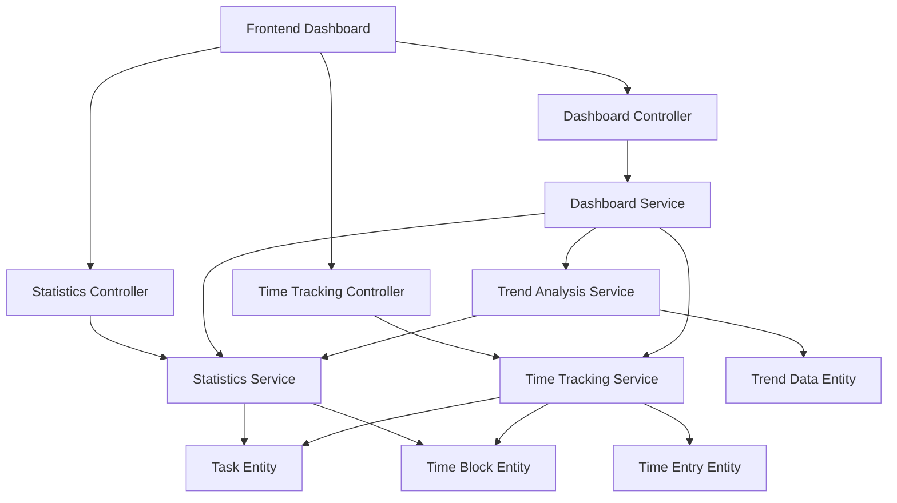

# Productivity Tracking Engine Design Document

## 1. Overview

The Productivity Tracking Engine is a new module for the todo-planer application that provides comprehensive analytics and insights into user productivity patterns. This engine will calculate statistics on task completion, track time spent on tasks, analyze productivity trends over time, and provide visual dashboards for users to monitor their performance.

This design addresses the following user stories from the requirements:
- 14.2.4.1 View statistics on completed tasks
- 14.2.4.2 Track time spent on tasks
- 14.2.4.3 See productivity trends over time
- 14.2.4 Productivity Tracking (Dashboard UI)

### 1.1 Purpose

The purpose of this module is to:
- Calculate and display statistics on task completion rates (daily, weekly, monthly)
- Track time spent on tasks through manual and automatic time tracking
- Analyze productivity trends over different time periods
- Provide visual dashboards with customizable widgets
- Generate insights to help users optimize their productivity
- Support real-time updates of statistics

### 1.2 Scope

This module will include:
- Backend services for statistics calculation and data aggregation
- API endpoints for retrieving productivity data
- Time tracking functionality with manual and automatic modes
- Trend analysis algorithms
- Data visualization components for the frontend
- Dashboard UI with customizable widgets
- Real-time update capabilities using WebSockets
- Data export functionality for reports

## 2. Architecture

The Productivity Tracking Engine will follow the existing modular architecture pattern of the todo-planer application, with a dedicated module containing controllers, services, and entities.

### 2.1 Module Structure

```
src/productivity-tracking/
├── controllers/
│   ├── statistics.controller.ts
│   ├── time-tracking.controller.ts
│   └── dashboard.controller.ts
├── services/
│   ├── statistics.service.ts
│   ├── time-tracking.service.ts
│   ├── trend-analysis.service.ts
│   └── dashboard.service.ts
├── entities/
│   ├── productivity-statistic.entity.ts
│   ├── time-entry.entity.ts
│   ├── trend-data.entity.ts
│   └── dashboard-widget.entity.ts
├── dto/
│   ├── create-statistic.dto.ts
│   ├── time-entry.dto.ts
│   ├── trend-filter.dto.ts
│   └── dashboard-config.dto.ts
├── productivity-tracking.module.ts
└── exceptions/
    └── productivity.exception.ts
```

### 2.2 Component Interaction



## 3. Data Models & ORM Mapping

### 3.1 Productivity Statistic Entity

```typescript
@Entity('productivity_statistics')
export class ProductivityStatistic {
  @PrimaryGeneratedColumn('uuid')
  id: string;

  @Column()
  userId: string;

  @Column({ type: 'date' })
  date: Date;

  @Column({ type: 'int' })
  tasksCompleted: number;

  @Column({ type: 'int' })
  tasksCreated: number;

  @Column({ type: 'int' })
  overdueTasks: number;

  @Column({ type: 'float' })
  completionRate: number;

  @Column({ type: 'bigint' })
  totalTimeTracked: number; // in seconds

  @Column({ type: 'float', nullable: true })
  averageCompletionTime: number; // in hours

  @CreateDateColumn()
  createdAt: Date;

  @UpdateDateColumn()
  updatedAt: Date;

  @ManyToOne(() => User, user => user.productivityStatistics, { onDelete: 'CASCADE' })
  @JoinColumn({ name: 'userId' })
  user: User;
}
```

### 3.2 Time Entry Entity

```typescript
@Entity('time_entries')
export class TimeEntry {
  @PrimaryGeneratedColumn('uuid')
  id: string;

  @Column()
  userId: string;

  @Column({ nullable: true })
  taskId: string;

  @Column({ type: 'timestamp' })
  startTime: Date;

  @Column({ type: 'timestamp', nullable: true })
  endTime: Date;

  @Column({ type: 'bigint', nullable: true })
  duration: number; // in seconds

  @Column({ default: false })
  isManual: boolean;

  @Column({ type: 'text', nullable: true })
  description: string;

  @CreateDateColumn()
  createdAt: Date;

  @UpdateDateColumn()
  updatedAt: Date;

  @ManyToOne(() => User, user => user.timeEntries, { onDelete: 'CASCADE' })
  @JoinColumn({ name: 'userId' })
  user: User;

  @ManyToOne(() => Task, task => task.timeEntries, { nullable: true, onDelete: 'SET NULL' })
  @JoinColumn({ name: 'taskId' })
  task: Task;
}
```

### 3.3 Trend Data Entity

```typescript
@Entity('trend_data')
export class TrendData {
  @PrimaryGeneratedColumn('uuid')
  id: string;

  @Column()
  userId: string;

  @Column({ type: 'date' })
  startDate: Date;

  @Column({ type: 'date' })
  endDate: Date;

  @Column({ type: 'varchar' })
  period: 'daily' | 'weekly' | 'monthly';

  @Column({ type: 'jsonb' })
  data: any; // JSON data containing trend metrics

  @CreateDateColumn()
  createdAt: Date;

  @ManyToOne(() => User, user => user.trendData, { onDelete: 'CASCADE' })
  @JoinColumn({ name: 'userId' })
  user: User;
}
```

### 3.4 Dashboard Widget Entity

```typescript
@Entity('dashboard_widgets')
export class DashboardWidget {
  @PrimaryGeneratedColumn('uuid')
  id: string;

  @Column()
  userId: string;

  @Column()
  widgetType: string;

  @Column({ type: 'int' })
  position: number;

  @Column({ type: 'jsonb' })
  config: any; // JSON configuration for the widget

  @Column({ default: true })
  isVisible: boolean;

  @CreateDateColumn()
  createdAt: Date;

  @UpdateDateColumn()
  updatedAt: Date;

  @ManyToOne(() => User, user => user.dashboardWidgets, { onDelete: 'CASCADE' })
  @JoinColumn({ name: 'userId' })
  user: User;
}
```

## 4. API Endpoints Reference

### 4.1 Statistics Endpoints

#### GET /productivity/statistics
Retrieve productivity statistics for a given date range

**Request:**
```
Query Parameters:
- startDate: string (ISO 8601 date)
- endDate: string (ISO 8601 date)
- userId: string (optional, defaults to current user)
```

**Response:**
```json
{
  "dailyStats": [
    {
      "date": "2023-06-01",
      "tasksCompleted": 5,
      "tasksCreated": 8,
      "overdueTasks": 2,
      "completionRate": 0.625,
      "totalTimeTracked": 7200,
      "averageCompletionTime": 1.2
    }
  ],
  "summary": {
    "totalTasksCompleted": 25,
    "totalTasksCreated": 35,
    "avgCompletionRate": 0.714,
    "totalTimeTracked": 36000
  }
}
```

#### GET /productivity/statistics/:date
Retrieve productivity statistics for a specific date

**Response:**
```json
{
  "date": "2023-06-01",
  "tasksCompleted": 5,
  "tasksCreated": 8,
  "overdueTasks": 2,
  "completionRate": 0.625,
  "totalTimeTracked": 7200,
  "averageCompletionTime": 1.2
}
```

### 4.2 Time Tracking Endpoints

#### POST /productivity/time-entries
Create a new time entry

**Request:**
```json
{
  "taskId": "task-uuid",
  "startTime": "2023-06-01T09:00:00Z",
  "endTime": "2023-06-01T11:00:00Z",
  "isManual": true,
  "description": "Working on project proposal"
}
```

**Response:**
```json
{
  "id": "time-entry-uuid",
  "taskId": "task-uuid",
  "startTime": "2023-06-01T09:00:00Z",
  "endTime": "2023-06-01T11:00:00Z",
  "duration": 7200,
  "isManual": true,
  "description": "Working on project proposal",
  "createdAt": "2023-06-01T11:05:00Z"
}
```

#### GET /productivity/time-entries
Retrieve time entries for a given date range

**Request:**
```
Query Parameters:
- startDate: string (ISO 8601 date)
- endDate: string (ISO 8601 date)
- taskId: string (optional)
```

**Response:**
```json
[
  {
    "id": "time-entry-uuid",
    "taskId": "task-uuid",
    "startTime": "2023-06-01T09:00:00Z",
    "endTime": "2023-06-01T11:00:00Z",
    "duration": 7200,
    "isManual": true,
    "description": "Working on project proposal"
  }
]
```

#### PUT /productivity/time-entries/:id
Update a time entry

#### DELETE /productivity/time-entries/:id
Delete a time entry

### 4.3 Trend Analysis Endpoints

#### GET /productivity/trends
Retrieve productivity trends

**Request:**
```
Query Parameters:
- period: 'daily' | 'weekly' | 'monthly'
- startDate: string (ISO 8601 date)
- endDate: string (ISO 8601 date)
```

**Response:**
```json
{
  "period": "weekly",
  "data": [
    {
      "startDate": "2023-05-29",
      "endDate": "2023-06-04",
      "tasksCompleted": 25,
      "completionRate": 0.71,
      "totalTimeTracked": 36000,
      "trend": "increasing"
    }
  ]
}
```

### 4.4 Dashboard Endpoints

#### GET /productivity/dashboard
Retrieve dashboard configuration and data

**Response:**
```json
{
  "widgets": [
    {
      "id": "widget-uuid",
      "type": "completion-chart",
      "position": 1,
      "config": {
        "title": "Weekly Completion Rate",
        "period": "weekly"
      },
      "data": {
        // Widget-specific data
      }
    }
  ]
}
```

#### POST /productivity/dashboard/widgets
Add a new widget to the dashboard

#### PUT /productivity/dashboard/widgets/:id
Update widget configuration

#### DELETE /productivity/dashboard/widgets/:id
Remove a widget from the dashboard

## 5. Business Logic Layer

### 5.1 Statistics Service

The Statistics Service is responsible for calculating productivity metrics based on task and time block data. This service will support real-time updates to ensure statistics are always current.

#### Real-time Updates
- Implement WebSocket connections for real-time statistics updates
- Push updates to clients when task status changes
- Update completion rates in real-time as tasks are completed
- Notify dashboard components of statistic changes
- Handle concurrent updates from multiple clients

#### Key Functions:
- `calculateDailyStatistics(userId: string, date: Date)`: Calculate statistics for a specific day
- `calculateWeeklyStatistics(userId: string, date: Date)`: Calculate statistics for a week
- `calculateMonthlyStatistics(userId: string, date: Date)`: Calculate statistics for a month
- `calculateDateRangeStatistics(userId: string, startDate: Date, endDate: Date)`: Calculate statistics for a date range
- `calculateCompletionRate(completedTasks: number, totalTasks: number)`: Calculate completion rate percentage
- `calculateAverageCompletionTime(taskIds: string[])`: Calculate average time to complete tasks
- `countOverdueTasks(userId: string, date: Date)`: Count tasks that were overdue as of a specific date
- `getRealTimeStatistics(userId: string)`: Get latest statistics with real-time updates

#### Algorithm:
1. Query tasks created/completed within the date range
2. Count overdue tasks based on due dates
3. Calculate completion rate (completed/created)
4. Aggregate time tracking data
5. Calculate average completion time

### 5.2 Time Tracking Service

The Time Tracking Service manages time entry records and provides time tracking functionality.

#### Key Functions:
- `startTimeTracking(taskId: string, userId: string)`: Start automatic time tracking for a task
- `stopTimeTracking(entryId: string)`: Stop time tracking and calculate duration
- `createTimeEntry(data: TimeEntryDto)`: Create a manual time entry
- `getTimeEntriesForTask(taskId: string)`: Retrieve all time entries for a task
- `adjustTimeEntry(entryId: string, adjustments: TimeAdjustmentDto)`: Manually adjust a time entry
- `getTimeEntriesForDateRange(userId: string, startDate: Date, endDate: Date)`: Retrieve time entries for a date range
- `generateTimeReport(userId: string, startDate: Date, endDate: Date)`: Generate a time tracking report

#### Algorithm:
1. When starting time tracking, create a time entry record with only startTime
2. When stopping, update the record with endTime and calculate duration
3. Validate that time entries don't overlap for the same user

### 5.3 Trend Analysis Service

The Trend Analysis Service analyzes productivity patterns over time and generates trend data.

#### Key Functions:
- `analyzeTrends(userId: string, period: 'daily' | 'weekly' | 'monthly', startDate: Date, endDate: Date)`: Analyze trends for a given period
- `detectPatterns(trendData: TrendData[])`: Detect productivity patterns and anomalies
- `generateInsights(userId: string)`: Generate productivity insights based on user data
- `filterTrendsByProject(userId: string, projectId: string)`: Filter trends by specific project
- `filterTrendsByTag(userId: string, tagId: string)`: Filter trends by specific tag
- `exportTrendData(userId: string, format: 'csv' | 'pdf')`: Export trend data in various formats

#### Algorithm:
1. Group statistics data by period (daily/weekly/monthly)
2. Calculate metrics for each period
3. Compare current period to previous periods
4. Identify trends (increasing, decreasing, stable)
5. Generate insights based on patterns

### 5.4 Dashboard Service

The Dashboard Service manages dashboard widgets and aggregates data for display.

#### Key Functions:
- `getUserDashboard(userId: string)`: Retrieve user's dashboard configuration and data
- `addWidget(userId: string, widgetConfig: DashboardWidgetDto)`: Add a new widget to user's dashboard
- `updateWidget(widgetId: string, config: Partial<DashboardWidgetDto>)`: Update widget configuration
- `aggregateWidgetData(widgetType: string, userId: string, config: any)`: Aggregate data for a specific widget

## 6. Frontend Components

### 6.1 Dashboard Components

#### ProductivityDashboard
Main dashboard component that orchestrates all widgets

#### CompletionRateChart
Visualizes task completion rates over time

#### TimeTrackingChart
Shows time spent on tasks

#### ProductivityTrendChart
Displays productivity trends with trend indicators

#### TaskSummaryWidget
Shows summary statistics for tasks

#### TimeSummaryWidget
Shows time tracking summary

#### DataExportButton
Component for exporting dashboard data in various formats (CSV, PDF)

### 6.2 Time Tracking Components

#### TimeTracker
Component for manual time tracking with start/stop functionality

#### TimeEntryList
List of time entries for a task or date range

#### TimeEntryForm
Form for creating/editing time entries

### 6.3 Visualization Components

#### LineChart
Reusable line chart component for trend visualization

#### BarChart
Reusable bar chart component for comparison visualization

#### PieChart
Reusable pie chart component for distribution visualization

## 7. Testing Strategy

The testing strategy will cover all requirements specified in the user stories, including test cases for:
- Daily completion statistics
- Weekly completion statistics
- Monthly completion statistics
- Completion rate calculation
- Overdue task counting
- Average completion time
- Real-time updates
- Manual time tracking start/stop
- Automatic time tracking
- Timestamp storage
- Time tracking reports
- Manual adjustment
- Day/week/month trends
- Chart/graph display
- Project/tag filtering
- Pattern highlighting
- Trend data export
- Chart rendering
- Interactive elements
- Data accuracy
- Performance optimization
- Responsive design
- Export functionality

Additionally, the testing strategy will cover all corner/edge cases specified in the requirements:
- Edge date boundaries
- Large data volumes
- Time zone differences
- Concurrent updates
- Data consistency
- Calculation accuracy
- Tracking across time zones
- System sleep/hibernation
- Network interruptions
- Concurrent tracking
- Tracking limits
- Data corruption
- Empty data states
- Network failures
- Browser compatibility
- Accessibility compliance
- Performance issues
- Insufficient data
- Extreme data variations
- Time zone impacts
- Concurrent analysis
- Large date ranges
- Data gaps
- Large datasets
- Empty datasets
- Browser compatibility
- Network delays
- Accessibility compliance
- Color contrast

### 7.1 Unit Tests

#### Statistics Service Tests
- Test daily statistics calculation with various task states
- Test date range statistics calculation
- Test completion rate calculation with edge cases
- Test average completion time calculation
- Test overdue task counting

#### Time Tracking Service Tests
- Test time tracking start/stop functionality
- Test manual time entry creation
- Test time entry validation (no overlaps)
- Test duration calculation

#### Trend Analysis Service Tests
- Test trend analysis for different periods
- Test pattern detection algorithms
- Test insight generation

#### Dashboard Service Tests
- Test dashboard retrieval
- Test widget management
- Test data aggregation

### 7.2 Integration Tests

#### API Endpoint Tests
- Test statistics endpoints with various date ranges
- Test time tracking endpoints
- Test trend analysis endpoints
- Test dashboard configuration endpoints

#### Data Consistency Tests
- Test that statistics match actual task data
- Test that time entries are properly validated
- Test that trends accurately reflect underlying data

### 7.3 End-to-End Tests

#### Dashboard Tests
- Test dashboard loading and widget display
- Test widget configuration and customization
- Test real-time data updates

#### Time Tracking Tests
- Test full time tracking workflow
- Test manual time entry creation
- Test time entry editing/deletion

## 8. Performance Considerations

### 8.1 Database Optimization
- Indexes on userId, date, and createdAt fields
- Efficient queries for date range filtering
- Aggregation queries for statistics calculation
- Pagination for large result sets
- Database partitioning for time-series data
- Connection pooling for concurrent requests

### 8.2 Timezone Handling
- Store all timestamps in UTC
- Convert to user timezone for display
- Handle timezone transitions (DST)
- Support user timezone preferences
- Ensure accurate date boundary calculations across timezones

### 8.2 Caching Strategy
- Cache frequently accessed statistics
- Cache dashboard configurations
- Use Redis for time-sensitive data caching

### 8.3 Data Archiving
- Archive old statistics data to reduce query load
- Implement data retention policies
- Provide data export functionality

## 8. Error Handling and Validation

### 8.1 Input Validation
- Validate all API inputs using class-validator decorators
- Implement proper error responses for invalid inputs
- Validate date ranges and ensure they are logically consistent
- Validate time entry durations are positive
- Validate user permissions for accessing productivity data

### 8.2 Error Responses
- Implement consistent error response format across all endpoints
- Provide meaningful error messages for common failure scenarios
- Log errors for monitoring and debugging purposes
- Handle database errors gracefully
- Implement retry mechanisms for transient failures

## 9. Security Considerations

### 9.1 Authentication
- All endpoints require JWT authentication
- User data isolation through userId filtering

### 9.2 Authorization
- Users can only access their own productivity data
- Admin access for enterprise features (future)

### 9.3 Data Protection
- Encrypt sensitive time tracking data
- Implement data retention and deletion policies
- Comply with privacy regulations (GDPR, etc.)

## 10. Implementation Phases

### Phase 1: Core Statistics Engine
- Implement statistics calculation service
- Create productivity statistics entity and database schema
- Develop statistics API endpoints
- Implement daily/weekly/monthly statistics calculation
- Add completion rate calculation
- Implement overdue task counting
- Add average completion time calculation
- Create basic unit tests

### Phase 2: Time Tracking Functionality
- Implement time tracking service
- Create time entry entity and database schema
- Develop time tracking API endpoints
- Add manual time tracking start/stop functionality
- Implement automatic time tracking
- Add time entry adjustment functionality
- Create time tracking reports
- Implement unit tests for time tracking

### Phase 3: Trend Analysis
- Implement trend analysis service
- Create trend data entity and database schema
- Develop trend analysis API endpoints
- Add day/week/month trend analysis
- Implement project/tag filtering
- Add pattern highlighting
- Create trend data export functionality
- Implement unit tests for trend analysis

### Phase 4: Dashboard and Visualization
- Implement dashboard service
- Create dashboard widget entity and database schema
- Develop dashboard API endpoints
- Create data visualization components
- Implement dashboard UI with customizable widgets
- Add real-time updates functionality using WebSockets
- Implement data export in multiple formats (CSV, PDF)
- Create comprehensive end-to-end tests

### Phase 5: Optimization and Advanced Features
- Optimize database queries for performance
- Implement caching strategies
- Add advanced analytics features
- Implement productivity insights generation
- Add goal tracking functionality
- Implement performance monitoring with metrics collection
- Conduct load testing
- Optimize for large data volumes
- Implement health checks for monitoring
- Add logging for audit and debugging