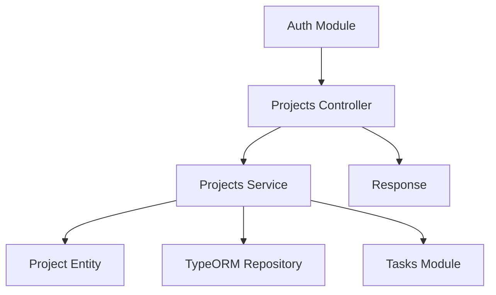
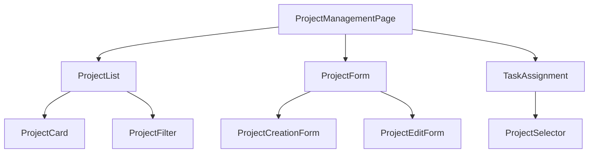

# Project Management UI Design

## 1. Overview

This document outlines the design for implementing project management functionality in the To-Do List and Time Planner application. The feature will allow users to create, retrieve, update, and delete projects, as well as assign tasks to projects for better organization and categorization.

### 1.1 Objectives
- Enable users to organize tasks into projects for better categorization
- Provide CRUD operations for project management
- Implement task-to-project assignment functionality
- Create an intuitive UI for project management
- Ensure data integrity and validation

### 1.2 Key Features
- Project creation with name, description, and color coding
- Project retrieval with filtering and pagination
- Project update functionality
- Project deletion with cascade handling
- Task assignment to projects
- Project-based filtering for tasks
- Responsive and accessible UI design

## 2. Architecture

The project management feature follows the existing NestJS modular architecture with a dedicated Projects module that integrates with the Tasks module. The architecture consists of:

- **Projects Module**: Main module containing controllers, services, and entities
- **Project Entity**: Database model representing a project
- **Projects Service**: Business logic layer for project operations
- **Projects Controller**: API endpoints for project management
- **DTOs**: Data transfer objects for request/response validation

### 2.1 Component Architecture



### 2.2 Technology Stack
- **Framework**: NestJS (Node.js framework with TypeScript support)
- **Database**: PostgreSQL with TypeORM
- **Frontend**: React with TypeScript
- **State Management**: Redux/Zustand
- **UI Library**: Material-UI/Custom Components
- **Validation**: class-validator for backend, React Hook Form for frontend

## 3. API Endpoints Reference

### 3.1 Project Creation Endpoint
- **URL**: `POST /projects`
- **Description**: Create a new project with validation
- **Authentication**: Required (JWT)
- **Request Body**: Project creation DTO with name, description, color
- **Success Response**: 201 Created with project object
- **Error Responses**: 
  - 400 Bad Request (validation errors)
  - 401 Unauthorized (missing/invalid token)

#### Create Project Request DTO
```json
{
  "name": "string (1-100 characters)",
  "description": "string (0-1000 characters, optional)",
  "color": "hex color code (optional, e.g., #FF5733)"
}
```

#### Create Project Response
```json
{
  "id": "UUID",
  "name": "string",
  "description": "string",
  "color": "hex color code",
  "isArchived": false,
  "userId": "UUID",
  "createdAt": "ISO 8601 date string",
  "updatedAt": "ISO 8601 date string"
}
```

### 3.2 Project Retrieval Endpoints
- **URL**: `GET /projects`
- **Description**: Retrieve all projects with filtering and pagination
- **Authentication**: Required (JWT)
- **Query Parameters**: 
  - `isArchived` (boolean, optional)
  - `page` (integer, default: 1)
  - `limit` (integer, default: 10, max: 100)
- **Success Response**: 200 OK with array of projects and pagination metadata

#### Get Projects Response
```json
{
  "data": [
    {
      "id": "UUID",
      "name": "string",
      "description": "string",
      "color": "hex color code",
      "isArchived": false,
      "userId": "UUID",
      "createdAt": "ISO 8601 date string",
      "updatedAt": "ISO 8601 date string"
    }
  ],
  "meta": {
    "page": 1,
    "limit": 10,
    "total": 25
  }
}
```

- **URL**: `GET /projects/:id`
- **Description**: Retrieve a specific project by ID
- **Authentication**: Required (JWT)
- **Success Response**: 200 OK with project object
- **Error Responses**: 
  - 401 Unauthorized (missing/invalid token)
  - 404 Not Found (project not found or not owned by user)

#### Get Project Response
```json
{
  "id": "UUID",
  "name": "string",
  "description": "string",
  "color": "hex color code",
  "isArchived": false,
  "userId": "UUID",
  "tasks": [
    {
      "id": "UUID",
      "title": "string",
      "description": "string",
      "dueDate": "ISO 8601 date string",
      "priority": 0,
      "status": "pending",
      "projectId": "UUID",
      "userId": "UUID",
      "createdAt": "ISO 8601 date string",
      "updatedAt": "ISO 8601 date string"
    }
  ],
  "createdAt": "ISO 8601 date string",
  "updatedAt": "ISO 8601 date string"
}
```

### 3.3 Project Update Endpoint
- **URL**: `PUT /projects/:id`
- **Description**: Update an existing project
- **Authentication**: Required (JWT)
- **Request Body**: Project update DTO with partial project fields
- **Success Response**: 200 OK with updated project object
- **Error Responses**: 
  - 400 Bad Request (validation errors)
  - 401 Unauthorized (missing/invalid token)
  - 403 Forbidden (project not owned by user)
  - 404 Not Found (project not found)

#### Update Project Request DTO
```json
{
  "name": "string (1-100 characters, optional)",
  "description": "string (0-1000 characters, optional)",
  "color": "hex color code (optional)",
  "isArchived": "boolean (optional)"
}
```

#### Update Project Response
```json
{
  "id": "UUID",
  "name": "string",
  "description": "string",
  "color": "hex color code",
  "isArchived": false,
  "userId": "UUID",
  "createdAt": "ISO 8601 date string",
  "updatedAt": "ISO 8601 date string"
}
```

### 3.4 Project Deletion Endpoint
- **URL**: `DELETE /projects/:id`
- **Description**: Delete a project
- **Authentication**: Required (JWT)
- **Success Response**: 204 No Content
- **Error Responses**: 
  - 401 Unauthorized (missing/invalid token)
  - 403 Forbidden (project not owned by user)
  - 404 Not Found (project not found)

#### Delete Project Response
```json
{
  "success": true,
  "message": "Project deleted successfully"
}
```

### 3.5 Task Assignment Endpoint
- **URL**: `PUT /projects/:id/tasks/:taskId`
- **Description**: Assign a task to a project
- **Authentication**: Required (JWT)
- **Success Response**: 200 OK with updated task object
- **Error Responses**: 
  - 401 Unauthorized (missing/invalid token)
  - 403 Forbidden (project or task not owned by user)
  - 404 Not Found (project or task not found)

### 3.1 Request/Response Schema

#### Create Project Request
```json
{
  "name": "string (1-100 characters)",
  "description": "string (0-1000 characters, optional)",
  "color": "hex color code (optional, e.g., #FF5733)"
}
```

#### Validation Requirements
- Name is required and must be between 1-100 characters
- Description is optional but must be between 0-1000 characters if provided
- Color must be a valid hex color code if provided

#### Project Response
```json
{
  "id": "UUID",
  "name": "string",
  "description": "string",
  "color": "hex color code",
  "isArchived": "boolean",
  "userId": "UUID",
  "tasks": "array of task objects",
  "createdAt": "ISO 8601 date string",
  "updatedAt": "ISO 8601 date string"
}
```

### 3.2 Authentication Requirements

All project management endpoints require JWT authentication. The user ID from the JWT token will be used to scope operations to the authenticated user's projects only.

## 4. Data Models & ORM Mapping

### 4.1 Project Entity

The Project entity is already defined in `src/projects/entities/project.entity.ts` with the following properties:

| Property | Type | Constraints | Description |
|----------|------|-------------|-------------|
| id | UUID | Primary Key | Unique identifier |
| name | string | 1-100 characters, Required | Project name |
| description | text | 0-1000 characters, Optional | Project description |
| color | string | Hex color code, Optional | Color coding for UI |
| isArchived | boolean | Default: false | Archive status |
| createdAt | timestamp | Auto-generated | Creation timestamp |
| updatedAt | timestamp | Auto-generated | Last update timestamp |
| userId | UUID | Foreign Key, Required | Owner user ID |

### 4.2 Relationships

- **User**: Many-to-One relationship with cascade delete
- **Tasks**: One-to-Many relationship with SET NULL on delete

## 5. Business Logic Layer

### 5.1 Project Creation Logic

1. Validate input data using class-validator decorators
   - Name must be between 1-100 characters
   - Description must be between 0-1000 characters if provided
   - Color must be a valid hex color code if provided
2. Associate project with authenticated user by extracting userId from JWT token
3. Set default isArchived to false
4. Trim whitespace from project name
5. Set createdAt and updatedAt timestamps
6. Save project to database
7. Return created project with generated ID

### 5.2 Project Retrieval Logic

1. Retrieve projects scoped to authenticated user by extracting userId from JWT token
2. Apply filtering by isArchived status if requested
   - If isArchived=true, return only archived projects
   - If isArchived=false, return only active projects
   - If isArchived is not provided, return all projects
3. Implement pagination for large result sets
   - Default page size: 10 projects
   - Maximum page size: 100 projects
   - Calculate offset based on page number and limit
4. Include related entities (tasks) as needed
5. Order results by createdAt timestamp (newest first)
6. Return paginated response with metadata

### 5.3 Project Update Logic

1. Validate that project belongs to authenticated user by comparing userId
2. Validate input data using class-validator decorators
   - Name must be between 1-100 characters if provided
   - Description must be between 0-1000 characters if provided
   - Color must be a valid hex color code if provided
3. Update only provided fields (partial update)
4. Trim whitespace from project name if provided
5. Update updatedAt timestamp
6. Handle name uniqueness validation per user
7. Save updated project to database
8. Return updated project object

### 5.4 Project Deletion Logic

1. Validate that project belongs to authenticated user by comparing userId
2. Check if project exists and is accessible to user
3. Delete project from database
4. Tasks associated with the project will have their projectId set to NULL (SET NULL cascade)
5. Return success response

### 5.5 Task Assignment Logic

1. Validate that both project and task belong to authenticated user by comparing userId
2. Check if project exists and is accessible to user
3. Check if task exists and is accessible to user
4. Associate task with project by setting projectId on task
5. Update task updatedAt timestamp
6. Save updated task to database
7. Return updated task object with project information

### 5.6 Project Filtering for Tasks

1. When retrieving tasks, allow filtering by projectId
2. Validate that specified project belongs to authenticated user
3. Apply project filter to task query
4. Return filtered task list
5. Handle case where project ID is invalid or inaccessible
6. Support removing project filter to show all tasks

## 6. Frontend Architecture

### 6.1 Component Hierarchy



### 6.2 Component Details

#### ProjectManagementPage
The main page component that orchestrates all project management functionality.

Props:
- None

State:
- Projects list
- Loading state
- Error messages
- Current project (for editing)
- Filter parameters

#### ProjectList
Component responsible for displaying the list of projects.

Props:
- projects: Project[]
- loading: boolean
- onEdit: (project: Project) => void
- onDelete: (projectId: string) => void

#### ProjectCard
Individual project card component displaying project information.

Props:
- project: Project
- onEdit: (project: Project) => void
- onDelete: (projectId: string) => void

#### ProjectFilter
Component for filtering projects by archived status.

Props:
- filters: { isArchived: boolean | null }
- onChange: (filters: { isArchived: boolean | null }) => void

#### ProjectForm
Container component for project creation and editing forms.

Props:
- project?: Project (optional, for editing)
- onSubmit: (projectData: CreateProjectDto | UpdateProjectDto) => void
- onCancel: () => void

#### ProjectSelector
Component for selecting a project when assigning tasks.

Props:
- projects: Project[]
- selectedProjectId?: string
- onChange: (projectId: string) => void

### 6.3 State Management

The project management feature will use the following state structure:

```typescript
interface ProjectState {
  projects: Project[];
  currentProject: Project | null;
  loading: boolean;
  error: string | null;
  filters: {
    isArchived: boolean | null;
  };
  pagination: {
    page: number;
    limit: number;
    total: number;
  };
}

// Task assignment state
interface TaskAssignmentState {
  projectId: string | null;
  loading: boolean;
  error: string | null;
}
```

### 6.4 API Integration Layer

The frontend will communicate with the backend through a dedicated project service:

```typescript
interface ProjectService {
  // Create a new project
  createProject(projectData: CreateProjectDto): Promise<Project>;
  
  // Get all projects
  getProjects(params: ProjectQueryParams): Promise<{ 
    projects: Project[]; 
    pagination: PaginationMeta 
  }>;
  
  // Get a specific project
  getProject(id: string): Promise<Project>;
  
  // Update a project
  updateProject(id: string, projectData: UpdateProjectDto): Promise<Project>;
  
  // Delete a project
  deleteProject(id: string): Promise<void>;
  
  // Assign task to project
  assignTaskToProject(projectId: string, taskId: string): Promise<Task>;
  
  // Remove task from project
  removeTaskFromProject(taskId: string): Promise<Task>;
}

interface ProjectQueryParams {
  isArchived?: boolean;
  page?: number;
  limit?: number;
}

interface PaginationMeta {
  page: number;
  limit: number;
  total: number;
}
```

### 6.3 API Integration Layer

The frontend will communicate with the backend through a dedicated project service:

```typescript
class ProjectService {
  // Create a new project
  createProject(projectData: CreateProjectDto): Promise<Project>;
  
  // Get all projects
  getProjects(params: ProjectQueryParams): Promise<{ 
    projects: Project[]; 
    pagination: PaginationMeta 
  }>;
  
  // Get a specific project
  getProject(id: string): Promise<Project>;
  
  // Update a project
  updateProject(id: string, projectData: UpdateProjectDto): Promise<Project>;
  
  // Delete a project
  deleteProject(id: string): Promise<void>;
  
  // Assign task to project
  assignTaskToProject(projectId: string, taskId: string): Promise<Task>;
}
```

## 7. UI/UX Design

### 7.1 Project Creation Form

The project creation form will include:
- Name input field (required, 1-100 characters)
  - Real-time validation with character counter
  - Error messaging for empty or too-long names
- Description textarea (optional, 0-1000 characters)
  - Character counter
  - Auto-resizing textarea
- Color picker for visual identification
  - Predefined color palette
  - Custom color selection option
- Submit and cancel buttons
  - Submit button disabled until form is valid
  - Loading state during submission

#### Validation Rules
- Name: Required, 1-100 characters
- Description: Optional, 0-1000 characters
- Color: Optional, valid hex color code

### 7.2 Project List View

The project list view will include:
- Grid or list layout of project cards
- Each card displaying project name, description preview, and color indicator
- Archive status indicator
- Task count for each project
- Action buttons for edit and delete
- Filter controls for archived projects

#### Project Card Details
- Color-coded border or header
- Project name (bold, primary text)
- Description preview (secondary text, truncated)
- Task count badge
- Archive status badge
- Action menu (edit, delete, archive/unarchive)

#### Filtering Options
- Show all projects
- Show active projects only
- Show archived projects only
- Search by project name

### 7.3 Project Edit Form

The project edit form will include:
- Pre-filled name, description, and color fields
- Archive toggle switch
- Save and cancel buttons

#### Special Considerations
- Confirmation dialog when archiving/unarchiving
- Warning when making significant changes
- Ability to revert changes
- Loading state during save operation

### 7.4 Task Assignment Interface

The task assignment interface will include:
- Dropdown or searchable list of projects when creating/editing a task
- Visual indicator of project assignment on task cards/lists
- Ability to change project assignment

#### Task Creation/Edit Form
- Project selector dropdown
  - Searchable by project name
  - Grouping by archived status
  - Clear selection option

#### Task List View
- Project column with color-coded project name
- Filter by project dropdown
- Ability to sort by project

### 7.5 Project Filtering for Tasks

The task filtering interface will include:
- Project filter dropdown in the task list view
- Ability to filter tasks by project
- Clear filter option

#### Filter Implementation
- Multi-select capability for filtering by multiple projects
- Real-time filtering as user types
- Saved filter preferences
- Reset to default filter option

#### Visual Indicators
- Color-coded project tags on tasks
- Project grouping in list view (optional)
- Project summary statistics

## 8. Testing Strategy

### 8.1 Unit Tests

Backend unit tests will cover:
- Project creation with valid and invalid data
  - Valid name, description, and color
  - Empty name
  - Name exceeding 100 characters
  - Description exceeding 1000 characters
  - Invalid color codes
  - SQL injection attempts
  - Special characters in name/description
- Project retrieval with various filter combinations
  - All projects
  - Active projects only
  - Archived projects only
  - Pagination scenarios
  - Large result sets
- Project update functionality
  - Valid field updates
  - Partial updates
  - Invalid field values
  - Non-existent project ID
- Project deletion handling
  - Successful deletion
  - Non-existent project ID
  - Projects with many tasks
- Task assignment logic
  - Assigning task to project
  - Reassigning task to different project
  - Removing task from project
  - Assigning to non-existent project
  - Assigning non-existent task
- Input validation rules
  - SQL injection protection
  - Special character handling
  - Concurrent creation scenarios

### 8.2 Integration Tests

Integration tests will cover:
- End-to-end project CRUD operations
  - Create project via API
  - Retrieve project list
  - Retrieve specific project
  - Update project details
  - Delete project
  - Verify database state after each operation
- Task-to-project assignment workflows
  - Assign task to project
  - Verify task-project relationship
  - Reassign task to different project
  - Remove task from project
  - Verify cascade behavior
- Authentication and authorization checks
  - Unauthenticated requests
  - Accessing other users' projects
  - Accessing other users' tasks
- Error handling and edge cases
  - Database connection issues
  - Concurrent edit handling
  - Network interruptions
  - Large payload scenarios

### 8.3 Frontend Tests

Frontend tests will cover:
- Component rendering and user interactions
  - Project list rendering
  - Project card display
  - Form element rendering
  - Button interactions
  - Filter controls
- Form validation and error display
  - Required field validation
  - Character limit validation
  - Error message display
  - Validation on blur and submit
- API integration and loading states
  - Loading indicators
  - Success handling
  - Error handling
  - Retry mechanisms
- Responsive design across device sizes
  - Mobile layout
  - Tablet layout
  - Desktop layout
  - Orientation changes
- Accessibility compliance
  - Screen reader support
  - Keyboard navigation
  - Color contrast ratios
  - ARIA attributes