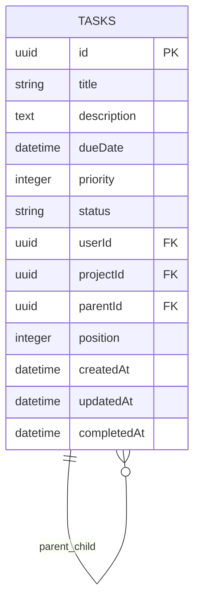
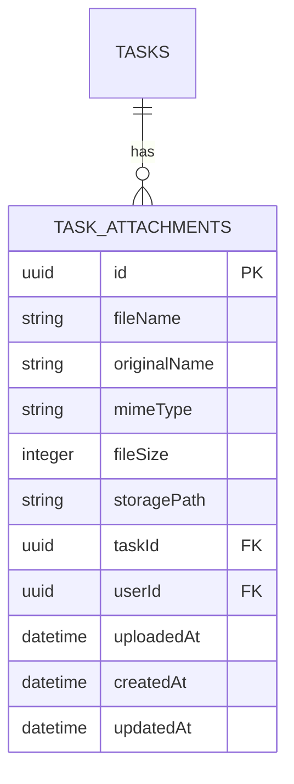

# Subtask Management and File Attachment System Design

## 1. Overview

This document outlines the design for implementing advanced task features in the To-Do List and Time Planner application, specifically focusing on subtask management and file attachment capabilities. These features will enhance task organization and provide users with more comprehensive task management tools.

## 2. Architecture

### 2.1 System Components

The implementation will extend the existing task management system with the following components:

1. **Subtask Management Module** - Extends the Task entity to support hierarchical task relationships
2. **File Attachment Module** - Adds file storage and management capabilities to tasks
3. **Enhanced Task Service** - Updates business logic to handle subtasks and file attachments
4. **Extended Task Controller** - Provides new API endpoints for subtask and file operations
5. **Database Schema Extensions** - Modifies existing schema to support new features

### 2.2 Technology Stack

- **Backend Framework**: NestJS with TypeScript
- **Database**: PostgreSQL with TypeORM
- **File Storage**: Local file system with future cloud storage capability
- **Authentication**: JWT-based authentication
- **Validation**: class-validator for DTO validation

## 3. Subtask Management Implementation

### 3.1 Data Model

The subtask functionality will be implemented by extending the existing Task entity with a self-referential relationship:



### 3.2 Key Features

1. **Hierarchical Task Structure**:
   - Tasks can have multiple subtasks
   - Subtasks can have their own subtasks (nested hierarchy)
   - Parent-child relationship maintained through parentId foreign key

2. **Subtask Properties**:
   - Position/ordering within parent task
   - Independent due dates and priorities
   - Status synchronization with parent task

3. **Progress Tracking**:
   - Parent task progress calculated based on subtask completion
   - Visual indicators for partially completed tasks

### 3.3 API Endpoints

- `POST /tasks/:id/subtasks` - Create a subtask
- `GET /tasks/:id/subtasks` - Retrieve all subtasks for a task
- `PUT /tasks/:id/subtasks/:subtaskId` - Update a subtask
- `DELETE /tasks/:id/subtasks/:subtaskId` - Delete a subtask
- `PUT /tasks/:id/subtasks/:subtaskId/move` - Reorder subtasks
- `POST /tasks/:id/subtasks/:subtaskId/convert` - Convert subtask to regular task

## 4. File Attachment System Implementation

### 4.1 Data Model

The file attachment system will introduce a new entity to track attached files:



### 4.2 Key Features

1. **File Management**:
   - Upload files with size and type validation
   - Download attached files
   - Delete file attachments
   - View file metadata

2. **Security Considerations**:
   - File type validation to prevent malicious uploads
   - Size limits to prevent storage abuse
   - User ownership verification
   - Secure file access with authentication

3. **Storage Strategy**:
   - Local file system storage with organized directory structure
   - Configurable storage limits
   - Future extensibility for cloud storage providers

### 4.3 API Endpoints

- `POST /tasks/:id/attachments` - Upload a file attachment
- `GET /tasks/:id/attachments` - List all file attachments for a task
- `GET /tasks/:id/attachments/:attachmentId` - Download a file attachment
- `DELETE /tasks/:id/attachments/:attachmentId` - Delete a file attachment

## 5. Enhanced Task Features

### 5.1 Tagging System Improvements

The existing tagging system will be enhanced with:

1. **Tag Management**:
   - Custom tag creation with color coding
   - Bulk tag assignment
   - Tag filtering and search

2. **Tag Cloud**:
   - Visual representation of tag usage
   - Quick tag assignment interface

### 5.2 Estimated Time Tracking

1. **Time Estimation**:
   - Estimated time input for tasks
   - Total project time calculation
   - Time tracking reports

2. **Actual Time Tracking**:
   - Start/stop time tracking functionality
   - Manual time adjustment
   - Time tracking across sessions

### 5.3 Search and Filtering

1. **Enhanced Search**:
   - Real-time search results
   - Fuzzy search algorithm
   - Search across task properties (title, description, tags)

2. **Advanced Filtering**:
   - Multi-criteria filtering
   - Saved filter functionality
   - Filter combination logic

### 5.4 Overdue Task Management

1. **Visual Highlighting**:
   - Color-coded overdue indicators
   - Dedicated overdue task views
   - Overdue notifications

## 6. Business Logic Layer

### 6.1 Subtask Management Logic

1. **Circular Reference Prevention**:
   - Validation to prevent parent-child cycles
   - Depth limitation for nesting levels

2. **Progress Calculation**:
   - Algorithm to calculate parent task progress
   - Status synchronization between parent and children

3. **Reordering Operations**:
   - Position management for subtasks
   - Bulk reordering capabilities

### 6.2 File Attachment Logic

1. **Upload Processing**:
   - File validation (size, type)
   - Secure storage with unique naming
   - Metadata extraction and storage

2. **Access Control**:
   - Ownership verification
   - Secure download links
   - File deletion handling

### 6.3 Data Integrity

1. **Cascade Operations**:
   - Subtask deletion when parent is deleted
   - Attachment cleanup when task is deleted
   - Referential integrity maintenance

## 7. API Design

### 7.1 Subtask Endpoints

#### Create Subtask
```
POST /tasks/:id/subtasks
Content-Type: application/json

{
  "title": "Implement subtask functionality",
  "description": "Detailed description",
  "dueDate": "2023-12-31T23:59:59Z",
  "priority": 2
}
```

#### Get Subtasks
```
GET /tasks/:id/subtasks
```

#### Update Subtask
```
PUT /tasks/:id/subtasks/:subtaskId
Content-Type: application/json

{
  "title": "Updated subtask title",
  "position": 2
}
```

#### Delete Subtask
```
DELETE /tasks/:id/subtasks/:subtaskId
```

### 7.2 File Attachment Endpoints

#### Upload File
```
POST /tasks/:id/attachments
Content-Type: multipart/form-data

file: [file data]
```

#### List Attachments
```
GET /tasks/:id/attachments
```

#### Download File
```
GET /tasks/:id/attachments/:attachmentId
```

#### Delete Attachment
```
DELETE /tasks/:id/attachments/:attachmentId
```

## 8. Database Schema Changes

### 8.1 Task Entity Modifications

```typescript
// Added to existing Task entity
@Column({ nullable: true })
parentId: string;

@ManyToOne(() => Task, task => task.subtasks, { onDelete: 'CASCADE' })
@JoinColumn({ name: 'parentId' })
parent: Task;

@OneToMany(() => Task, task => task.parent)
subtasks: Task[];

@Column({ type: 'int', nullable: true })
position: number;
```

### 8.2 New Attachment Entity

```typescript
@Entity('task_attachments')
export class TaskAttachment {
  @PrimaryGeneratedColumn('uuid')
  id: string;

  @Column()
  fileName: string;

  @Column()
  originalName: string;

  @Column()
  mimeType: string;

  @Column({ type: 'int' })
  fileSize: number;

  @Column()
  storagePath: string;

  @CreateDateColumn()
  uploadedAt: Date;

  @CreateDateColumn()
  createdAt: Date;

  @UpdateDateColumn()
  updatedAt: Date;

  @ManyToOne(() => Task, task => task.attachments, { onDelete: 'CASCADE' })
  @JoinColumn({ name: 'taskId' })
  task: Task;

  @Column()
  taskId: string;

  @ManyToOne(() => User, user => user.taskAttachments, { onDelete: 'CASCADE' })
  @JoinColumn({ name: 'userId' })
  user: User;

  @Column()
  userId: string;
}
```

## 9. Security Considerations

1. **File Upload Security**:
   - MIME type validation
   - File size limits (10MB default)
   - Sanitization of file names
   - Storage outside web root

2. **Access Control**:
   - Ownership verification for all operations
   - JWT-based authentication for all endpoints
   - Rate limiting for file uploads

3. **Data Validation**:
   - Input validation for all API endpoints
   - Protection against SQL injection
   - XSS prevention in file metadata

## 10. Performance Considerations

1. **Database Indexing**:
   - Index on parentId for efficient subtask queries
   - Index on taskId for attachment queries
   - Composite indexes for filtering operations

2. **File Storage**:
   - Organized directory structure to prevent filesystem bottlenecks
   - Efficient file retrieval mechanisms
   - Caching strategies for frequently accessed files

3. **Query Optimization**:
   - Efficient loading of task hierarchies
   - Pagination for large result sets
   - Lazy loading for related entities

## 11. Testing Strategy

### 11.1 Unit Tests

1. **Subtask Service Tests**:
   - Subtask creation under parent task
   - Subtask due dates and priorities
   - Parent task progress calculation
   - Subtask reordering
   - Subtask conversion to regular task
   - Circular reference prevention

2. **File Attachment Service Tests**:
   - File upload within size limits
   - Supported format validation
   - File viewing functionality
   - File download functionality
   - File deletion functionality

### 11.2 Integration Tests

1. **API Endpoint Tests**:
   - Subtask creation and management endpoints
   - File upload and download endpoints
   - Error handling for invalid requests

2. **Database Tests**:
   - Cascade delete operations
   - Referential integrity validation
   - Index performance verification

### 11.3 Edge Case Tests

1. **Subtask Edge Cases**:
   - Circular parent-child relationships
   - Deep nesting levels
   - Subtask with same parent
   - Concurrent subtask operations
   - Subtask deletion impact on parent
   - Bulk subtask operations
   - Subtask with invalid dates

2. **File Attachment Edge Cases**:
   - Files exceeding size limits
   - Unsupported file formats
   - Corrupted file uploads
   - Network interruption during upload
   - Concurrent file operations
   - File name with special characters
   - Multiple file uploads
   - File storage limits

## 12. Migration Strategy

### 12.1 Database Migration

1. **Task Table Alterations**:
   - Add parentId column with foreign key constraint
   - Add position column for ordering
   - Create indexes for performance

2. **New Attachment Table**:
   - Create task_attachments table
   - Define relationships with tasks and users
   - Add necessary indexes

### 12.2 Data Migration

1. **Existing Tasks**:
   - No migration needed for existing data
   - New columns will be nullable for backward compatibility

2. **Attachments Directory**:
   - Create file storage directory structure
   - Configure appropriate permissions

## 13. Future Extensibility

1. **Cloud Storage Integration**:
   - Adapter pattern for different storage providers
   - Configuration-based storage selection

2. **Advanced Collaboration Features**:
   - Shared task assignments
   - Commenting system
   - Notification mechanisms

3. **Enhanced Reporting**:
   - Time tracking analytics
   - Progress visualization
   - Export capabilities