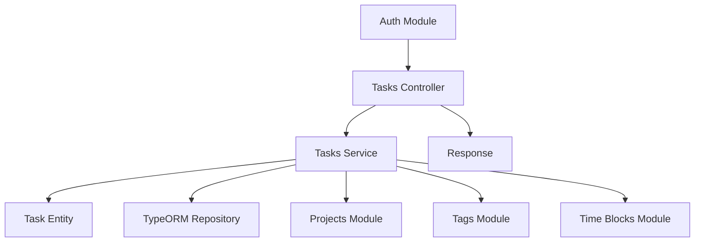

# Task Management Feature Design

## 1. Overview

This document outlines the design for implementing the task management feature in the To-Do List and Time Planner application. The feature will allow users to create, retrieve, update, and delete tasks with associated metadata such as due dates, priorities, and status tracking.

## 2. Architecture

The task management feature follows the existing NestJS modular architecture with a dedicated Tasks module that integrates with other modules like Authentication, Projects, Tags, and Time Blocks. The architecture consists of:

- **Tasks Module**: Main module containing controllers, services, and entities
- **Task Entity**: Database model representing a task
- **Tasks Service**: Business logic layer for task operations
- **Tasks Controller**: API endpoints for task management
- **DTOs**: Data transfer objects for request/response validation

### 2.1 Component Architecture



## 3. API Endpoints Reference

### 3.1 Task Creation Endpoint
- **URL**: `POST /tasks`
- **Description**: Create a new task with validation
- **Authentication**: Required (JWT)
- **Request Body**: Task creation DTO with title, description, dueDate, priority, projectId, tagIds
- **Success Response**: 201 Created with task object
- **Error Responses**: 
  - 400 Bad Request (validation errors)
  - 401 Unauthorized (missing/invalid token)
  - 404 Not Found (referenced project/tag not found)

### 3.2 Task Retrieval Endpoints
- **URL**: `GET /tasks`
- **Description**: Retrieve all tasks with filtering and pagination
- **Authentication**: Required (JWT)
- **Query Parameters**: 
  - `status` (pending, in-progress, completed, cancelled)
  - `priority` (0-4)
  - `dueDate` (ISO 8601 date)
  - `page` (integer, default: 1)
  - `limit` (integer, default: 10, max: 100)
- **Success Response**: 200 OK with array of tasks and pagination metadata

- **URL**: `GET /tasks/:id`
- **Description**: Retrieve a specific task by ID
- **Authentication**: Required (JWT)
- **Success Response**: 200 OK with task object
- **Error Responses**: 
  - 401 Unauthorized (missing/invalid token)
  - 404 Not Found (task not found or not owned by user)

### 3.3 Task Update Endpoint
- **URL**: `PUT /tasks/:id`
- **Description**: Update an existing task
- **Authentication**: Required (JWT)
- **Request Body**: Task update DTO with partial task fields
- **Success Response**: 200 OK with updated task object
- **Error Responses**: 
  - 400 Bad Request (validation errors)
  - 401 Unauthorized (missing/invalid token)
  - 403 Forbidden (task not owned by user)
  - 404 Not Found (task not found)

### 3.4 Task Deletion Endpoint
- **URL**: `DELETE /tasks/:id`
- **Description**: Delete a task
- **Authentication**: Required (JWT)
- **Success Response**: 204 No Content
- **Error Responses**: 
  - 401 Unauthorized (missing/invalid token)
  - 403 Forbidden (task not owned by user)
  - 404 Not Found (task not found)

### 3.1 Request/Response Schema

#### Create Task Request
```json
{
  "title": "string (1-200 characters)",
  "description": "string (0-2000 characters, optional)",
  "dueDate": "ISO 8601 date string (optional)",
  "priority": "integer (0-4, optional, default: 0)",
  "projectId": "UUID (optional)",
  "tagIds": "array of UUIDs (optional)"
}
```

#### Validation Requirements
- Title is required and must be between 1-200 characters
- Description is optional but must be between 0-2000 characters if provided
- Priority must be an integer between 0-4 if provided
- Due date must be a valid ISO 8601 date string if provided
- Project ID must be a valid UUID if provided
- Tag IDs must be an array of valid UUIDs if provided

#### Task Response
```json
{
  "id": "UUID",
  "title": "string",
  "description": "string",
  "dueDate": "ISO 8601 date string",
  "priority": "integer",
  "status": "string (pending, in-progress, completed, cancelled)",
  "completedAt": "ISO 8601 date string",
  "projectId": "UUID",
  "userId": "UUID",
  "tags": "array of tag objects",
  "timeBlocks": "array of time block objects",
  "createdAt": "ISO 8601 date string",
  "updatedAt": "ISO 8601 date string"
}
```

### 3.2 Authentication Requirements

All task management endpoints require JWT authentication. The user ID from the JWT token will be used to scope operations to the authenticated user's tasks only.

## 4. Data Models & ORM Mapping

### 4.1 Task Entity

The Task entity is already defined in `src/tasks/entities/task.entity.ts` with the following properties:

| Property | Type | Constraints | Description |
|----------|------|-------------|-------------|
| id | UUID | Primary Key | Unique identifier |
| title | string | 1-255 characters, Required | Task title |
| description | text | 0-5000 characters, Optional | Task description |
| dueDate | timestamp | Optional | Due date and time |
| priority | integer | 0-4, Default: 0 | Priority level |
| status | string | pending, in-progress, completed, cancelled, Default: pending | Task status |
| completedAt | timestamp | Optional | Completion timestamp |
| createdAt | timestamp | Auto-generated | Creation timestamp |
| updatedAt | timestamp | Auto-generated | Last update timestamp |
| userId | UUID | Foreign Key, Required | Owner user ID |
| projectId | UUID | Foreign Key, Optional | Associated project ID |

### 4.2 Relationships

- **User**: Many-to-One relationship with cascade delete
- **Project**: Many-to-One relationship with SET NULL on delete
- **Tags**: Many-to-Many relationship with junction table
- **TimeBlocks**: One-to-Many relationship with cascade delete

## 5. Business Logic Layer

### 5.1 Task Creation Logic

1. Validate input data using class-validator decorators
2. Set default status to "pending"
3. Associate task with authenticated user
4. Link to project if projectId is provided
5. Associate tags if tagIds are provided
6. Set createdAt and updatedAt timestamps
7. Save task to database

### 5.2 Task Retrieval Logic

1. Retrieve tasks scoped to authenticated user
2. Apply filtering by status, priority, due date if requested
3. Implement pagination for large result sets
4. Include related entities (project, tags, time blocks) as needed
5. Support sorting by creation date, due date, priority, and title
6. Implement search functionality to filter tasks by title and description content

### 5.3 Task Update Logic

1. Validate that task belongs to authenticated user
2. Validate input data
3. Update only provided fields (partial update)
4. Update updatedAt timestamp
5. Handle status transitions:
   - When status changes to "completed", set completedAt timestamp
   - When status changes from "completed" to another status, clear completedAt
   - Validate status transitions are valid (e.g., cannot transition directly from "pending" to "cancelled" without going through "in-progress")

### 5.4 Task Status Management

1. Valid status values: "pending", "in-progress", "completed", "cancelled"
2. Status transitions:
   - pending → in-progress → completed
   - pending → cancelled
   - in-progress → cancelled
   - completed → pending (reopening)
3. When transitioning to "completed":
   - Set completedAt timestamp
   - Update updatedAt timestamp
4. When transitioning from "completed" to another status:
   - Clear completedAt timestamp
   - Update updatedAt timestamp
5. Validation of status transitions to prevent invalid state changes

### 5.5 Due Date and Priority Management

1. Due Date Functionality:
   - Optional timestamp field for task deadlines
   - Date picker UI component for selection
   - Validation for future dates only (optional)
   - Overdue task identification and highlighting
   - Due date warnings for approaching deadlines

2. Priority Levels:
   - Integer values from 0-4 (0=none, 1=low, 2=medium, 3=high, 4=urgent)
   - Visual color coding in UI (none=gray, low=blue, medium=yellow, high=orange, urgent=red)
   - Sorting by priority in task lists
   - Filtering by priority level

### 5.6 Task Deletion Logic

1. Validate that task belongs to authenticated user
2. Perform soft delete by removing from database
3. Cascade delete related time blocks
4. Maintain referential integrity for project associations

## 6. Middleware & Interceptors

### 6.1 Authentication Middleware

JWT authentication is handled by the existing `JwtAuthGuard` which validates the access token and attaches user information to the request.

### 6.2 Validation Pipes

Class-validator decorators on DTOs and entities ensure data integrity:
- Title length validation (1-255 characters)
- Description length validation (0-5000 characters)
- Priority range validation (0-4)
- Status validation (pending, in-progress, completed, cancelled)

### 6.3 Error Handling

Global exception filters handle:
- Unauthorized access attempts
- Validation errors
- Database constraint violations
- Resource not found errors

## 7. UI Component Design

### 7.1 Task Creation Form
- Form fields for title (1-200 characters), description (0-2000 characters)
- Date picker for due date selection
- Priority selector (0-4)
- Project selector dropdown
- Tag selector with multi-select capability
- Form validation with real-time feedback
- Responsive design for all device sizes

### 7.2 Task Listing Component
- Task cards display with title, description preview, due date, priority
- Filtering controls for status, priority, due date
- Sorting options (creation date, due date, priority, title)
- Pagination controls for large task sets
- Search functionality for task content
- Responsive grid layout

### 7.3 Task Editing Form
- Pre-population of existing task data
- Same fields as creation form with current values
- Status transition controls with validation
- Save and cancel functionality
- Delete task option with confirmation

## 7. Testing

### 7.1 Unit Tests

Unit tests will be implemented for the TasksService covering:
- Task creation with valid and invalid data
  - Valid task creation with title and description
  - Title length validation (1-200 characters)
  - Description length validation (0-2000 characters)
  - Default status assignment ("pending")
  - Timestamp creation
- Task retrieval with various filter combinations
  - Single task retrieval
  - Multiple task retrieval
  - Filtering by status, priority, and due date
  - Pagination support
- Task updates with partial data
  - Task field updates
  - Last modified timestamp update
  - Field validation
  - Status transition handling
- Task deletion operations
- Edge cases and error conditions
  - Empty title
  - Title exceeding 200 characters
  - Description exceeding 2000 characters
  - Special characters in title/description
  - Unicode characters
  - SQL injection attempts
  - Missing required fields
  - Concurrent task creation
  - Non-existent task ID
  - Invalid task ID format

### 7.2 Integration Tests

Integration tests will be implemented in `test/task-management.e2e-spec.ts` covering:
- End-to-end API workflows
  - Task creation flow with validation
  - Task retrieval with filtering and pagination
  - Task update with partial data
  - Task deletion flow
- Authentication requirements
  - Valid JWT token access
  - Missing/invalid token rejection
  - Unauthorized access prevention
- Data validation
  - Input validation for all endpoints
  - Database constraint validation
  - Relationship integrity validation
- Response format verification
  - Consistent JSON response structure
  - Proper HTTP status codes
  - Error message format consistency
- Database state verification
  - Data persistence correctness
  - Relationship maintenance
  - Timestamp accuracy
- Performance and Security Tests
  - API rate limiting
  - SQL injection prevention
  - Concurrent access handling
