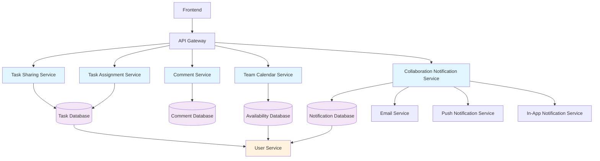

# Team Collaboration System Design

## 1. Overview

The Team Collaboration System is designed to enhance the todo-planer application with collaborative features that allow users to work together on tasks and projects. This system will enable task sharing, assignment, commenting, team calendar views, availability tracking, and collaboration notifications.

### 1.1 Purpose
To provide a comprehensive collaboration solution that allows teams to effectively coordinate, communicate, and manage shared tasks within the todo-planer application.

### 1.2 Scope
This design covers the implementation of:
- Task sharing functionality with permission management
- Task assignment system
- Commenting system for shared tasks
- Team calendar views for availability tracking
- Collaboration notifications for task updates

### 1.3 Key Features
- Share tasks with team members with configurable permissions (view, edit, manage)
- Assign tasks to other users with notification system
- Comment on shared tasks with support for replies and basic formatting
- View team members' availability in calendar views
- Receive notifications for collaborative task updates through multiple channels (email, push, in-app)

## 2. Architecture

### 2.3 Integration with Existing Modules

The collaboration system will integrate with existing modules in the todo-planer application:

1. **Tasks Module Integration**
   - Extend Task entity with sharing, assignment, and comment relationships
   - Utilize existing task CRUD operations
   - Integrate with task filtering and search functionality

2. **Users Module Integration**
   - Extend User entity with collaboration relationships
   - Utilize existing user authentication and authorization
   - Integrate with user profile management

3. **Notifications Module Integration**
   - Extend existing notification system for collaboration events
   - Utilize existing notification delivery mechanisms
   - Integrate with notification preferences

4. **Projects Module Integration**
   - Support sharing and assignment of project tasks
   - Integrate with project-based filtering

5. **Time Blocks Module Integration**
   - Support availability tracking for time blocks
   - Integrate with calendar views

### 2.1 System Components



### 2.2 Module Structure
The collaboration system will be implemented as separate modules that integrate with existing components:

```
src/
├── collaboration/
│   ├── task-sharing/
│   │   ├── dto/
│   │   │   ├── create-task-share.dto.ts
│   │   │   └── update-task-share.dto.ts
│   │   ├── entities/
│   │   │   └── task-share.entity.ts
│   │   ├── services/
│   │   │   └── task-sharing.service.ts
│   │   ├── controllers/
│   │   │   └── task-sharing.controller.ts
│   │   └── task-sharing.module.ts
│   ├── task-assignment/
│   │   ├── dto/
│   │   │   ├── create-task-assignment.dto.ts
│   │   │   └── update-task-assignment-status.dto.ts
│   │   ├── entities/
│   │   │   └── task-assignment.entity.ts
│   │   ├── services/
│   │   │   └── task-assignment.service.ts
│   │   ├── controllers/
│   │   │   └── task-assignment.controller.ts
│   │   └── task-assignment.module.ts
│   ├── comments/
│   │   ├── dto/
│   │   │   ├── create-task-comment.dto.ts
│   │   │   └── update-task-comment.dto.ts
│   │   ├── entities/
│   │   │   └── task-comment.entity.ts
│   │   ├── services/
│   │   │   └── comment.service.ts
│   │   ├── controllers/
│   │   │   └── comment.controller.ts
│   │   └── comments.module.ts
│   ├── team-calendar/
│   │   ├── dto/
│   │   ├── entities/
│   │   ├── services/
│   │   │   └── team-calendar.service.ts
│   │   ├── controllers/
│   │   │   └── team-calendar.controller.ts
│   │   └── team-calendar.module.ts
│   ├── availability/
│   │   ├── dto/
│   │   │   ├── create-user-availability.dto.ts
│   │   │   └── update-user-availability.dto.ts
│   │   ├── entities/
│   │   │   └── user-availability.entity.ts
│   │   ├── services/
│   │   │   └── availability.service.ts
│   │   ├── controllers/
│   │   │   └── availability.controller.ts
│   │   └── availability.module.ts
│   └── collaboration.module.ts
```

## 3. Data Models & ORM Mapping

### 3.1 DTO Definitions

#### CreateTaskShareDto
```typescript
import { IsUUID, IsIn, IsNotEmpty } from 'class-validator';

export class CreateTaskShareDto {
  @IsUUID()
  @IsNotEmpty()
  sharedWithId: string;

  @IsIn(['view', 'edit', 'manage'])
  permissionLevel: 'view' | 'edit' | 'manage';
}
```

#### UpdateTaskShareDto
```typescript
import { IsIn } from 'class-validator';

export class UpdateTaskShareDto {
  @IsIn(['view', 'edit', 'manage'])
  permissionLevel: 'view' | 'edit' | 'manage';
}
```

#### CreateTaskAssignmentDto
```typescript
import { IsUUID, IsNotEmpty } from 'class-validator';

export class CreateTaskAssignmentDto {
  @IsUUID()
  @IsNotEmpty()
  assignedToId: string;
}
```

#### UpdateTaskAssignmentStatusDto
```typescript
import { IsIn, IsNotEmpty } from 'class-validator';

export class UpdateTaskAssignmentStatusDto {
  @IsIn(['accepted', 'rejected', 'completed'])
  @IsNotEmpty()
  status: 'accepted' | 'rejected' | 'completed';
}
```

#### CreateTaskCommentDto
```typescript
import { IsString, IsUUID, Length, IsOptional } from 'class-validator';

export class CreateTaskCommentDto {
  @IsString()
  @Length(1, 2000)
  content: string;

  @IsUUID()
  @IsOptional()
  parentId?: string;
}
```

#### UpdateTaskCommentDto
```typescript
import { IsString, Length } from 'class-validator';

export class UpdateTaskCommentDto {
  @IsString()
  @Length(1, 2000)
  content: string;
}
```

#### CreateUserAvailabilityDto
```typescript
import { IsISO8601, IsIn, IsString, Length, IsOptional } from 'class-validator';

export class CreateUserAvailabilityDto {
  @IsISO8601()
  startTime: string;

  @IsISO8601()
  endTime: string;

  @IsIn(['available', 'busy', 'away', 'offline'])
  status: 'available' | 'busy' | 'away' | 'offline';

  @IsString()
  @Length(0, 500)
  @IsOptional()
  note?: string;
}
```

#### UpdateUserAvailabilityDto
```typescript
import { IsISO8601, IsIn, IsString, Length, IsOptional } from 'class-validator';

export class UpdateUserAvailabilityDto {
  @IsISO8601()
  @IsOptional()
  startTime?: string;

  @IsISO8601()
  @IsOptional()
  endTime?: string;

  @IsIn(['available', 'busy', 'away', 'offline'])
  @IsOptional()
  status?: 'available' | 'busy' | 'away' | 'offline';

  @IsString()
  @Length(0, 500)
  @IsOptional()
  note?: string;
}
```

## 3. Data Models & ORM Mapping

### 3.1 Task Sharing Entity

```typescript
@Entity('task_shares')
export class TaskShare {
  @PrimaryGeneratedColumn('uuid')
  id: string;

  @Column({ type: 'uuid' })
  taskId: string;

  @ManyToOne(() => Task, task => task.shares, { onDelete: 'CASCADE' })
  @JoinColumn({ name: 'taskId' })
  task: Task;

  @Column({ type: 'uuid' })
  ownerId: string;

  @ManyToOne(() => User, user => user.sharedTasks, { onDelete: 'CASCADE' })
  @JoinColumn({ name: 'ownerId' })
  owner: User;

  @Column({ type: 'uuid' })
  sharedWithId: string;

  @ManyToOne(() => User, user => user.receivedSharedTasks, { onDelete: 'CASCADE' })
  @JoinColumn({ name: 'sharedWithId' })
  sharedWith: User;

  @Column({ 
    type: 'enum', 
    enum: ['view', 'edit', 'manage'],
    default: 'view'
  })
  permissionLevel: 'view' | 'edit' | 'manage';

  @Column({ default: false })
  isAccepted: boolean;

  @Column({ type: 'timestamp', nullable: true })
  acceptedAt: Date;

  @Column({ default: false })
  isRevoked: boolean;

  @CreateDateColumn()
  createdAt: Date;

  @UpdateDateColumn()
  updatedAt: Date;
}
```

### 3.2 Task Assignment Entity

```typescript
@Entity('task_assignments')
export class TaskAssignment {
  @PrimaryGeneratedColumn('uuid')
  id: string;

  @Column({ type: 'uuid' })
  taskId: string;

  @ManyToOne(() => Task, task => task.assignments, { onDelete: 'CASCADE' })
  @JoinColumn({ name: 'taskId' })
  task: Task;

  @Column({ type: 'uuid' })
  assignedById: string;

  @ManyToOne(() => User, user => user.assignedTasks, { onDelete: 'CASCADE' })
  @JoinColumn({ name: 'assignedById' })
  assignedBy: User;

  @Column({ type: 'uuid' })
  assignedToId: string;

  @ManyToOne(() => User, user => user.receivedAssignedTasks, { onDelete: 'CASCADE' })
  @JoinColumn({ name: 'assignedToId' })
  assignedTo: User;

  @Column({ default: 'pending' })
  @IsIn(['pending', 'accepted', 'rejected', 'completed'])
  status: string;

  @CreateDateColumn()
  createdAt: Date;

  @UpdateDateColumn()
  updatedAt: Date;
}
```

### 3.3 Comment Entity

```typescript
@Entity('task_comments')
export class TaskComment {
  @PrimaryGeneratedColumn('uuid')
  id: string;

  @Column({ type: 'uuid' })
  taskId: string;

  @ManyToOne(() => Task, task => task.comments, { onDelete: 'CASCADE' })
  @JoinColumn({ name: 'taskId' })
  task: Task;

  @Column({ type: 'uuid' })
  userId: string;

  @ManyToOne(() => User, user => user.taskComments, { onDelete: 'CASCADE' })
  @JoinColumn({ name: 'userId' })
  user: User;

  @Column({ type: 'text' })
  @Length(1, 2000)
  content: string;

  @Column({ type: 'uuid', nullable: true })
  parentId: string;

  @ManyToOne(() => TaskComment, comment => comment.replies, { onDelete: 'CASCADE' })
  @JoinColumn({ name: 'parentId' })
  parent: TaskComment;

  @OneToMany(() => TaskComment, comment => comment.parent)
  replies: TaskComment[];

  @CreateDateColumn()
  createdAt: Date;

  @UpdateDateColumn()
  updatedAt: Date;
}
```

### 3.4 Availability Entity

```typescript
@Entity('user_availability')
export class UserAvailability {
  @PrimaryGeneratedColumn('uuid')
  id: string;

  @Column({ type: 'uuid' })
  userId: string;

  @ManyToOne(() => User, user => user.availability, { onDelete: 'CASCADE' })
  @JoinColumn({ name: 'userId' })
  user: User;

  @Column({ type: 'timestamp' })
  startTime: Date;

  @Column({ type: 'timestamp' })
  endTime: Date;

  @Column({ 
    type: 'enum', 
    enum: ['available', 'busy', 'away', 'offline'],
    default: 'available'
  })
  status: 'available' | 'busy' | 'away' | 'offline';

  @Column({ type: 'text', nullable: true })
  @Length(0, 500)
  note: string;

  @CreateDateColumn()
  createdAt: Date;

  @UpdateDateColumn()
  updatedAt: Date;
}
```

### 3.5 Enhanced Task Entity Relationships

The existing Task entity will be extended with new relationships:

```typescript
// In Task entity
@OneToMany(() => TaskShare, share => share.task)
shares: TaskShare[];

@OneToMany(() => TaskAssignment, assignment => assignment.task)
assignments: TaskAssignment[];

@OneToMany(() => TaskComment, comment => comment.task)
comments: TaskComment[];
```

### 3.6 Enhanced User Entity Relationships

The existing User entity will be extended with new relationships:

```typescript
// In User entity
@OneToMany(() => TaskShare, share => share.owner)
sharedTasks: TaskShare[];

@OneToMany(() => TaskShare, share => share.sharedWith)
receivedSharedTasks: TaskShare[];

@OneToMany(() => TaskAssignment, assignment => assignment.assignedBy)
assignedTasks: TaskAssignment[];

@OneToMany(() => TaskAssignment, assignment => assignment.assignedTo)
receivedAssignedTasks: TaskAssignment[];

@OneToMany(() => TaskComment, comment => comment.user)
taskComments: TaskComment[];

@OneToMany(() => UserAvailability, availability => availability.user)
availability: UserAvailability[];
```

## 4. API Endpoints Reference

### 4.1 Task Sharing API

#### Share Task with User
```
POST /api/tasks/:taskId/share
```

**Request Body**:
```json
{
  "sharedWithId": "uuid",
  "permissionLevel": "view|edit|manage"
}
```

**Response**:
- `201 Created`: Task shared successfully
- `400 Bad Request`: Invalid request data
- `401 Unauthorized`: Missing or invalid authentication token
- `403 Forbidden`: User doesn't have permission to share task
- `404 Not Found`: Task not found
- `409 Conflict`: Task already shared with user

#### Get Shared Tasks
```
GET /api/tasks/shared
```

**Query Parameters**:
- `permissionLevel`: Filter by permission level (view, edit, manage)
- `status`: Filter by acceptance status (pending, accepted, revoked)
- `page`: Page number for pagination (default: 1)
- `limit`: Number of items per page (default: 10, max: 100)

**Response**:
- `200 OK`: Returns array of shared tasks
- `400 Bad Request`: Invalid query parameters
- `401 Unauthorized`: Missing or invalid authentication token

#### Update Share Permission
```
PUT /api/tasks/share/:shareId
```

**Request Body**:
```json
{
  "permissionLevel": "view|edit|manage"
}
```

**Response**:
- `200 OK`: Share updated successfully
- `400 Bad Request`: Invalid request data
- `401 Unauthorized`: Missing or invalid authentication token
- `403 Forbidden`: User doesn't have permission to update share
- `404 Not Found`: Share not found

#### Revoke Task Share
```
DELETE /api/tasks/share/:shareId
```

**Response**:
- `204 No Content`: Share revoked successfully
- `401 Unauthorized`: Missing or invalid authentication token
- `403 Forbidden`: User doesn't have permission to revoke share
- `404 Not Found`: Share not found

#### Accept Task Share
```
POST /api/tasks/share/:shareId/accept
```

**Response**:
- `200 OK`: Share accepted successfully
- `401 Unauthorized`: Missing or invalid authentication token
- `403 Forbidden`: User doesn't have permission to accept share
- `404 Not Found`: Share not found
- `409 Conflict`: Share already accepted

### 4.2 Task Assignment API

#### Assign Task to User
```
POST /api/tasks/:taskId/assign
```

**Request Body**:
```json
{
  "assignedToId": "uuid"
}
```

**Response**:
- `201 Created`: Task assigned successfully
- `400 Bad Request`: Invalid request data
- `401 Unauthorized`: Missing or invalid authentication token
- `403 Forbidden`: User doesn't have permission to assign task
- `404 Not Found`: Task not found
- `409 Conflict`: Task already assigned to user

#### Get Assigned Tasks
```
GET /api/tasks/assigned
```

**Query Parameters**:
- `status`: Filter by assignment status (pending, accepted, rejected, completed)
- `page`: Page number for pagination (default: 1)
- `limit`: Number of items per page (default: 10, max: 100)

**Response**:
- `200 OK`: Returns array of assigned tasks
- `400 Bad Request`: Invalid query parameters
- `401 Unauthorized`: Missing or invalid authentication token

#### Update Assignment Status
```
PUT /api/tasks/assignment/:assignmentId/status
```

**Request Body**:
```json
{
  "status": "accepted|rejected|completed"
}
```

**Response**:
- `200 OK`: Assignment status updated successfully
- `400 Bad Request`: Invalid request data
- `401 Unauthorized`: Missing or invalid authentication token
- `403 Forbidden`: User doesn't have permission to update assignment
- `404 Not Found`: Assignment not found
- `409 Conflict`: Invalid status transition

### 4.3 Comment API

#### Add Comment to Task
```
POST /api/tasks/:taskId/comments
```

**Request Body**:
```json
{
  "content": "string (1-2000 characters)",
  "parentId": "uuid (optional, for replies)"
}
```

**Response**:
- `201 Created`: Comment added successfully
- `400 Bad Request`: Invalid request data
- `401 Unauthorized`: Missing or invalid authentication token
- `403 Forbidden`: User doesn't have permission to comment
- `404 Not Found`: Task not found

#### Get Task Comments
```
GET /api/tasks/:taskId/comments
```

**Query Parameters**:
- `parentId`: Filter by parent comment (for replies)
- `page`: Page number for pagination (default: 1)
- `limit`: Number of comments per page (default: 20, max: 100)
- `sortBy`: Sort field (createdAt, updatedAt)
- `sortOrder`: Sort order (asc, desc)

**Response**:
- `200 OK`: Returns array of comments with pagination metadata
- `400 Bad Request`: Invalid query parameters
- `401 Unauthorized`: Missing or invalid authentication token
- `404 Not Found`: Task not found

#### Update Comment
```
PUT /api/tasks/comments/:commentId
```

**Request Body**:
```json
{
  "content": "string (1-2000 characters)"
}
```

**Response**:
- `200 OK`: Comment updated successfully
- `400 Bad Request`: Invalid request data
- `401 Unauthorized`: Missing or invalid authentication token
- `403 Forbidden`: User doesn't have permission to update comment
- `404 Not Found`: Comment not found
- `409 Conflict`: Comment has replies and cannot be edited

#### Delete Comment
```
DELETE /api/tasks/comments/:commentId
```

**Response**:
- `204 No Content`: Comment deleted successfully
- `401 Unauthorized`: Missing or invalid authentication token
- `403 Forbidden`: User doesn't have permission to delete comment
- `404 Not Found`: Comment not found
- `409 Conflict`: Comment has replies and cannot be deleted

### 4.4 Team Calendar API

#### Set User Availability
```
POST /api/team/availability
```

**Request Body**:
```json
{
  "startTime": "ISO 8601 date string",
  "endTime": "ISO 8601 date string",
  "status": "available|busy|away|offline",
  "note": "string (0-500 characters, optional)"
}
```

**Response**:
- `201 Created`: Availability set successfully
- `400 Bad Request`: Invalid request data (e.g., end time before start time)
- `401 Unauthorized`: Missing or invalid authentication token
- `409 Conflict`: Overlapping availability period

#### Get Team Availability
```
GET /api/team/availability
```

**Query Parameters**:
- `startDate`: Start date for availability period (required)
- `endDate`: End date for availability period (required)
- `userIds`: Comma-separated list of user IDs to filter
- `status`: Filter by availability status (available, busy, away, offline)

**Response**:
- `200 OK`: Returns array of team availability with user details
- `400 Bad Request`: Invalid query parameters
- `401 Unauthorized`: Missing or invalid authentication token

#### Get User Availability
```
GET /api/team/availability/:userId
```

**Query Parameters**:
- `startDate`: Start date for availability period (required)
- `endDate`: End date for availability period (required)
- `status`: Filter by availability status (available, busy, away, offline)

**Response**:
- `200 OK`: Returns user availability
- `400 Bad Request`: Invalid query parameters
- `401 Unauthorized`: Missing or invalid authentication token
- `403 Forbidden`: User doesn't have permission to view availability
- `404 Not Found`: User not found

### 4.5 Collaboration Notifications API

#### Get Collaboration Notifications
```
GET /api/notifications/collaboration
```

**Query Parameters**:
- `type`: Filter by notification type (task_share, task_assignment, task_comment, availability_change)
- `read`: Filter by read status (true, false)
- `page`: Page number for pagination (default: 1)
- `limit`: Number of notifications per page (default: 20, max: 100)
- `sortBy`: Sort field (createdAt, readAt)
- `sortOrder`: Sort order (asc, desc)

**Response**:
- `200 OK`: Returns array of collaboration notifications with pagination metadata
- `400 Bad Request`: Invalid query parameters
- `401 Unauthorized`: Missing or invalid authentication token

#### Mark Notification as Read
```
PUT /api/notifications/collaboration/:notificationId/read
```

**Response**:
- `200 OK`: Notification marked as read
- `401 Unauthorized`: Missing or invalid authentication token
- `404 Not Found`: Notification not found

#### Mark All Notifications as Read
```
PUT /api/notifications/collaboration/read-all
```

**Response**:
- `200 OK`: All notifications marked as read
- `401 Unauthorized`: Missing or invalid authentication token

#### Delete Notification
```
DELETE /api/notifications/collaboration/:notificationId
```

**Response**:
- `204 No Content`: Notification deleted successfully
- `401 Unauthorized`: Missing or invalid authentication token
- `404 Not Found`: Notification not found

## 5. Business Logic Layer

### 5.1 Task Sharing Service

The Task Sharing Service handles all business logic related to sharing tasks between users:

1. **Share Creation**
   - Validate that the task belongs to the requesting user
   - Validate that the target user exists
   - Prevent duplicate sharing
   - Validate permission level values
   - Send invitation notification to shared user via preferred channels
   - Create share record with "pending" status
   - Log share creation event

2. **Share Acceptance**
   - Validate that the share exists and belongs to the requesting user
   - Update share status to "accepted"
   - Grant appropriate permissions to the shared task
   - Send confirmation notification to owner
   - Update task visibility for shared user
   - Log acceptance event

3. **Permission Management**
   - Enforce permission levels (view, edit, manage)
   - Validate user permissions before allowing task modifications
   - Handle cascading permissions for subtasks
   - Prevent permission escalation
   - Validate permission changes

4. **Share Revocation**
   - Validate that the requesting user has permission to revoke
   - Remove shared user's access to the task
   - Send notification to affected user
   - Clean up related data (comments, assignments)
   - Update share status to "revoked"
   - Log revocation event

### 5.2 Task Assignment Service

The Task Assignment Service handles task assignment functionality:

1. **Task Assignment**
   - Validate that the task belongs to the requesting user
   - Validate that the assignee exists
   - Prevent self-assignment unless explicitly allowed
   - Check for existing assignments to same user
   - Create assignment record with "pending" status
   - Send assignment notification to assignee via preferred channels
   - Log assignment event

2. **Assignment Status Management**
   - Handle status transitions (pending → accepted/rejected/completed)
   - Validate user permissions for status updates
   - Prevent invalid status transitions
   - Send status change notifications to relevant parties
   - Update task ownership when assignment is accepted
   - Log status changes

3. **Assignment History**
   - Track all assignment activities
   - Maintain audit trail of assignments
   - Store assignment comments and notes
   - Provide assignment analytics

### 5.3 Comment Service

The Comment Service handles commenting functionality:

1. **Comment Creation**
   - Validate that the user has access to the task
   - Validate comment content length (1-2000 characters)
   - Sanitize comment content to prevent XSS
   - Handle parent-child comment relationships
   - Prevent circular comment references
   - Send notification to relevant users (task owner, assignee, other commenters)
   - Support basic text formatting (bold, italic, links)
   - Log comment creation

2. **Comment Management**
   - Validate user permissions for editing/deleting (owners can edit/delete their comments)
   - Handle comment threading
   - Maintain comment history
   - Prevent editing/deleting comments with replies
   - Support comment reactions (likes, etc.)
   - Handle comment mentions (@username)

3. **Comment Retrieval**
   - Efficiently retrieve comment threads
   - Support pagination for large comment sets
   - Filter comments by date, user, or content
   - Sort comments chronologically
### 5.4 Team Calendar Service

The Team Calendar Service handles availability tracking:

1. **Availability Management**
   - Validate time slot conflicts
   - Store user availability preferences
   - Handle time zone conversions
   - Support recurring availability patterns
   - Validate availability status values
   - Prevent overlapping availability periods
   - Support integration with external calendars

2. **Team Availability Views**
   - Aggregate availability data for team views
   - Handle privacy settings (public, team-only, private)
   - Optimize data retrieval for calendar views
   - Support different view modes (day, week, month)
   - Handle large team scenarios with pagination
   - Provide conflict detection for meeting scheduling
   - Support export to calendar formats (iCal, etc.)

3. **Meeting Scheduling**
   - Find available time slots for team meetings
   - Send meeting invitations
   - Handle meeting responses
   - Integrate with task assignments for meeting context

### 5.5 Collaboration Notification Service

The Collaboration Notification Service handles notifications for collaborative activities:

1. **Notification Generation**
   - Generate notifications for task shares (creation, acceptance, revocation)
   - Generate notifications for task assignments (assignment, status changes)
   - Generate notifications for comments (new comments, replies, mentions)
   - Generate notifications for availability changes (when relevant to shared tasks)
   - Customize notification content based on event type
   - Include relevant context (task title, user names, etc.)
   - Set appropriate notification priorities

2. **Notification Delivery**
   - Deliver notifications via email, push, and in-app channels
   - Handle user notification preferences (opt-in/opt-out for specific types)
   - Manage notification batching for high-activity periods
   - Respect "do not disturb" settings
   - Support real-time delivery for high-priority notifications
   - Handle delivery failures with retry mechanisms
   - Provide delivery status tracking

3. **Notification Management**
   - Track notification read status
   - Handle notification dismissal
   - Maintain notification history with retention policies
   - Support notification search and filtering
   - Provide notification analytics
   - Handle notification preferences UI integration

## 6. Security Considerations

### 6.1 Authentication & Authorization
- All collaboration endpoints require JWT authentication
- Fine-grained permission checking based on share/assignment levels
- Role-based access control for team management features

### 6.2 Data Privacy
- Users can only access collaboration data they're authorized to view
- Availability data respects user privacy settings
- Comment visibility follows task sharing permissions

### 6.3 Input Validation
- All user inputs are validated using class-validator decorators
- Protection against SQL injection through TypeORM
- Protection against XSS through proper output encoding

### 6.4 Rate Limiting
- API rate limiting to prevent abuse
- Throttling for notification generation

## 7. Testing Strategy

### 7.1 Unit Tests

#### Task Sharing Tests
- Share creation with valid/invalid users
- Duplicate share prevention
- Permission level enforcement (view, edit, manage)
- Share acceptance/rejection workflows
- Share revocation functionality
- Permission validation for shared task operations
- Cascading permissions for subtasks
- Share expiration handling

#### Task Assignment Tests
- Assignment creation with valid/invalid users
- Assignment status transitions (pending → accepted/rejected/completed)
- Assignment history tracking
- Self-assignment handling
- Multiple assignment prevention
- Assignment ownership transfer
- Assignment notification delivery

#### Comment Tests
- Comment creation with valid/invalid content
- Comment threading functionality
- Comment editing/deleting permissions
- Comment with mentions (@username)
- Comment with basic formatting
- Comment reply handling
- Comment with attachments
- Comment search functionality

#### Availability Tests
- Availability setting with valid/invalid time slots
- Time zone handling
- Availability conflict detection
- Recurring availability patterns
- External calendar integration
- Availability privacy settings
- Team availability aggregation

#### Notification Tests
- Notification generation for collaboration events
- Notification delivery through multiple channels (email, push, in-app)
- Notification preference handling
- Notification batching
- Notification priority handling
- Notification search and filtering
- Notification retention policies

### 7.2 Integration Tests

#### API Integration Tests
- End-to-end testing of all collaboration endpoints
- Authentication requirement validation
- Data validation testing
- Response format verification

#### Database Integration Tests
- Entity relationship validation
- Cascade delete behavior
- Indexing performance

### 7.3 Edge Case Tests

#### Task Sharing Edge Cases
- Sharing with non-existent users
- Duplicate sharing attempts
- Permission conflicts
- Concurrent sharing operations
- Sharing revoked tasks
- Sharing with users who have reached limit
- Network failures during sharing
- Storage limitations
- Invalid permission levels

#### Task Assignment Edge Cases
- Self-assignment
- Multiple assignments
- Concurrent assignment operations
- Assigning to non-existent users
- Assigning already assigned tasks
- Assignment to users with full task load
- Network failures during assignment
- Invalid status transitions

#### Comment Edge Cases
- Empty comments
- Oversized comments
- Concurrent comment operations
- Comments with special characters
- Comments with malicious content
- Comments on deleted tasks
- Comments with invalid parent IDs
- Network interruptions during comment posting

#### Availability Edge Cases
- Time zone transitions
- Schedule conflicts
- Concurrent availability updates
- Overlapping availability periods
- Availability during system maintenance
- Large date ranges
- Invalid time formats
- Time zone conversion errors

#### Notification Edge Cases
- High notification volume
- Delivery failures
- Preference conflicts
- Duplicate notifications
- Notification during maintenance windows
- Invalid notification channels
- Storage limitations for notification history
- Concurrent notification processing

## 8. Performance Considerations

### 8.1 Database Optimization
- Indexing on frequently queried fields (userId, taskId, shareId, etc.)
- Efficient joins for retrieving shared task data
- Pagination for large result sets

### 8.2 Caching Strategy
- Cache team availability data for calendar views
- Cache user permissions for shared tasks
- Cache frequently accessed comments

### 8.3 Asynchronous Processing
- Notification delivery via background jobs
- Email sending via queue system
- Batch processing for high-volume operations

## 9. Deployment Considerations

### 9.1 Database Migrations
- Create new tables for collaboration entities
- Add relationships to existing entities
- Ensure backward compatibility
- Implement migration rollback procedures
- Test migrations with production data samples

### 9.2 Environment Configuration
- Notification service configuration
- Email service integration
- Push notification service setup
- Configure rate limiting for collaboration endpoints
- Set up caching for team availability data

### 9.3 Monitoring & Logging
- Track collaboration feature usage
- Monitor notification delivery success rates
- Log security-related events
- Monitor API response times
- Track database query performance
- Set up alerts for system failures

### 9.4 Rollout Strategy
- Deploy collaboration features incrementally
- Start with task sharing functionality
- Follow with assignment and commenting features
- Release team calendar and availability features
- Monitor system performance and user feedback
- Implement feature flags for controlled rollout