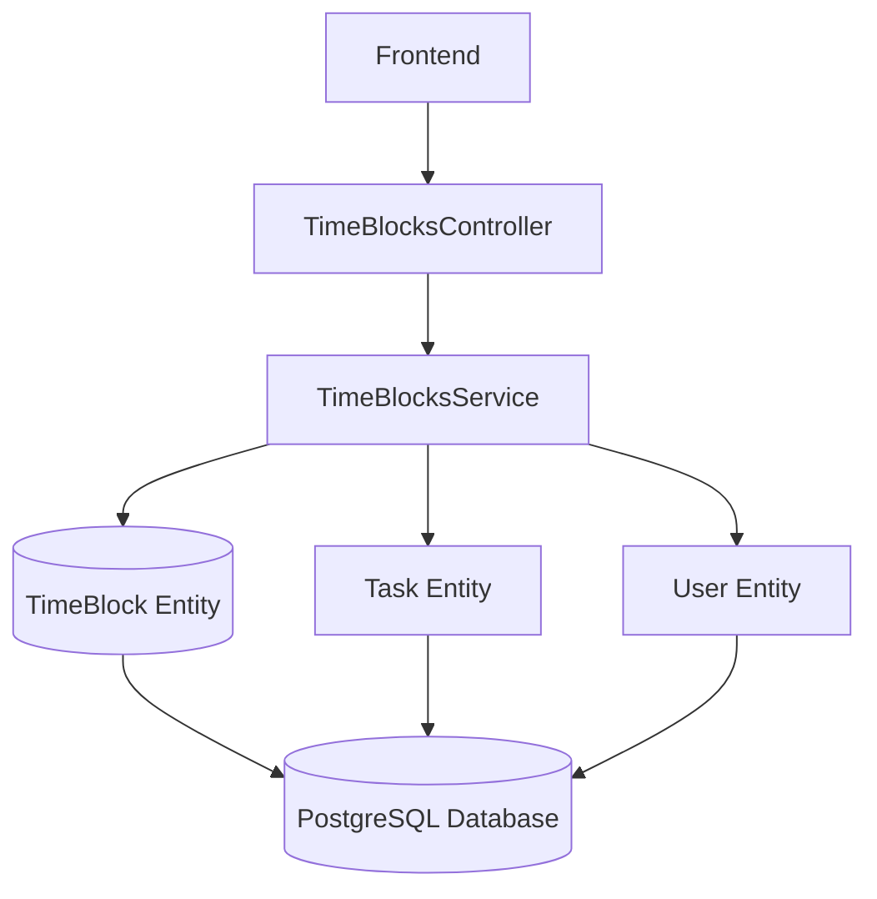
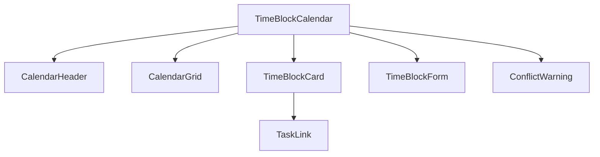

# Time Blocking Feature Design

## 1. Overview

The Time Blocking feature allows users to schedule focused work periods on their calendar, helping them manage their time more effectively. This feature integrates with the existing task management system, allowing users to link tasks to specific time blocks for better time tracking and productivity analysis.

### 1.1 Core Functionality

- Create, read, update, and delete time blocks with start/end times
- Visual calendar interface for scheduling time blocks
- Color coding for better organization
- Task linking to track time spent on specific tasks
- Conflict detection to prevent overlapping time blocks
- Recurrence patterns for regular activities

### 1.2 Requirements

- TIME-BLOCK-001: Implement time block creation, retrieval, update, and deletion API endpoints
- TIME-BLOCK-002: Support color coding for time blocks
- TIME-BLOCK-003: Enable linking of tasks to time blocks
- TIME-BLOCK-004: Implement time block conflict detection
- TIME-BLOCK-005: Support time block updates with conflict re-checking
- TIME-VIEW-001: Provide time block calendar UI
- TIME-EDIT-001: Enable time block field updates
- TIME-CONFLICT-001: Implement time block overlap detection
- TIME-TRACK-001: Enable time tracking integration
- UI-WARN-001: Display conflict warnings to users
- REPORT-002: Provide reporting data for linked tasks

### 1.3 User Stories

- As a user, I want to create time blocks on my calendar to schedule focused work periods (14.2.3.1)
- As a user, I want to link tasks to time blocks to track time spent on specific tasks (14.2.3.2)
- As a user, I want to receive warnings when I try to create overlapping time blocks (14.2.3.4)
- As a user, I want to visualize my schedule in a calendar view (14.2.3)

## 2. Architecture

### 2.1 Technology Stack

- **Backend**: NestJS with TypeORM for data persistence
- **Database**: PostgreSQL with TypeORM entities
- **Frontend**: Next.js with React for UI components
- **Validation**: class-validator for request validation
- **Authentication**: JWT-based authentication

### 2.2 Component Architecture



### 2.3 Frontend Component Architecture



#### 2.3.1 Calendar Components

| Component | Description | Props | State |
|----------|-------------|-------|-------|
| TimeBlockCalendar | Main calendar view for displaying time blocks | dateRange: DateRange, userId: string | selectedDate: Date, viewMode: string |
| CalendarHeader | Navigation controls for the calendar | currentView: string, currentDate: Date | - |
| CalendarGrid | Grid layout for displaying time blocks | timeBlocks: TimeBlock[], date: Date | - |
| TimeBlockCard | Visual representation of a time block | timeBlock: TimeBlock, onEdit: Function, onDelete: Function | isHovered: boolean |
| TimeBlockForm | Form for creating/editing time blocks | timeBlock?: TimeBlock, onSubmit: Function, onCancel: Function | formData: TimeBlockData |
| ConflictWarning | Warning display for time conflicts | conflicts: TimeBlock[], onResolve: Function | isVisible: boolean |
| TaskLink | Display of linked task information | taskId: string, onLink: Function | - |

### 2.4 Data Model

The TimeBlock entity has the following structure:

| Field | Type | Required | Description |
|-------|------|----------|-------------|
| id | UUID | Yes | Unique identifier |
| title | String (1-100 chars) | Yes | Time block title |
| description | Text (0-500 chars) | No | Optional description |
| startTime | Timestamp | Yes | Start time of the block |
| endTime | Timestamp | Yes | End time of the block |
| recurrencePattern | String | No | Recurrence pattern for repeating blocks |
| color | String (Hex color) | No | Color coding for visualization |
| userId | UUID | Yes | Reference to the user |
| taskId | UUID | No | Reference to a linked task |
| createdAt | Timestamp | Yes | Creation timestamp |
| updatedAt | Timestamp | Yes | Last update timestamp |

### 2.4 Entity Relationships

- **User** → **TimeBlock** (One-to-Many): Users can have multiple time blocks
- **Task** → **TimeBlock** (One-to-Many): Tasks can have multiple time blocks
- **TimeBlock** → **User** (Many-to-One): Each time block belongs to one user
- **TimeBlock** → **Task** (Many-to-One): Each time block can be linked to one task

## 3. API Endpoints Reference

### 3.1 Time Block Creation
- **Endpoint**: `POST /time-blocks`
- **Authentication**: Required (JWT)
- **Request Body**:
  ```json
  {
    "title": "string",
    "description": "string (optional)",
    "startTime": "ISO 8601 timestamp",
    "endTime": "ISO 8601 timestamp",
    "color": "#RRGGBB (optional)",
    "taskId": "UUID (optional)"
  }
  ```
- **Response**:
  ```json
  {
    "id": "UUID",
    "title": "string",
    "description": "string",
    "startTime": "ISO 8601 timestamp",
    "endTime": "ISO 8601 timestamp",
    "color": "#RRGGBB",
    "userId": "UUID",
    "taskId": "UUID",
    "createdAt": "ISO 8601 timestamp",
    "updatedAt": "ISO 8601 timestamp"
  }
  ```
- **Conflict Response** (409 Conflict):
  ```json
  {
    "statusCode": 409,
    "message": "Time block conflicts with existing time blocks",
    "conflicts": [
      {
        "id": "UUID",
        "title": "string",
        "startTime": "ISO 8601 timestamp",
        "endTime": "ISO 8601 timestamp"
      }
    ]
  }
  ```

### 3.2 Time Block Retrieval
- **Endpoint**: `GET /time-blocks/:id`
- **Authentication**: Required (JWT)
- **Response**:
  ```json
  {
    "id": "UUID",
    "title": "string",
    "description": "string",
    "startTime": "ISO 8601 timestamp",
    "endTime": "ISO 8601 timestamp",
    "color": "#RRGGBB",
    "userId": "UUID",
    "taskId": "UUID",
    "createdAt": "ISO 8601 timestamp",
    "updatedAt": "ISO 8601 timestamp"
  }
  ```

### 3.3 Time Block Listing
- **Endpoint**: `GET /time-blocks`
- **Authentication**: Required (JWT)
- **Query Parameters**:
  - `startDate`: Filter by start date
  - `endDate`: Filter by end date
- **Response**:
  ```json
  [
    {
      "id": "UUID",
      "title": "string",
      "description": "string",
      "startTime": "ISO 8601 timestamp",
      "endTime": "ISO 8601 timestamp",
      "color": "#RRGGBB",
      "userId": "UUID",
      "taskId": "UUID",
      "createdAt": "ISO 8601 timestamp",
      "updatedAt": "ISO 8601 timestamp"
    }
  ]
  ```

### 3.4 Time Block Update
- **Endpoint**: `PATCH /time-blocks/:id`
- **Authentication**: Required (JWT)
- **Request Body**:
  ```json
  {
    "title": "string (optional)",
    "description": "string (optional)",
    "startTime": "ISO 8601 timestamp (optional)",
    "endTime": "ISO 8601 timestamp (optional)",
    "color": "#RRGGBB (optional)",
    "taskId": "UUID (optional)"
  }
  ```
- **Response**:
  ```json
  {
    "id": "UUID",
    "title": "string",
    "description": "string",
    "startTime": "ISO 8601 timestamp",
    "endTime": "ISO 8601 timestamp",
    "color": "#RRGGBB",
    "userId": "UUID",
    "taskId": "UUID",
    "createdAt": "ISO 8601 timestamp",
    "updatedAt": "ISO 8601 timestamp"
  }
  ```
- **Conflict Response** (409 Conflict):
  ```json
  {
    "statusCode": 409,
    "message": "Time block conflicts with existing time blocks",
    "conflicts": [
      {
        "id": "UUID",
        "title": "string",
        "startTime": "ISO 8601 timestamp",
        "endTime": "ISO 8601 timestamp"
      }
    ]
  }
  ```

### 3.5 Time Block Deletion
- **Endpoint**: `DELETE /time-blocks/:id`
- **Authentication**: Required (JWT)
- **Response**: `204 No Content`

## 4. Data Models & ORM Mapping

### 4.1 TimeBlock Entity

```typescript
@Entity('time_blocks')
export class TimeBlock {
  @PrimaryGeneratedColumn('uuid')
  id: string;

  @Column()
  @Length(1, 100)
  title: string;

  @Column({ type: 'text', nullable: true })
  @Length(0, 500)
  description: string;

  @Column({ type: 'timestamp' })
  @IsDate()
  startTime: Date;

  @Column({ type: 'timestamp' })
  @IsDate()
  endTime: Date;

  @Column({ nullable: true })
  recurrencePattern: string;

  @Column({ nullable: true })
  @Matches(/^#[0-9A-F]{6}$/i, { message: 'Color must be a valid hex color code' })
  color: string;

  @CreateDateColumn()
  createdAt: Date;

  @UpdateDateColumn()
  updatedAt: Date;

  @ManyToOne(() => User, user => user.timeBlocks, { onDelete: 'CASCADE' })
  @JoinColumn({ name: 'userId' })
  user: User;

  @Column()
  userId: string;

  @ManyToOne(() => Task, task => task.timeBlocks, { nullable: true, onDelete: 'SET NULL' })
  @JoinColumn({ name: 'taskId' })
  task: Task;

  @Column({ nullable: true })
  taskId: string;

  @BeforeInsert()
  @BeforeUpdate()
  validateTime() {
    if (this.startTime && this.endTime && this.startTime >= this.endTime) {
      throw new Error('End time must be after start time');
    }
  }
}
```

### 4.2 Data Transfer Objects

#### 4.2.1 CreateTimeBlockDto

```typescript
export class CreateTimeBlockDto {
  @IsString()
  @Length(1, 100)
  title: string;

  @IsString()
  @Length(0, 500)
  @IsOptional()
  description?: string;

  @IsISO8601()
  startTime: string;

  @IsISO8601()
  endTime: string;

  @IsString()
  @Matches(/^#[0-9A-F]{6}$/i, { message: 'Color must be a valid hex color code' })
  @IsOptional()
  color?: string;

  @IsUUID()
  @IsOptional()
  taskId?: string;
}
```

#### 4.2.2 UpdateTimeBlockDto

```typescript
export class UpdateTimeBlockDto {
  @IsString()
  @Length(1, 100)
  @IsOptional()
  title?: string;

  @IsString()
  @Length(0, 500)
  @IsOptional()
  description?: string;

  @IsISO8601()
  @IsOptional()
  startTime?: string;

  @IsISO8601()
  @IsOptional()
  endTime?: string;

  @IsString()
  @Matches(/^#[0-9A-F]{6}$/i, { message: 'Color must be a valid hex color code' })
  @IsOptional()
  color?: string;

  @IsUUID()
  @IsOptional()
  taskId?: string;
}
```

### 4.3 Database Schema

The TimeBlocks table has the following structure:

```sql
CREATE TABLE time_blocks (
  id UUID PRIMARY KEY DEFAULT uuid_generate_v4(),
  title VARCHAR(100) NOT NULL,
  description TEXT,
  startTime TIMESTAMP NOT NULL,
  endTime TIMESTAMP NOT NULL,
  recurrencePattern VARCHAR,
  color VARCHAR,
  userId UUID NOT NULL REFERENCES users(id) ON DELETE CASCADE,
  taskId UUID REFERENCES tasks(id) ON DELETE SET NULL,
  createdAt TIMESTAMP DEFAULT NOW(),
  updatedAt TIMESTAMP DEFAULT NOW()
);
```

### 4.3 Indexes

The following indexes have been created for performance optimization:
- Composite index on (userId, startTime, endTime) for efficient querying by user and time range
- Index on taskId for efficient task-time block relationship queries

## 5. Business Logic Layer

### 5.1 Time Block Creation

When creating a time block, the system performs the following validations:
1. Validate that start time is before end time
2. Check for conflicts with existing time blocks for the same user
3. Validate hex color format if provided
4. Ensure title length is between 1-100 characters
5. Ensure description length is between 0-500 characters
6. Validate that the user exists
7. Validate that the linked task exists (if provided)

#### 5.1.1 Service Implementation

The TimeBlocksService implements the business logic for time block management:

1. **Creation**: Validates user and task existence, checks for conflicts, and creates time blocks
2. **Retrieval**: Finds time blocks by ID or lists them with optional date range filtering
3. **Update**: Verifies ownership, validates task existence, checks for new conflicts, and updates time blocks
4. **Deletion**: Verifies ownership and deletes time blocks
5. **Conflict Detection**: Uses database queries to find overlapping time blocks for the same user

### 5.2 Conflict Detection

Before creating or updating a time block, the system checks for conflicts with existing time blocks:
1. Find all time blocks for the user within the same time range
2. If any overlapping time blocks are found, return a conflict error
3. Allow adjacent time blocks (where end time of one equals start time of another)

#### 5.2.1 Conflict Detection Algorithm

The conflict detection algorithm works as follows:

```typescript
function detectConflicts(newTimeBlock: TimeBlock, existingTimeBlocks: TimeBlock[]): TimeBlock[] {
  return existingTimeBlocks.filter(block => {
    // Check if time blocks overlap
    // Overlap occurs when: 
    // newStart < existingEnd AND existingStart < newEnd
    return newTimeBlock.startTime < block.endTime && block.startTime < newTimeBlock.endTime;
  });
}
```

#### 5.2.2 Conflict Resolution Options

When conflicts are detected, the system provides the following resolution options:
1. Adjust the time block to avoid conflicts
2. Replace the conflicting time block
3. Merge overlapping time blocks
4. Cancel the operation

### 5.3 Task Linking

Time blocks can be linked to tasks to track time spent:
1. When a time block is linked to a task, it appears in the task's time blocks collection
2. When a task is deleted, linked time blocks have their taskId set to NULL (SET NULL behavior)
3. Time blocks can be unlinked by setting taskId to NULL

#### 5.3.1 Time Tracking Integration

Linked time blocks contribute to task time tracking:
1. Total time spent on a task is calculated from linked time blocks
2. Time distribution by day/week/month for reporting
3. Productivity metrics based on planned vs actual time

### 5.4 Recurrence Patterns

Time blocks support recurrence patterns for regular activities:
1. Pattern format to be defined in future implementation
2. Recurring time blocks will be expanded when retrieved
3. Updates to recurring time blocks will affect future instances

## 6. Middleware & Interceptors

### 6.1 Authentication

All time block endpoints require JWT authentication:
- Users must be authenticated to access any time block functionality
- Users can only access their own time blocks
- User ID is automatically associated with created time blocks

The JwtAuthGuard is used to protect all endpoints:

```typescript
@UseGuards(JwtAuthGuard)
```

User context is extracted from the request object:

```typescript
@Request() req  // req.user.id contains the authenticated user ID
```

### 6.2 Validation

Request validation is performed using class-validator:
- DTOs for create and update operations
- Automatic validation of required fields
- Format validation for timestamps and color codes

### 6.3 Error Handling

Standard error responses for common scenarios:
- 400 Bad Request for validation errors
- 401 Unauthorized for authentication failures
- 403 Forbidden for access to other users' data
- 404 Not Found for non-existent time blocks
- 409 Conflict for time block overlaps

## 7. Testing

### 7.1 Unit Tests

Unit tests cover the following scenarios based on requirements:

#### Time Block Creation (TIME-BLOCK-001, TIME-BLOCK-002, TIME-VIEW-001)
- Time block creation with start/end times
- Color coding support
- User association
- Conflict detection
- API response format

#### Time Block Retrieval (TIME-BLOCK-001, TIME-VIEW-001)
- Single time block retrieval
- Multiple time block retrieval
- Date range filtering
- User-specific filtering
- API response format

#### Time Block Update (TIME-BLOCK-005, TIME-EDIT-001)
- Time block field updates
- Time range modifications
- Conflict re-checking
- API response format
- Validation rules

#### Time Block Deletion (TIME-BLOCK-001)
- Time block deletion
- API response format
- Cascade handling
- Permission validation
- Confirmation workflow

### 7.2 Integration Tests

Integration tests cover the following scenarios:
- End-to-end API workflow
- Authentication requirement validation
- Data validation testing
- Response format verification
- Database state verification

### 7.3 Edge Cases

Tests for edge cases include:

#### Time Block Creation
- Invalid time ranges
- Overlapping time blocks
- Extreme time values
- Invalid color codes
- Missing required fields
- SQL injection attempts
- Concurrent creation

#### Time Block Retrieval
- Non-existent time block ID
- Invalid time block ID
- Database connection issues
- Large result sets
- Date range edge cases
- Time zone differences

#### Time Block Update
- Non-existent time block ID
- Invalid field values
- New conflicts after update
- Concurrent edits
- Database constraints
- Network interruptions

#### Time Block Deletion
- Non-existent time block ID
- Concurrent deletions
- Database constraint issues
- Network failures
- Permission violations
- Linked task dependencies

#### Time Block Calendar UI (TIME-BLOCK-001, TIME-VIEW-001)
- Calendar rendering
- Time block display
- Visual styling

## Implementation Status

### 5. Basic Time Blocking
- [x] Implement time block creation API endpoint
  - **User Story Mapping**: 14.2.3.1 Create time blocks on calendar
  - **Requirements**: TIME-BLOCK-001, TIME-BLOCK-002, TIME-VIEW-001
  - **Test Cases**:
    - Time block creation with start/end times
    - Color coding support
    - User association
    - Conflict detection
    - API response format
  - **Corner/Edge Cases**:
    - Invalid time ranges
    - Overlapping time blocks
    - Extreme time values
    - Invalid color codes
    - Missing required fields
    - SQL injection attempts
    - Concurrent creation

- [x] Implement time block retrieval API endpoint
  - **User Story Mapping**: 14.2.3 Time Blocking
  - **Requirements**: TIME-BLOCK-001, TIME-VIEW-001
  - **Test Cases**:
    - Single time block retrieval
    - Multiple time block retrieval
    - Date range filtering
    - User-specific filtering
    - API response format
  - **Corner/Edge Cases**:
    - Non-existent time block ID
    - Invalid time block ID
    - Database connection issues
    - Large result sets
    - Date range edge cases
    - Time zone differences

- [x] Implement time block update API endpoint
  - **User Story Mapping**: 14.2.3 Time Blocking
  - **Requirements**: TIME-BLOCK-005, TIME-EDIT-001
  - **Test Cases**:
    - Time block field updates
    - Time range modifications
    - Conflict re-checking
    - API response format
    - Validation rules
  - **Corner/Edge Cases**:
    - Non-existent time block ID
    - Invalid field values
    - New conflicts after update
    - Concurrent edits
    - Database constraints
    - Network interruptions

- [x] Implement time block deletion API endpoint
  - **User Story Mapping**: 14.2.3 Time Blocking
  - **Requirements**: TIME-BLOCK-001
  - **Test Cases**:
    - Time block deletion
    - API response format
    - Cascade handling
    - Permission validation
    - Confirmation workflow
  - **Corner/Edge Cases**:
    - Non-existent time block ID
    - Concurrent deletions
    - Database constraint issues
    - Network failures
    - Permission violations
    - Linked task dependencies

- [ ] Create time block calendar UI
  - **User Story Mapping**: 14.2.3 Time Blocking
  - **Requirements**: TIME-BLOCK-001, TIME-VIEW-001
  - **Test Cases**:
    - Calendar rendering
    - Time block display
    - Visual styling
    - Responsive design
    - User interaction
    - Performance
  - **Corner/Edge Cases**:
    - Empty calendar
    - Many time blocks
    - Browser compatibility
    - Network delays
    - Time zone handling
    - Accessibility compliance

- [x] Implement time block conflict detection
  - **User Story Mapping**: 14.2.3.4 Receive conflict warnings
  - **Requirements**: TIME-BLOCK-004, TIME-CONFLICT-001, UI-WARN-001
  - **Test Cases**:
    - Overlap detection
    - Warning display
    - Conflict details
    - Resolution options
    - API integration
  - **Corner/Edge Cases**:
    - Adjacent time blocks
    - Identical time blocks
    - Nested time blocks
    - Multiple overlaps
    - Time zone conflicts
    - Database consistency

- [x] Implement task linking to time blocks
  - **User Story Mapping**: 14.2.3.2 Link tasks to time blocks
  - **Requirements**: TIME-BLOCK-003, TIME-TRACK-001, REPORT-002
  - **Test Cases**:
    - Task linking functionality
    - Time tracking integration
    - Reporting data
    - UI controls
    - API integration
  - **Corner/Edge Cases**:
    - Linking non-existent task
    - Linking non-existent time block
    - Multiple task links
    - Concurrent linking
    - Database constraints
    - Permission issues