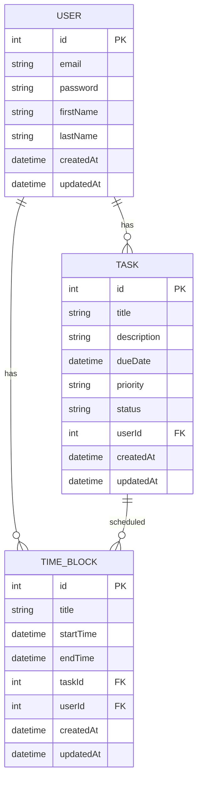
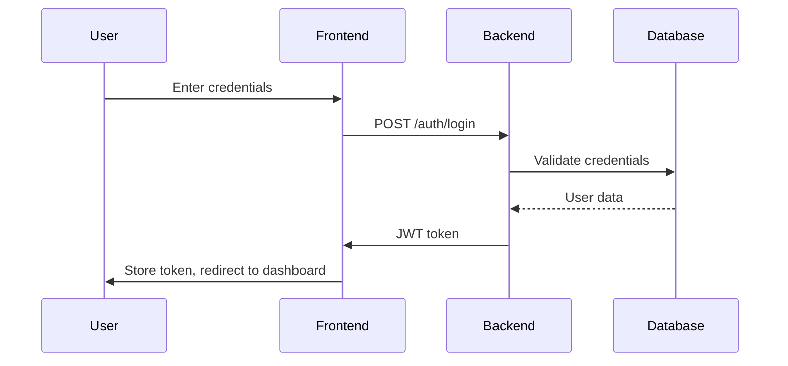

# To-Do List and Time Planner Application Design

## 1. Overview

The To-Do List and Time Planner is a full-stack web application that allows users to manage their tasks and schedule their time effectively. The application will feature task management with due dates, time blocking, calendar views, and productivity tracking.

### 1.1 Technology Stack
- **Frontend**: Next.js (React framework with SSR/SSG capabilities)
- **Backend**: NestJS (Node.js framework with TypeScript support)
- **Database**: SQLite (development), PostgreSQL/MySQL (production)
- **Authentication**: JWT-based authentication
- **State Management**: React Context API with potential integration of Redux/Zustand
- **Styling**: Tailwind CSS or Material UI

## 2. Frontend Architecture (Next.js)

### 2.1 Component Architecture

#### 2.1.1 Component Hierarchy
```
App
├── Layout
│   ├── Header
│   ├── Sidebar
│   └── MainContent
├── Pages
│   ├── Dashboard
│   ├── TaskList
│   ├── Calendar
│   ├── TimeBlocks
│   └── Settings
└── Components
    ├── Task
    ├── TaskForm
    ├── CalendarView
    ├── TimeBlock
    └── Statistics
```

#### 2.1.2 Core Components

| Component | Description | Props |
|----------|-------------|-------|
| Task | Displays individual task information | task: TaskObject, onEdit: Function, onDelete: Function |
| TaskForm | Form for creating/editing tasks | task?: TaskObject, onSubmit: Function, onCancel: Function |
| CalendarView | Calendar display of tasks and time blocks | events: Array, onEventClick: Function |
| TimeBlock | Visual representation of time blocks | block: TimeBlockObject, onEdit: Function |
| Header | Navigation and user controls | user: UserObject |

### 2.2 State Management
- Local component state for form inputs and UI interactions
- Global state for user data, tasks, and settings using React Context API
- Potential integration with Redux or Zustand for more complex state management

### 2.3 Routing & Navigation
- `/` - Dashboard with overview of tasks and schedule
- `/tasks` - List view of all tasks
- `/calendar` - Calendar view of tasks and time blocks
- `/planner` - Time blocking interface
- `/settings` - User preferences and account settings

### 2.4 API Integration Layer
- Axios or Fetch API for HTTP requests
- Custom hooks for data fetching (e.g., useTasks, useUser)
- Error handling and loading states

## 3. Backend Architecture (NestJS)

### 3.1 API Endpoints

#### 3.1.1 Authentication
| Endpoint | Method | Description |
|----------|--------|-------------|
| `/auth/register` | POST | User registration |
| `/auth/login` | POST | User login |
| `/auth/profile` | GET | Get user profile |
| `/auth/profile` | PUT | Update user profile |

#### 3.1.2 Tasks
| Endpoint | Method | Description |
|----------|--------|-------------|
| `/tasks` | GET | Get all tasks for user |
| `/tasks` | POST | Create new task |
| `/tasks/:id` | GET | Get specific task |
| `/tasks/:id` | PUT | Update task |
| `/tasks/:id` | DELETE | Delete task |

#### 3.1.3 Time Blocks
| Endpoint | Method | Description |
|----------|--------|-------------|
| `/time-blocks` | GET | Get all time blocks for user |
| `/time-blocks` | POST | Create new time block |
| `/time-blocks/:id` | GET | Get specific time block |
| `/time-blocks/:id` | PUT | Update time block |
| `/time-blocks/:id` | DELETE | Delete time block |

### 3.2 Data Models

#### 3.2.1 User Model
```typescript
interface User {
  id: number;
  email: string;
  password: string;
  firstName: string;
  lastName: string;
  createdAt: Date;
  updatedAt: Date;
}
```

#### 3.2.2 Task Model
```typescript
interface Task {
  id: number;
  title: string;
  description: string;
  dueDate: Date;
  priority: 'low' | 'medium' | 'high';
  status: 'todo' | 'in-progress' | 'completed';
  userId: number;
  createdAt: Date;
  updatedAt: Date;
}
```

#### 3.2.3 TimeBlock Model
```typescript
interface TimeBlock {
  id: number;
  title: string;
  startTime: Date;
  endTime: Date;
  taskId: number | null;
  userId: number;
  createdAt: Date;
  updatedAt: Date;
}
```

### 3.3 Business Logic Layer

#### 3.3.1 Task Service
- CRUD operations for tasks
- Task filtering and sorting
- Due date validation
- Priority management

#### 3.3.2 Time Block Service
- CRUD operations for time blocks
- Time conflict detection
- Scheduling algorithms
- Calendar integration

#### 3.3.3 User Service
- User registration and authentication
- Profile management
- Password encryption
- Session management

### 3.4 Middleware & Interceptors
- Authentication middleware for protected routes
- Logging interceptor for request/response tracking
- Validation pipes for data integrity
- Error handling middleware

## 4. Database Design

### 4.1 Entity Relationship Diagram


### 4.2 Database Schema
- **Users Table**: Stores user account information
- **Tasks Table**: Stores task information with due dates and priorities
- **TimeBlocks Table**: Stores scheduled time blocks that can be linked to tasks

## 5. Data Flow Between Layers

### 5.1 Frontend to Backend Communication
1. User interacts with UI components
2. Frontend makes API calls to backend services
3. Backend validates requests and processes business logic
4. Database operations are performed
5. Backend returns structured responses
6. Frontend updates UI based on responses

### 5.2 Authentication Flow


## 6. Testing Strategy

### 6.1 Frontend Testing
- Unit tests for components using Jest and React Testing Library
- Integration tests for API calls
- End-to-end tests using Cypress

### 6.2 Backend Testing
- Unit tests for services and controllers
- Integration tests for database operations
- API endpoint testing with Jest and Supertest

## 7. Deployment Considerations

### 7.1 Development Environment
- SQLite for local development
- Hot reloading for frontend and backend
- Environment-based configuration

### 7.2 Production Environment
- PostgreSQL/MySQL database
- Docker containerization
- CI/CD pipeline
- Load balancing and scaling considerations