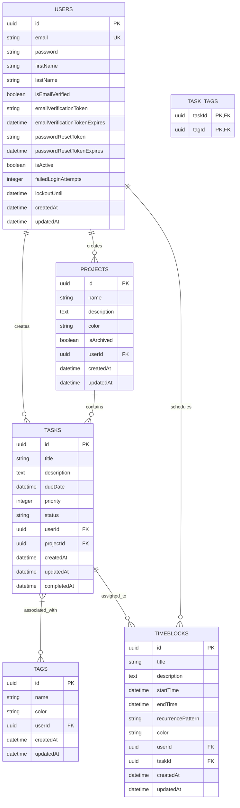

# Database Schema Documentation

This document describes the database schema for the To-Do List and Time Planner application.

## Entity Relationship Diagram



## Entities

### Users
The Users table stores authentication and user profile information.

### Tasks
The Tasks table stores individual task items with due dates, priorities, and status.

### Projects
The Projects table provides a categorization system for organizing related tasks.

### Tags
The Tags table provides a labeling system for organizing and filtering tasks.

### TimeBlocks
The TimeBlocks table stores scheduled time slots for focused work periods.

## Relationships

- Users have a one-to-many relationship with Tasks, Projects, Tags, and TimeBlocks
- Projects have a one-to-many relationship with Tasks
- Tasks have a many-to-many relationship with Tags through the task_tags junction table
- Tasks have a one-to-many relationship with TimeBlocks
- Users have a one-to-many relationship with TimeBlocks

## Indexes

The following indexes have been created for performance optimization:

- IDX_TASK_USER_STATUS: Composite index on Tasks table (userId, status)
- IDX_TASK_USER_DUE_DATE: Composite index on Tasks table (userId, dueDate)
- IDX_TASK_PROJECT: Index on Tasks table (projectId)
- IDX_PROJECT_USER_ARCHIVED: Composite index on Projects table (userId, isArchived)
- IDX_TAG_USER_NAME: Composite index on Tags table (userId, name)
- IDX_TIME_BLOCK_USER_TIME: Composite index on TimeBlocks table (userId, startTime, endTime)
- IDX_TIME_BLOCK_TASK: Index on TimeBlocks table (taskId)

## Migration

To run the database migration, use the following command:

```bash
npm run migration:run
```

To revert the last migration, use:

```bash
npm run migration:revert
```